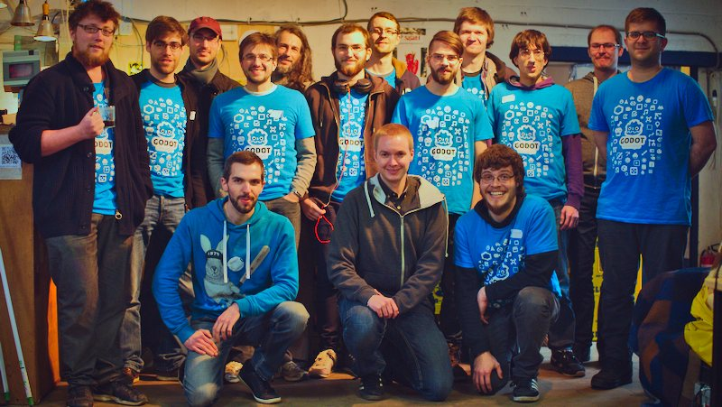

## GDQuest's mission

GDQuest's goal is to help you **become a better game designer**. It's a growing library of [ game creation tutorials ](/tutorial), and tools to help **indies**, **students**, and **hobbyists** learn professional design, programming, and art techniques. All that using **Free and Open Source Software**.

With over 200 free tutorials out already on Youtube and several courses, we've already reached out to **tens of thousands of students**.

GDQuest is community-driven: the last 2 projects were crowdfunded on Kickstarter and shaped with the backers' feedback:

1. [ Make Professional 2d game art with Krita ]()
2. [ Make Professional 2d games with Godot 3 ](https://gumroad.com/l/godot-tutorial-make-professional-2d-games)

You will also find many Free resources on [ GDQuest's GitHub page ](https://github.com/GDQuest/), including an open Godot 3 presentation, game project source code and [Power Sequencer](https://github.com/GDQuest/Blender-power-sequencer), our Blender add-on for video editors.

## The guy behind GDQuest

Hey, I'm Nathan (*bottom left on the picture above*), the voice you've heard in most videos on [ Youtube ](http://youtube.com/c/gdquest). I'm currently in Nara, a large Japanese city surrounded by mountains.

I've been working in the game industry for over 5 years now, both as a game designer and an artist. We ran an indie game development company with my former teammate [ Florian ](https://twitter.com/Nemega) and worked full time on mobile and web games for 18 months together. Our first projects failed miserably, then we slowly managed to make a living off of our work. As a designer, I got to study all domains related to Game Creation, so I've got some first-hand experience to help you learn from.

As we were still young and lacked experience, we decided to part ways. Florian became the lead developer at Royal Cactus, and I went on to work as a freelance designer and writer, still working on mobile games and [ writing game design articles ](https://gameanalytics.com/blog/how-to-make-your-game-ui-shine-and-increase-conversions.html) for companies like Game Analytics.

[Omitted long matching line]

Heck, I even write and code with [ Emacs ](https://www.gnu.org/software/emacs/) in Vim mode! If that's not being crazy about open source... ;)

## Get in touch

Although I love to chat, I receive many messages and have busy weeks.

If you're looking for help with a given program please first post on Discord, forums, or another public place where other game creators can also help you.

If you have a question about GDQuest, courses, or some project you'd like to discuss, please drop me a message.

You can find me on:

- [Discord](https://discord.gg/KVaCsSP), the best place for questions or support. That's where we hang out with the community. If I'm away, other creators will be around to answer your questions.
- [Twitter](https://twitter.com/NathanGDQuest) is a popular social network for game developers.
- You can also [drop me an email](mailto:nathan@gdquest.com)!

### Affiliates and collaborations

I'm open to collab opportunities with fellow content creators and game creation tutors in particular. It's fun and motivating. If you're up for it, please message me.

At GDQuest we create courses for open source programs, both free and paid. You can find our premium catalog on our [Gumroad shop](https://gumroad.com/gdquest). If you're interested in becoming an affiliate please [send me an email](mailto:nathan@gdquest.com?subject=Affiliate%20partnership)!
