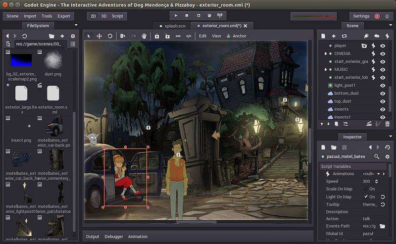
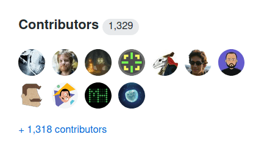
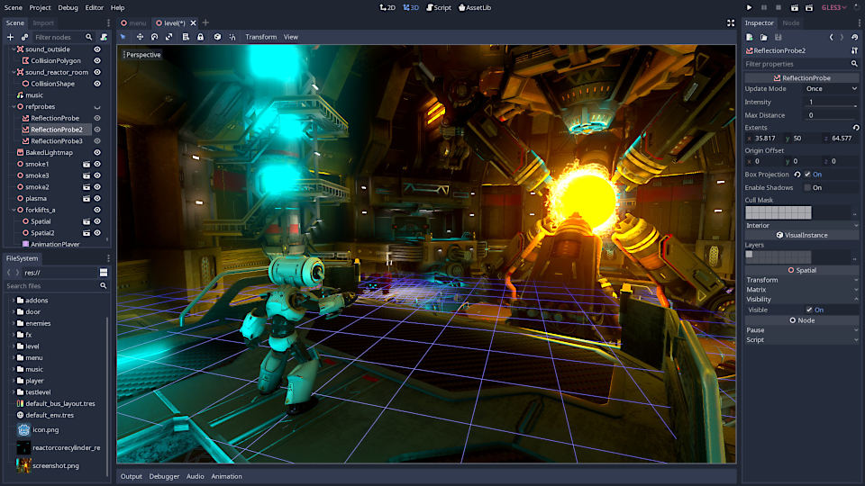

+++
author = "nathan"
title = "About us"
small = "GDQuest, its mission, and the people behind it"
date = "2017-04-10T13:40:07+02:00"

paginate = false

[banner]
src = "/img/social-banner.png"
alt = "Godot course update 4 banner showing characters on a tiles-based map"
+++

On GDQuest, we help you **become a game developer** using the free and open-source game engine **Godot**.

We are a [Free Software](//en.wikipedia.org/wiki/Free_software) project and a **social company**. It means we invest _all_ our profits back into our projects, creating free education and tools for you.

There are many websites and channels where you can find game programming tutorials.

Many of those tutorials show you quick and _simple tactics_ to solve a small problem. But few go past that to help you forge the fundamental skills you need to become a _professional_ developer.

Even less so with Godot, as most tutorials come from developers who share a trick or two they've learned through their projects. It's a hobby on the side, so they don't invest much time learning to teach well.

There's nothing wrong with that, of course. For one, that's how I started making tutorials before teaching full-time. And I think it's great for people to share their knowledge. If anything, I wish more persons would do that.

It's just that you need more than that to become a professional and independent developer.

If you've been watching dozens, if not hundreds of tutorials, and you still can't make games on your own, that's why, in part.

And we're here to help you get past that, using Godot.

## Falling in love with Godot

Back in late 2014, I saw and tested the first open-source release of Godot.

After years in development behind closed doors, its creators decided to share it with the world under the permissive MIT license.

Back then, it was far from what it is today, and it felt clunky. It was far from mainstream engines.

But to me, it was already clear it had much potential.

There was no fully-fledged free and open-source general game engine with a complete editor in the likes of Game Maker or Unity.

Having access to the engine's source code may not be evident at first.

**That is, until the day you're six months into production, an obscure bug brings your work to a halt, and you can't do anything about it because your engine is closed source.**

When that happens, it feels terrible. You can't just throw away six months of work, so you have to keep going and endure your tool until the end of your project.

I've heard some _horror stories_ from fellow game developers.

Thankfully, I never had to suffer that since I started using Godot. It's not that it's perfect, but when there's a bug, I can look at the source code and either ask someone to fix it or find an appropriate workaround.

Godot is one of those open-source projects that got things right: the developers keep the source code clean to help you understand it and contribute to it. The developers work closely with the community and prioritize the features that most users need.

As a result, the project already got **over 1300 contributors**, an incredible number that keeps increasing at a rapid pace. The engine's feature-packed, and the editor's interface keeps getting better.

Most people who try it end up sticking with it because it's free, open-source, user-friendly, and covers everything an indie developer needs.

Godot's already one of the most popular game engines worldwide and the most popular game technology on GitHub, the largest social platform for developers and open-source projects.

The developers and community achieved that with less than 0.1% of Unity's budget. They do a ton with very little.

## My story with Godot

Hi, I'm Nathan, GDQuest's founder.

Years ago, I discovered Free Software like Blender, Krita, and Inkscape, and started making game art tutorials on YouTube as a hobby.

In 2016, I made my first Godot tutorial. At the time, I worked as a designer and artist. Being self-taught and inexperienced when it comes to programming, I had shaky foundations.

This first series was _awful_, between my annoying French accent and showing programming practices I would not recommend today!

Yet, I got warmly welcomed in the community, met the core developers, and found people who cared about their users, freedom, and sharing.

That mindset of sharing is very dear to me. I received a lot from the free software community.

**Experienced mentors in the community saved me months, if not years of learning.** 

Also, so many engineers contributed to amazing technologies I use daily at no cost.

GDQuest is a way for me to contribute to this global collaborative effort.

After this first poor tutorial series, you asked for more, and I kept going. Your support grew, led to a successful crowdfunding campaign, and making Godot tutorials became a full-time job.

Our increasing revenue allowed us to become a team, create open-source demos and tools, and contribute to Godot directly.

**We now have over 100,000 subscribers on YouTube, 4 successful Kickstarter campaigns, and over 100 free and open-source demos and tools on GitHub.**

That's where the story is at, thanks to the community.

But we're just getting started. And we'd like to write the next page with you.

GDQuest is a growing library of [free Godot tutorials](/tutorial), [Godot courses](https://gdquest.mavenseed.com/courses/), and [open-source projects](https://github.com/GDQuest/) to help you become the game developer you want to be.

Join our community today, enjoy our free learning resources, and level up your game creation skills!



## Get in touch

If you're looking for help with a given program, head to our [Discord](//discord.gg/87NNb3Z) server!

In general, you can find us on:

- [Discord](//discord.gg/87NNb3Z), the best place for questions or support. That's where we hang out with the community. If I'm away, other creators will be around to answer your questions.
- [Twitter](//twitter.com/NathanGDQuest) is a popular social network for game developers.

## Meet the team

GDQuest wouldn't be much without its team. Here are the folks who work on the project consistently.

