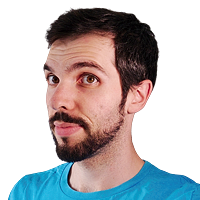

## GDQuest's mission

GDQuest is a social company focused on education and bringing people together around [Free Software](https://en.wikipedia.org/wiki/Free_software).

Our mission is to **help you become a better game developer**.

We share **the techniques professionals use to make games** and open source the code for most of our projects on [our GitHub page](https://github.com/GDquest/).

### Free education

GDQuest is a growing library of [game creation tutorials](/tutorial) and tools to help **indies**, **students**, and **hobbyists** learn professional design, programming, and art techniques. All that using **Free and Open Source Software** like the [Godot game engine](https://godotengine.org/), [Krita](https://krita.org/en/), and [Blender](https://www.blender.org/), to which we contribute.

## The story of GDQuest

Hi, I'm Nathan.

I've always tried to get people to work hand in hand. Helping others has been a big part of my life.

One day, I recorded a quick video tutorial to share my speed painting process with some online friends. I put it up on YouTube. To my surprise, within a few days, it got close to a thousand views:



Despite my heavy French accent, people asked for more. So I made some more.

Back then, I didn't know a thing about Free Software. I made game sprites in Photoshop, edited with Sony Vegas, and prototyped games with Construct 2.

One day, I stumbled upon Krita, which was just ported to Windows. It was barely usable at first, but I could see its rich feature set and potential. A year later, a big update brought so many improvements I decided to shift my focus to it.

It still had some rough edges, it was slow... but it was free. Anyone, anywhere around the globe could use it without having to pay for anything. Also, there were few tutorials dedicated to it.

One thing leading to another, I started to learn about the philosophy behind Free Software. Along the way, I met contributors and project maintainers who share everything they know. I learned a lot from them.

GDQuest was born like that, inspired by benevolent creators. Also by the need for quality free education and tools. Even though we sell products, as quality content takes a lot of work to create, we used that to fund the hundreds of free tutorials we released already and dozens of free and open source projects we have [on our GitHub](https://github.com/GDQuest).

## Get in touch

If you're looking for help with a given program, head to our [Discord](https://discord.gg/KVaCsSP) server!

In general, you can find me on:

- [Discord](https://discord.gg/KVaCsSP), the best place for questions or support. That's where we hang out with the community. If I'm away, other creators will be around to answer your questions.
- [Twitter](https://twitter.com/NathanGDQuest) is a popular social network for game developers.
