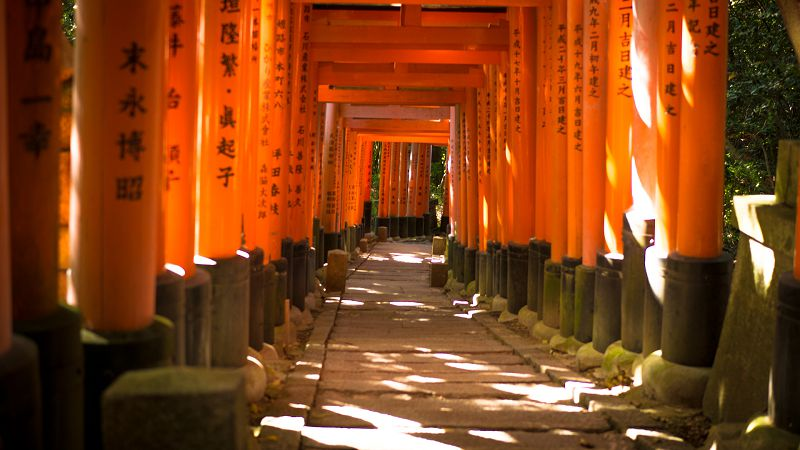
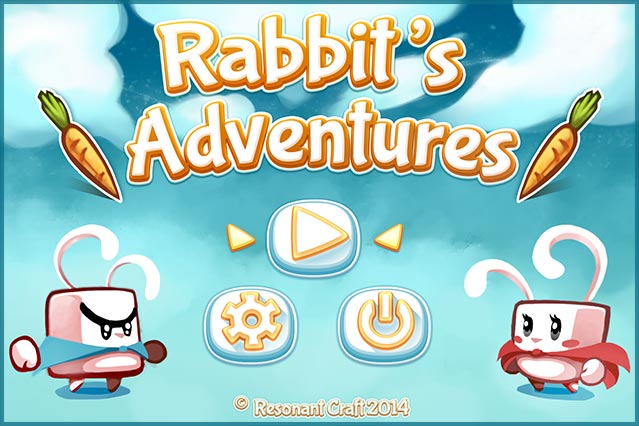

## GDquest's mission

GDquest's goal is to help you **become a better game designer**. It's a growing library of [ game creation tutorials ](/tutorial) and tools to help **indies**, **students** and **hobbyists** learn professional design, programming, and art techniques, all that using **Free and Open Source Software**.

With over 200 free tutorials out already on Youtube and several courses, I've already reached out to **tens of thousands of students**.

GDquest is community-driven: the last 2 projects were crowdfunded on Kickstarter and shaped with the backers' feedback:

1. [ Make Professional 2d game art with Krita ]()
2. [ Make Professional 2d games with Godot 3 ](https://gumroad.com/l/godot-tutorial-make-professional-2d-games)

You can also find a lot of Free resources on [ GDquest's GitHub page ](https://github.com/GDquest/), including an open Godot 3 presentation, Godot project source code and [Power Sequencer](https://github.com/GDquest/Blender-power-sequencer), our the Blender add-on for video editors.

## The guy behind GDquest

Hey, I'm Nathan, the voice you've heard in most videos on [ Youtube ](http://youtube.com/c/gdquest). I'm currently living in Nara, a large city lost in the Japanese countryside.

I've been working in the game industry for over 5 years now, both as a game designer and an artist. We ran an indie game development company with my former teammate [ Florian ](https://twitter.com/Nemega) and worked full time on mobile and web games for 18 months together. Our first projects failed miserably so I've got some experience with that.

I then went on to work as a freelance designer and writer, working on various games and [ writing game design articles ](https://gameanalytics.com/blog/how-to-make-your-game-ui-shine-and-increase-conversions.html) for companies like Game Analytics.

GDquest was a risky project to work full-time around Free Software (it turns out it worked). I like and do contribute to the open source ecosystem whenever possible. I'm part of Godot's documentation team on GitHub and already wrote 6 of the new getting started pages for Godot 3, like the [ intro to Godot 3's design philosophy ](http://docs.godotengine.org/en/latest/getting_started/step_by_step/godot_design_philosophy.html) or the long [UI design intro](http://docs.godotengine.org/en/latest/getting_started/step_by_step/ui_game_user_interface.html). Heck, I even write and code with [ Emacs ](https://www.gnu.org/software/emacs/)!

## Get in touch

Although I love to chat I'm receive many messages and always have work to do. If you have an issue or a question, request or issue, please ask it directly. If you're looking for support with this or that program, please also first post on Discord, GitHub or another public channel where others can also help you.

You can find me on:

- [Discord](https://discord.gg/KVaCsSP), the best place for questions or support. That's where we hang out with the community. If I'm away, other creators will be around to answer your questions.
- [Twitter](https://twitter.com/NathanGDquest) is a popular social network for game developers.

### Affiliates and collaborations

I'm open to collab opportunities with fellow content creators and game creation tutors in particular. It's fun and motivating. If you're up for it please feel free to [drop me an email](mailto:nathan@gdquest.com)!

At GDquest we create courses for open source programs, both free and paid. You can find our premium catalogue on our [Gumroad shop](https://gumroad.com/gdquest). If you're interested in becoming an affiliate or need someone to write tutorials for you, please [send me an email](mailto:nathan@gdquest.com?subject=Affiliate%20partnership)!
