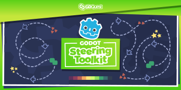

+++
date = "2020-02-02T00:00:00+00:00"
title = "Godot Steering AI Framework"
description = "A free and open-source framework to create smart AI agents for your Godot games, in both 2D and in 3D."
weight = 5
chapter = false
aliases = ["/docs/godot-steering-toolkit/"]
+++

This toolkit is a framework for the [Godot engine](https://godotengine.org/). It takes a lot of inspiration from the excellent [GDX-AI](https://github.com/libgdx/gdx-ai) framework for the [LibGDX](https://libgdx.badlogicgames.com/) java-based framework.

Every class in the toolkit is based on Godot's [Reference](https://docs.godotengine.org/en/latest/classes/class_reference.html) type. There is no need to have a complex scene tree; everything that has to do with the AI's movement can be contained inside movement oriented classes.

As a short overview, a character is represented by a steering agent; it stores its position, orientation, maximum speeds and current velocity.

A steering behavior is associated with a steering agent and calculates a linear or an angular change in velocity based on its information. The coder then applies that acceleration in whatever ways is appropriate to the character to change its velocity, like RigidBody's apply_impulse, or a KinematicBody's move_and_slide.

## More information and resources

- [Understanding Steering Behaviors](https://gamedevelopment.tutsplus.com/series/understanding-steering-behaviors--gamedev-12732): Breakdowns of various behaviors by Fernando Bevilacqua with graphics and in-depth explanations.
- [GDX-AI Wiki](https://github.com/libgdx/gdx-ai/wiki/Steering-Behaviors): Descriptions of how LibGDX's AI submodule uses steering behaviors with a few graphics. Since this toolkit uses it for inspiration, there will be some similarities.
- [RedBlobGames](https://www.redblobgames.com/) - An excellent resources for complex pathfinding like A\*, graph theory, and other algorithms that are game-development related. Steering behaviors are not covered, but for anyone looking to study and bulk up on their algorithms, this is a great place.
