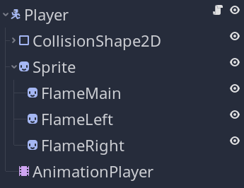
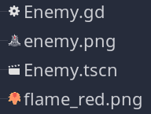
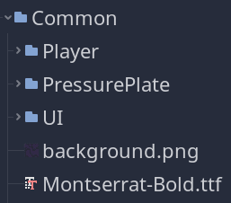
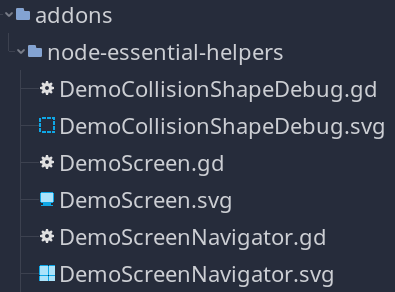

---
aliases:
- /open-source/guidelines/godot-gdscript/
author: nathan
date: "2019-07-16T08:34:54+09:00"
description: This guide covers some best practices to write solid GDScript code and
  keep a sane code-base when developing projects of growing sizes.
menuTitle: GDScript
resources:
- name: banner
  src: banner.jpg
title: Godot GDScript guidelines
weight: 5
---

This guide covers our guidelines when writing GDScript code.

We use it to keep our code clean and maintainable. It builds upon the [official GDScript guidelines](http://docs.godotengine.org/en/stable/getting_started/scripting/gdscript/gdscript_styleguide.html).

We will cover:

1. Our code writing style. We will start with an example, then break down every guideline we follow.
1. The use of static type hints. We use them to minimize errors and improve autocompletion.
1. Our naming conventions.
1. Avoiding null references.
1. Writing self documenting code.

This guide focuses on the details of how we write GDScript code at GDQuest.

For our Godot demo creation guidelines, check out this document instead: [Coding godot demos for tutorials](/docs/guidelines/best-practices/creating-demos).

We wrote these GDScript programming guidelines with a few goals in mind:

- To avoid coupling and having systems depend on (or break!) one another.
- To manage boundaries, that is to say, the places where different systems interact with one another.
- To keep the code readable while working as a team. As developers, we spend more time reading code than writing it.

## Complete example

Here is a complete class example that follows our guidelines. We'll break it down in the following section.

```gdscript
# Hierarchical State machine for the player.
#
# Initializes states and delegates engine callbacks to the state.
class_name StateMachine
extends Node


signal state_changed(previous, new)

export var initial_state := NodePath()

onready var state: State = get_node(initial_state) setget set_state
onready var _state_name := state.name


func _init() -> void:
		add_to_group("state_machine")


func _ready() -> void:
		connect("state_changed", self, "_on_state_changed")
		state.enter()


func _unhandled_input(event: InputEvent) -> void:
		state.unhandled_input(event)


func _physics_process(delta: float) -> void:
		state.physics_process(delta)


# Replaces the current state with the state at `target_state_path` if the path
# is valid. Passes the `msg` dictionary to the new state's `enter` function.
func transition_to(target_state_path: String, msg: Dictionary = {}) -> void:
		if not has_node(target_state_path):
				return

		var target_state := get_node(target_state_path)
		assert(target_state.is_composite == false)

		state.exit()
		self.state = target_state
		state.enter(msg)
		Events.emit_signal("player_state_changed", state.name)


func set_state(value: State) -> void:
		state = value
		_state_name = state.name


func _on_state_changed(previous: Node, new: Node) -> void:
		print_debug("state changed")
		emit_signal("state_changed")
```

## Code style and order

Start with the optional `class_name` if needed. Then add the `extends` keyword if the class extends a built-in type.

If you include a class docstring, it should always be at the top and start with two leading dash signs: `##`. This Godot 4 syntax differentiates docstrings from comments and will generate a reference page for your class.

```gdscript
# A brief description of the class's role and functionality.
#
# A longer description if needed, possibly of multiple paragraphs. Properties and method names
# should be in backticks like so: `_process`, `x` etc.
#
# You can use *markdown* in the docstrings.
#
# Keep lines under 100 characters long.
class_name MyNode
extends Node
```

Signals come next and don't use parentheses unless they pass function parameters. Use the past tense to name signals. Append `_started` or `_finished` if the signal corresponds to the beginning or the end of an action.

```gdscript
signal moved
signal talk_started(parameter_name)
signal talk_finished
```

{}
Starting from Godot 3.2, you can write docstrings as a series of comments above any class, property, signal, or function. The GDScript language server will show the comments as part of the description in the docs preview, if your code editor supports this feature. You can also use that to create a code reference with our tool [GDScript Docs Maker](https://github.com/GDQuest/gdscript-docs-maker).
{}

After signals, the order is: enums, constants, exported variables, public variables (regular name), and pseudo-private variables (starting with `_`), in this order.

Enum type names should be in `PascalCase` while the enum values themselves should be in `ALL_CAPS_SNAKE_CASE`. This order is important because exported variables might depend on previously defined enums and constants.

```gdscript
enum TileTypes { EMPTY=-1, WALL, DOOR }

const MAX_TRIALS := 3
const TARGET_POSITION := Vector2(2, 56)

export var number := 0
export var is_active := true
```

_Note:_ for booleans, always include a name prefix like `is_`, `can_`, or `has_`.

After enums and constants, we have public and then pseudo-private member variables. Their names should use `snake_case` and `_snake_case_with_leading_underscore` respectively.

Define setters and getters when properties alter the object's state or if changing the property triggers methods. Do this carefully to avoid losing track of hidden alterations and behaviors.

Include a docstring in the setters/getters if they modify the node/class state in complex ways.

Start with a leading underscore when writing setters or getters for a private variable just like you would for the variable itself.

```gdscript
var animation_length := 1.5
var tile_size := 40
var side_length := 5 setget set_side_length, get_side_length

var _count := 0 setget _set_count, _get_count
var _state := Idle.new()
```

Place `onready` variables right before `_init` and/or `_ready` functions to visually connect these with their usage inside the `_ready` function.

```gdscript
onready var timer := $HungerCheckTimer
onready var ysort := $YSort
```

Next, define virtual methods from Godot (the built-in methods starting with a leading `_`, e.g. `_ready`). Always leave 2 blank lines between methods to visually distinguish them from other code blocks.

```gdscript
func _init() -> void:
	pass


func _process(delta: float) -> void:
	pass
```

For signal callbacks, we use Godot's convention, `_on_NodeName_signal_name`:

```gdscript
func _on_Quest_started(which: Quest) -> void:
	#...
```

You should remove `NodeName` if the object connects to itself:

```gdscript
class_name HitBox
extends Area2D


func _ready() -> void:
	connect("area_entered", self, "_on_area_entered")
```

Then, define public methods. Include type hints for variables and the return type. You can use a brief comment to describe what the function does and what it returns.

Start the sentence with `Returns` when describing the return value. Use the present tense and active voice. See Godot's [documentation writing guidelines](//docs.godotengine.org/en/latest/community/contributing/docs_writing_guidelines.html) for more information.

```gdscript
func can_move(cell_coordinates: Vector2) -> bool:
	return grid[cell_coordinates] != TileTypes.WALL
```

Use `return` only at the beginning and end of functions. At the beginning of the function, we use `return` as a guard mechanism if the conditions for executing the function aren't met.

**Don't** return in the middle of the method. It makes it harder to track returned values.

Here's an example of a **clean** and readable method:

```gdscript
# If this sector has a planet, checks the 8 sectors around it.
# If there are planets in those sectors, creates a travel lane between the two of them.
func _generate_travel_lanes(sector: Vector2) -> void:
	var planet: Dictionary = _sectors[sector].planet
	if not planet:
		return

	for neighbor in NEIGHBORS:
		var neighbor_sector: Vector2 = sector + neighbor
		if not _sectors[neighbor_sector].planet:
			continue

		var neighbor_position: Vector2 = _sectors[neighbor_sector].planet.position
		_sectors[sector].travel_lanes.append(
			{source = planet.position, destination = neighbor_position}
		)
```

## Use static type hints

We use static types to help write more insightful code and help avoid errors.

At the time of writing, static typing doesn't provide any performance boosts in GDScript. But it gives you better code completion and error reporting. In the future, it should give you major performance improvements over dynamic code as well.

To get started with GDScript's type hints, read [Static typing in GDScript](//docs.godotengine.org/en/latest/getting_started/scripting/gdscript/static_typing.html) in the official manual.

#### Use type inference when possible

Normally, you define typed variables like this:

```gdscript
var direction: Vector2 = get_move_direction()
```

But if `get_move_direction` has a return type annotation, Godot can infer the type of the variable for us. In that case, we only need to add a colon after the variable's name:

```gdscript
func get_move_direction() -> Vector2:
	var direction := Vector2(
		#...
	)
	return direction

var direction := get_move_direction() # The variable's type is Vector2
```

**Let Godot infer the type whenever you can**. It's less error prone because the system keeps better track of types than we humanly can. It also pushes us to have proper return values for all the functions and methods we write.

Since the compiler doesn't enforce static types, sometimes we have to help it out. Take the following example:

```gdscript
var array := [1, "Some text"]
var text: String = array.pop_back()
```

The `Array` can contain values with different types. In the example above, we have both an `int` and a `String` stored in the array. If you only wrote `var text := array.pop_back()`, Godot would complain because it doesn't know what type the `pop_back` method should return.

If we open the code reference with <kbd>Shift+F1</kbd> and search for the method, we see that:

```
Variant pop_back()
	Remove the last element of the array.
```

`Variant` is a generic type that can hold any type Godot supports. That's why we have to explicitly write variable types when dealing with these functions: `var text: String = arr.pop_back()`.

You'll face this issue with all built-in methods that return the engine's `Variant` type.

## Avoid `null` references

**Use `null` only when you have to**. Instead, think about alternatives to implement the same functionality with other types.

Using `null` is often a lost opportunity to have a value that makes sense instead, like `Vector2.ZERO`, or to simplify code, removing unnecessary state checks, i.e.:

```gdscript
if not variable:
	return
```

With type hints and type inference you will naturally avoid `null`:

```gdscript
var speed := Vector2.ZERO
var path := TrajectorySpline.new()
```

This said, it's impossible to get rid of `null` completely because GDScript relies on built-in functions that work with `null` values.

{}
`None`, `null`, `NULL`, and similar references may well be the biggest mistake in the history of computing. Here's a detailed explanation from the man who invented it himself: [Null References: The Billion Dollar Mistake](//www.infoq.com/presentations/Null-References-The-Billion-Dollar-Mistake-Tony-Hoare).
{}

## Write self-documenting code and use comments sparingly

If you need comments to explain most of what your code does, you can most likely rewrite it to make it more transparent for everyone. When working together for an extended period, code readability is essential for everyone to stay productive.

Use clear variable names in plain English and write full words. E.g. `character_position` and not `char_pos`. The same goes for method names.

**Do not** repeat words in the method's name and its arguments. E.g. write `Inventory.add(item)`, not `Inventory.add_item(item)`. The same goes for signals.

Use plain verbs instead of repeating the class name in signals:

```gdscript
class_name Event
extends Node

signal started
signal completed
```

You _may_ use short variable names for local variables inside your methods to avoid repeating a type hint.

In the example below, the variable `e`, an instance of `Element`, only appears in 4 consecutive lines so the code stays readable:

```gdscript
func _set_elements(elements: int) -> bool:
	#...
	for i in range(elements):
		var e := Element.new()
		e.node_a = "../StaticBody2D"
		e.position = skin_viewport_staticbody.position
...
```

### Use comments if they save time or add key explanations

Your code should be **self-explanatory whenever possible**. Sometimes you may have a long block of code that you can't change, or some strange code to work around an engine bug.

In these cases, writing a short comment above the corresponding block can save everyone a lot of time, including your future self.

In this example, the code involves transforming and multiplying matrices to calculate a position in Godot's 2D viewport. A one-line comment can capture what it does and avoid having to make sense of the calculations:

```gdscript
func drag_to(event_position: Vector2) -> void:
	# Calculate the position of the mouse cursor relative to the RectExtents' center
	var viewport_transform_inverse:= rect_extents.get_viewport().get_global_canvas_transform().affine_inverse()
	var viewport_position: Vector2 = viewport_transform_inv.xform(event_position)
	var transform_inverse:= rect_extents.get_global_transform().affine_inverse()
	var target_position: Vector2 = transform_inv.xform(viewport_position.round())
```

In the following example, the comment explains why a seemingly strange line of code is necessary. This ensures another developer doesn't remove it accidentally:

```gdscript
extends BattlerAI

func choose_action(actor: Battler, targets: Array = []):
	# We use yield even though the action is instantaneous
	# because the combat system expects this method to use a coroutine
	yield(get_tree(), "idle_frame")
	#...
```

## File naming and folder conventions

We follow some guidelines to keep the name of our files meaningful and consistent.

We arrange and name our files in a way that reflects and informs us on the project's code structure.

In short, the rules are:

- Name directories, scenes, and script files in `PascalCase`.
- Name scripts and scenes after a scene's root node.
- Name other files without spaces in the name.
- Group assets, scripts, and scenes together whenever possible.

### Naming directories and files

Our main guideline is to use `PascalCase` for everything that represents a category or a "class" in our project.

We use `PascalCase` for directories, scripts, and scenes, but also to name individual nodes inside of scenes.



For other files, we just make sure to not leave spaces in the names. This is mostly because we use command line tools to process files, and avoiding spaces makes them a little easier to handle.



Always name your script and scene after the scene's root node if applicable. This makes it much easier to search for the files corresponding to a scene.
When you update a scene's filename, be sure to update the scenes root node and the corresponding script file.

### Group assets, scripts, and scenes together

We try to group files together in our Godot projects.

This helps to:

- Keep dependencies together, reducing search time on the project.
- Use relative file paths in scripts and limit errors when moving files.
- Have a folder structure that gives you information about the application's architecture.

It comes at a little maintenance cost, as you sometimes need to move files when re-factoring the code.

If a `Character` scene uses two sprites and two different scripts, the scene file, the sprites and description should all be in one directory named `Character`. You would also want to include sounds and other resources that are exclusive to the character in the same directory.

For files that are shared across multiple scenes throughout the project, like the UI theme resource, reusable sprites, sounds, shaders, or even scripts and scenes, we place them in a directory named `Common`.

In the `Common` directory, we follow the same principles as stated above, trying to group related files together.



In some cases, we use Godot's `addons` directory. This is mostly for files that we want to or may reuse across projects, besides editor plug-ins.



## References

In this style guide, we drew inspiration from the work of the Python community, some functional programming principles, and the official GDScript documentation:

1. [GDScript Style Guide](//docs.godotengine.org/en/stable/getting_started/scripting/gdscript/gdscript_styleguide.html)
1. [Static typing in GDScript](//docs.godotengine.org/en/stable/getting_started/scripting/gdscript/static_typing.html)
1. [Docs writing guidelines](//docs.godotengine.org/en/latest/community/contributing/docs_writing_guidelines.html)
1. [Boundaries - A talk by Gary Bernhardt from SCNA 2012](//www.destroyallsoftware.com/talks/boundaries) & [Functional Core, Imperative Shell](//www.destroyallsoftware.com/screencasts/catalog/functional-core-imperative-shell)
1. [The Clean Architecture in Python](//www.youtube.com/watch?v=DJtef410XaM)
1. [Onion Architecture Without the Tears - Brendan Richards](//www.youtube.com/watch?v=R2pW09tMCnE&t=1095s)
1. [Domain Driven Design Through Onion Architecture](//www.youtube.com/watch?v=pL9XeNjy_z4)
