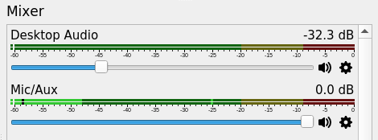
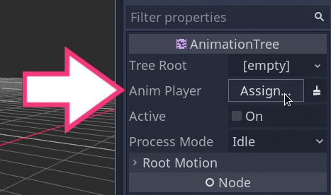

+++
author = "nathan"
date = "2019-07-07T09:34:00+09:00"
description = "This document is a living tool to help us improve the educational value and the consistency of our video lessons."
title = "Best Practices: Making Videos"
menuTitle = "Making Tutorials"
weight = 4
aliases = ["/open-source/guidelines/gdquest-videos/"]

+++

This document is a living guide to help us improve the quality and consistency across all our tutorials. It focuses on practical tips about writing, recording, and editing. For notes on education, see [Education in online tutorials]().

Creating great videos starts with **planning**, **writing**, and **recording good footage**. I detail my approach to this in the video below.



## Check-list ##

Recording:

1. Open all the programs you need: [Key Mon](https://code.google.com/archive/p/key-mon/) to screencast keys, [Open Joystick Display](https://ojdproject.com/), etc.
1. Make the main program you're recording full-screen.
1. Warm up your voice.
1. Do a short test recording to ensure that everything is working as expected: the microphone is on, etc.

Video editing:

1. Normalize the audio. Listen to the audio to do so, don't rely on the waveforms, they can be misleading.


## Video recording ##

You will save a lot of time if your source material is clean and your speech precise. If you don't take the time to plan, you will limit the quality of your tutorial.

You should always record:

- At **1920x1080**, in full-HD
- At **29.97 Frames Per Second**, also called NTSC or NTSC film

Your footage should be smooth, not choppy. Be careful that the framerate does not drop in your recordings. To do so, I recommend you to do a test recording at the start of recording sessions or when you change your recording environment. This way you'll ensure that the visual quality and audio levels are working as expected.

You should **suppress or close any program that can distract the viewer** from the tutorial:

- Turn off Notifications
- Close chat applications
- Make the programs full-screen
- Suppress system sounds

**Avoid waving the mouse cursor** as you talk. Put the mouse or stylus down when you're talking, and you're not pointing at anything in particular. The motion can be distracting.

**Set the desktop audio channel to record at a low volume** so it doesn't cover your voice. I keep it at -20db to -30db most of the time in OBS Studio.



When you make a small mistake or need to re-record a sentence, **clap in front of the mic**. This produces a sharp vertical line on the audio waveform that makes it easy for the editor to find and remove the faulty parts.


### Setting up the microphone ###

The closer you are to the microphone when you record, the louder your voice will be relative to the sound reflected by your environment. You should place the microphone no more than 50cm away from your mouth if you can.

Don't place your mouth right next to the microphone if you still move your head while recording: your movement will cause significant changes in your voice's volume.

The voice should be normalized at around -6db. Use other YouTube videos or one of your recordings with good audio levels for reference. Always check your edit against the reference before exporting your video.

### Preventing mouth noises ###

Mouth noises happen when your mouth is dry, or after drinking coffee, tea, and some other beverages.

If you drank one of these, try to brush your teeth, tongue, and palate before recording.

Keep a bottle or a glass of water next to you to stay hydrated.

### Warming up ###

The mouth and vocal folds move thanks to muscles. To articulate to your fullest and to get the most out of your voice, you need to warm up, like before any exercise. At least for a minute or two.

**The longer the recording session, the longer you should warm up**.

Here's a [short vocal warm up](//www.youtube.com/watch?v=9tXK7cw9mrg) from Julian Treasure's TED talk. You want to warm up your lips, your tongue, and your jaw. The siren exercise then focuses on the vocal cords. To improve pronunciation of specific sounds, add a few [tongue twisters](//pun.me/pages/tongue-twisters.php): they'll serve both as an exercise and complete your warm up.

### Take your time ###

If you're struggling to explain something while recording, clap, and take the time to breathe and to think. Rehearse the complex idea in your mind or in front of the microphone. You can leave the recording running in the meantime. When you're ready, do a clean and confident take. It's easy to edit the long silence out later.

### Program layout ###

Use one of the default interfaces and, when possible, the default interaction mode for the program covered in the video.

E.g. for Blender 2.80 and up, left click is the default to select and grab objects. As viewers stumble upon videos organically and generally won't watch them in a particular order, the tutorials should stay close to the programs' default settings. There are some exceptions for tools like the shell, vim, or emacs that, once you've learned the basics, you are meant to customize a lot.

Make the program **full-screen** whenever possible. Many programs use the <kbd>F11</kbd> key or a related shortcut for that.

- For Godot, before recording, go to Editor -> Editor Layout -> Default to reset the interface.
- For Krita, I recommend using the Big Paint workspace over the default, as it centers the canvas on screen. It also shows the Layers, color palette, tool options, document overview, brushes, toolbox, and advanced color selector: everything you need to paint is visible on screen.

### Font size ###

The font size should be large enough for the video to read on a tablet, or depending on the video, on a large mobile phone in landscape orientation. If the program supports it, increase the font size to 20pt or more.

For instance, in Godot, I use 20pt for the editor's font and 23pt for the code. Past 20pt, the editor's layout can feel too packed.


## Video editing ##


Avoid abrupt cuts in both the audio and the video. You should cut mistakes and long silences or hesitations, but avoid cutting too much between words. 

When editing live action footage, like interviews that are face camera, inserting many cuts can make the video feel robotic or sped up. There's a natural rhythm to the human speech we should preserve.

### Make the flow of the video easy to follow ###

Assume the viewers are facing new information and have a big cognitive load when watching educational videos. Anything that makes it harder to keep track of what the teacher is doing increases that load:

1. The lack of visual continuity between shots, like jumping between files without mentioning it.
2. Making changes in the project without communicating them to the student.

That is why you should use the visuals, audio cues, and your voice to make understanding minor details of the tutorial as comfortable as possible.

Mention and show things such as:

- Navigating through the program.
- Navigating through code.
- Or when you bring up a topic that's not illustrated by the original recording.

When navigating around the interface or documents, show how you get there with the mouse cursor. If possible, also tell the viewer where you are going.

### Use a program to screencast key presses ###

Use a program like [Key-Mon](https://code.google.com/archive/p/key-mon/) to display key presses, mouse clicks, etc.


You can install Key-Mon using the Python package manager: `pip install key-mon`.

That way, even if you forget to mention a keyboard shortcut, the viewer can see it in the video. This also reinforces vocal cues.

### Use the animated arrow to point at UI elements ###

Often, there are situations where we have to move from one side of a program to another. 

For example, after creating a node in Godot, in the docker on the left, we configure it in the inspector on the opposite side of the screen.

The blender `video.blend` template includes an animated pointer arrow.



Use this arrow to help guide the student's eye to small icons or when jumping to a distant area of the interface. Especially when it's not obvious on screen.

## Automating tasks ##

You can save time on repetitive tasks and increase your productivity following conventions and using simple programs.

### Using conventions ###

To be as efficient as possible, follow the same process and naming conventions to record videos. This helps to later batch-process videos using code.

Try to record several videos in a single recording sessions and name them as you go. For series, start each recording with a two-digit number. For new videos, change the number.

Here is an example with three video projects recorded in five segments:

```
01.intro-fsm.flv
02.importing-start-dir.flv
03.state-class-01.flv
03.state-class-02-fix-end.flv
03.state-class-03-fix-end-2.flv
```

When a video is made of several recordings, you can number the parts to keep them sorted.

Create a folder for each series where you will place all the recordings.

With these naming conventions, you can then create projects in batches using a command line script.

### Creating video projects in batches ###

The fish shell script below creates a blender video project for each set set of recordings, following the naming conventions above.

It creates a directory for each video project, create a blender project from a template, and move all the footage to a subdirectory called "footage" in each folder.

For example, from the files above, the script will create the following structure:


```
.
├── 01.intro-fsm
│   ├── 01.intro-fsm.blend
│   └── footage
│       ├── 01.intro-fsm.flv
├── 02.importing-start-dir
│   ├── 02.importing-start-dir.blend
│   └── footage
│       ├── 02.importing-start-dir.flv
├── 03.state-class-1
│   ├── 03.state-class-1.blend
│   ├── footage
│   │   ├── 03.state-class-1.flv
│   │   ├── 03.state-class-2-fix-end.flv
│   │   ├── 03.state-class-3-fix-end-2.flv
```

To use the script, you need:

1. The [fish shell](//fishshell.com/) installed.
1. A template blend file called `video.blend` in your `~/Templates/` directory.

How to use:

1. Copy the code below.
1. Open the folder that contains all the videos with the fish shell.
1. (Optional) Make a backup of the files.
1. Paste the code below in your terminal.


#! /usr/bin/fish
set temp_file mktemp
for v in *.flv; string replace .flv "" $v >> $temp_file; end
for i in (cat $temp_file | uniq -w 3)
    mkdir -p $i/footage
    mv (string sub -l 2 $i)*.flv $i/footage
    cp ~/Templates/video.blend $i/$i.blend
end
rm $temp_file



