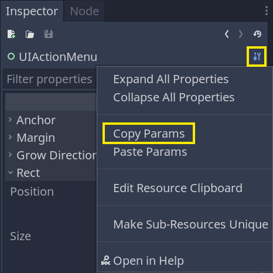
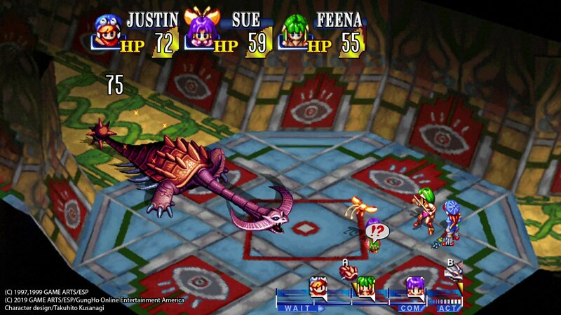
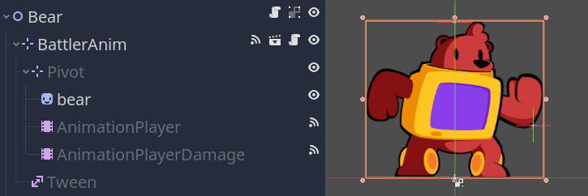
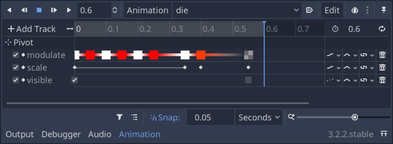
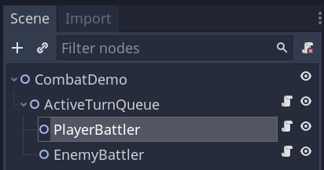
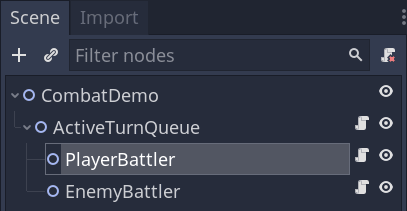
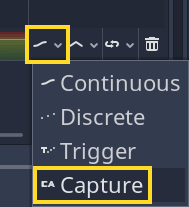
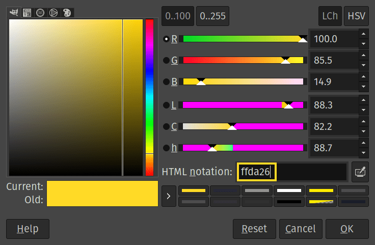

+++
title = "Taking great pictures"
description = "Our guidelines "
author = "nathan"

date = 2021-05-23
weight = 4
+++

These are all our guidelines regarding creating pictures, animated GIFs, and inline videos for our online tutorials and courses.

You want to:

- Use many contextual pictures.
- Set up Godot's interface to take consistent screenshots.
- Crop, trim, and outline pictures in a certain way.
- Keep inline videos and animated GIFs to a minimum.
- Optimize your file sizes with our image and video optimizer programs.

## Use many contextual pictures

You want to use many small and contextual images to help people visualize what you are talking about. It's a critical part of writing great tutorials and guides.

Whenever you talk about properties in the _Inspector_, add a small image of that property and include the surrounding ones to help the user locate it.



If you're talking about different kinds of games, try to include a screenshot of a popular game. That way, the reader instantly understands what you mean.



Or, if they're not familiar with the genre, they can look for a video of the game.

## Setting up the Godot interface for consistent images

We should all have the same interface in Godot to take consistent screenshots:

- Use the default editor theme.
- Work with a 1920×1080 resolution.
- Set the editor's font size to 22 points.
- Set the code font size to 24 points.



The resolution and font size make the pictures readable for people who have problems with their eyesight or work on small screens.

In particular, it makes the images readable on mobile devices like phones and tablets, which are prevalent in a fair part of the world.

## Cropping and outlining pictures

We want to make screenshots as easy as possible for the user to read and understand.

To do so, you want to:

- Crop pictures to only show what's necessary.
- Trim pictures automatically for a clean and consistent look.
- Use a yellow stroke to outline a key area of the screenshot when necessary.

### Cropping and trimming pictures

You should never show more than necessary.

Showing irrelevant parts of the interface adds visual noise. It makes it harder to understand where to look in the screenshot.

For example, if you're talking about an animation, take a screenshot of the animation editor. Or you could take a shot of the animation editor along with the viewport.



You do not want to include the _Inspector_, the _Scene_ dock, and other parts of the interface unless necessary.

You can use a screenshot tool like [Flameshot](https://flameshot.org/) (Linux), [Lightshot](https://app.prntscr.com/en/index.html) (Windows and MacOS), or [ShareX](https://getsharex.com/) (Windows) to finely crop the image as you capture it.

In some cases, you will need a more powerful image editor like [GIMP](https://www.gimp.org/), which offers great crop and selection tools.

#### Trimming inconsistent borders

We trim our pictures to remove inconsistent borders around screenshots of docks.

When you take a screenshot on the fly, you might have a little bit of a border left around it with a different thickness on the left and right side of the image.



You can use an image editing tool to trim it automatically and make the result look cleaner.



You don't have to do this operation as you capture the pictures: as with cropping, you can do it all in one batch at the end of the writing process.

You can trim images manually or in batch using a program like GIMP.

Another great option is to use the command line program [ImageMagick](https://imagemagick.org/index.php).

On Linux, when it's installed, you can run the following command to trim images in place.

```sh
mogrify -trim file1.png file2.png file3.png
```

### Outlining part of the interface

When you want to point out a part of the interface, outline the area with a 4 pixels yellow border.



We use that tone for colorblind people, as other tones can blend with Godot's background depending on the type of colorblindness.

You can use a program like GIMP to do so:

1. Open the image in GIMP.
1. Set the color to the following yellow tone with the color selector: `#ffda26`



1. Select the area to outline with the rectangle selection tool (<kbd>R</kbd>).
1. Use the _Edit -> Stroke Selection..._ option and set the stroke width to `4` pixels.

From the next time onward, you can type <kbd></kbd>/ and look for _Stroke Selection_ (without the ellipsis) to instantly apply your predefined stroke.

## Animated GIFs and inline video clips

You sometimes want to include animated pictures and videos to better illustrate what is happening in the tutorial or the corresponding Godot demo.

We have some guidelines for those:

- Use video clips sparingly. This is mostly because our online platform does not support inline videos, so we need a fallback for the online version of the course.
- Shorter is better. Keep video clips under 10 seconds. Even under 5 seconds if you can.
- Isolate exactly what you're trying to illustrate.
- Only capture the portion of the screen you need to capture.
- For animated GIFs, use as few frames and as small a size as possible.

## Optimize all images and videos

We try to keep our course files small for people with slow Internet. A fair part of our audience lives in countries where the Internet is slow or with limited bandwidth.

Before publication, you always want to optimize all your pictures. You can do that in batch using the [optimise_images.sh](https://github.com/GDQuest/product-packager/blob/master/programs/optimize_pictures.sh) script in the product package.

It automatically compresses jpg and png images and optionally resizes them.

```sh
# The -s option uses ImageMagick's resize syntax. The \> means "only scale down
# if the image is bigger than this resolution."
# The -i option overwrites the images. Be sure to check the pictures in git
# before running the program.
optimize_pictures.sh -s 960x800\> -i -- *.png
```

You need ImageMagick installed and available on the `PATH` to use it.

We have a similar script for MP4 videos: [optimise_videos.sh](https://github.com/GDQuest/product-packager/blob/master/programs/optimize_videos.sh).

You need [FFmpeg](https://ffmpeg.org/) installed and available on the `PATH` to use it.

Both these programs can scale down your images and videos. When a user reads the tutorial in the browser, the reading area will never get past 960 pixels wide, so that's the maximum width we use for our images.

For inline videos, we generally go with a resolution of 1280×720 as the users can enlarge them and watch them fullscreen.

Here's a command to do so.

```sh
# The --tune animation option optimizes the output for Godot's interface and our
# games' cartoony graphics.
# The resize syntax follows ffmpeg's syntax. It's a bit cryptic so you can
# copy-paste this.
# It only downscales the video if it's larger than 1280 pixels and ensures the
# output resolution is divisible by 2.
optimize_videos.sh --tune animation --no-audio --resize "'min(1280\,iw)'":-2 -i **.mp4
```

You can optimize files only once, in batch, when you finish writing an entire series. You don't have to do it as you go. A reviewer or project maintainer can also do it for you.
