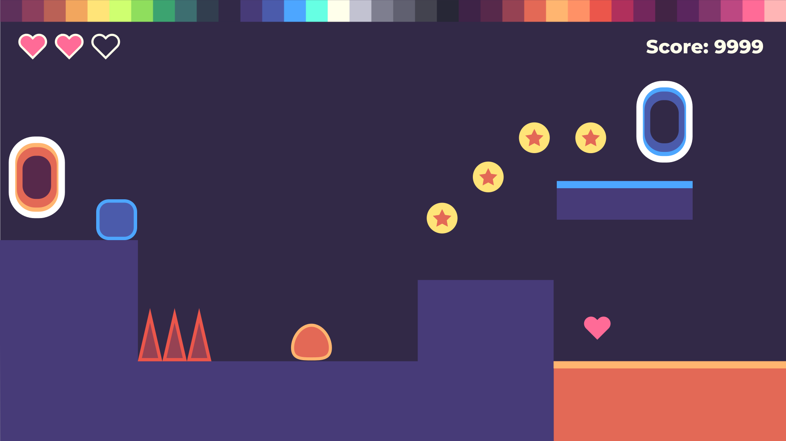
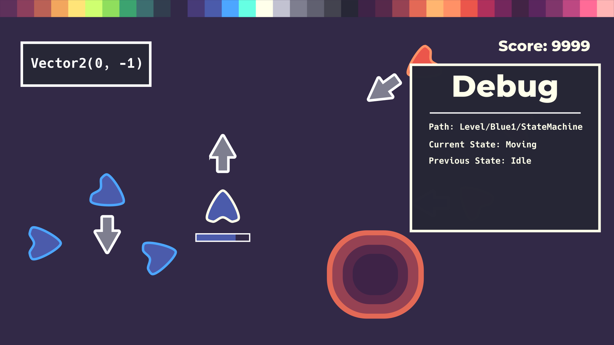
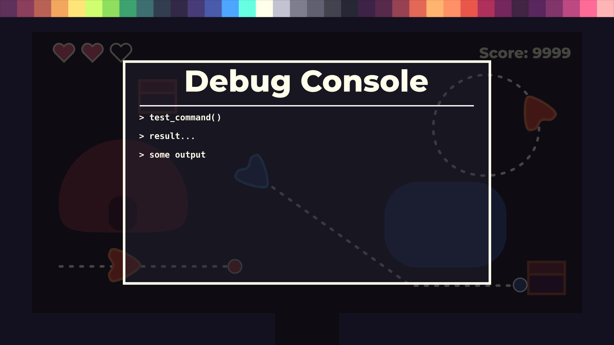
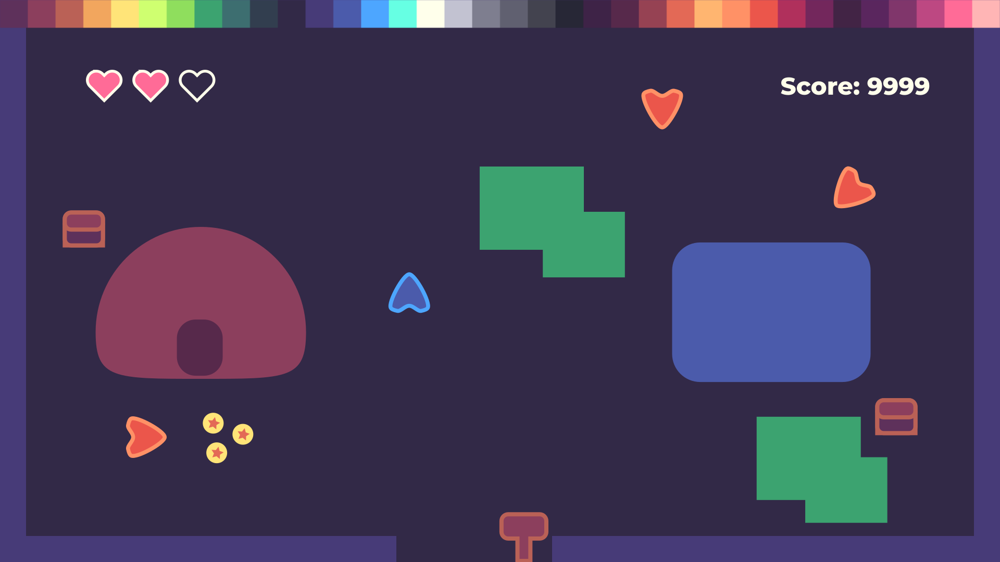
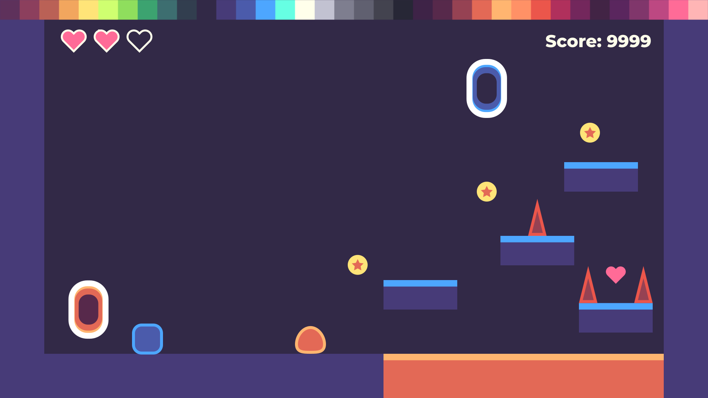
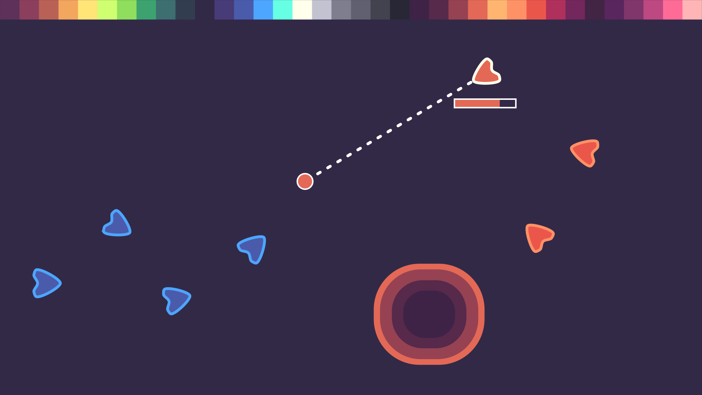
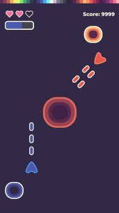

+++
title = "Game art style guide"
menuTitle = "Art style guide"
description = "This document describes an accessible art style to create game art efficiently. This is the style we use in our Godot tutorials."
author = "henrique"
date = "2020-02-06"
weight = 5
+++

This document describes an accessible art style to create game art efficiently. This is the style we use in our [Godot tutorials](https://youtu.be/Mc13Z2gboEk). It uses flat design to make the sprites read well.

We designed this visual language to be:

- **Clear**. The game should always read well.
- **Colorful and appealing**. We want it to be warm and to attract the eye.
- **Accessible** even to inexperienced digital artists. It relies on simple shapes and vector graphics.

## Colors ##

We use the [Pear36 color palette](https://lospec.com/palette-list/pear36) for all of our sprites. With 36 colors, it has enough to hues to distinguish most props in the game, and not so many colors it becomes hard to pick them.

Here are some rules of thumbs to pick good colors.

### Value contrast ###

Use value contrast to make gameplay assets more visible than the background: 

- Use bright tones for the characters, enemies, loot, and interactive objects.
- Use darker tones for trees, the grass, houses, and everything that's part of the background.

You should also use outlines to highlight important sprites.

### Picking good hues ###

You can use the natural hue of an element whenever possible, like orange and red for lava, or brown for a tree's trunk.

However, there are many cases where colors are symbolic, like a green bar to represent the health of a character. In that case, look for references, and use common conventions:

- Red is a good tone to convey danger, but also love or life, as in a red heart.
- You can use green to represent health, healing, bonuses, or endurance.
- Yellow stands out and works well for coins, but also indicators like an arrow that tells the player where to go, or a quest marker.

There are no hard rules there. What matters is that the players understand the game from its graphics.

{}
You may have seen infographics about [the meaning of colors](https://www.color-meanings.com/). Take them with a pinch of salt. The perception of colors varies between cultures and depends on the context. I've read multiple times that purple would be the color of royalty. But if you look at historical portraits or outfits of kings and queens, you'll find a lot of red, gold, beige, or black. These are the colors that come to my mind when thinking of "royalty."
{}

### Complementary colors ###

Complementary colors are colors that, when mixed, cancel out each other, turning out gray. On the computer, in the RGB color model, these colors correspond to hues that are opposite on the color wheel.



These colors offer a striking visual contrast. You can use them to express relationships between game elements: 

- Orange and blue portals can be two parts of the same system.
- Blue walls and floor can suggest a safe environment while the red lava reads as unsafe.
- A green player and a purple enemy suggest opposite entities.

### Use lighter outline colors ###

With a dark background, a bright outline offers maximum visual contrast. That's why we use a lighter outline color compared to a sprite's fill.

Not every element needs outlines. In the image at the top of this guide, the coins stand out thanks to their bright yellow fill.

## Shapes ##

Minimalism is the core of the shapes design, simplicity is core and helps distinguish each individual element.

- Reliable elements are usually represented by squares. These are elements which behavior is predictable and consistent: the player which is a reliable character, static platforms, floor, walls, even the lava since its behavior is consistent
- Circles usually represent interactive elements. The coins, the heart, the top part of the enemy since players can stomp them, the portals...
- Triangles usually convey danger and avoidance, use them for elements that cause damage on contact, or to give direction, as in the enemy that is a mix of a circle and a triangle, meaning its top part is safer than its sides
- You can mix those characteristics to convey better meaning with slightly more complex shapes(see below): the meteors are 2 sized circles to easily distinguish their rotation, the players are notched triangles to communicate their look direction, bullets are capsules to convey movement...

## Type ##

We are currently using *Montserrat Bold* font for most of the text used in game, it is a good *sans serif* font with enough weight to be readable and still maintain its place in the game screen's hierarchy.

When teaching we often use Debug elements that need to be readable yet distinguishable from ingame elements in order to properly explain technical information. For that we use a *monospace bold* font.

Some interactive debug elements are better as transparent, allowing to immediately perceive how our input propagates inside the game.

## Conclusion ##

With this in mind you can be as creative as necessary to express meaningful information without complexity and focus on teaching good game development concepts with quality visuals.

In sum:

- Form follows function
- Each element should be distinct and unique
- Simplicity and elegance over complexity
- High abstraction through conservative and well established concepts

## Resources ##

- Pear36: https://lospec.com/palette-list/pear36
- Montserrat font family:https://fonts.google.com/specimen/Montserrat
- Monospace font: https://fonts.google.com/specimen/PT+Mono
- Flat design principles
  - https://designmodo.com/flat-design-principles/
  - https://simplicable.com/new/flat-design

## Elements ##

| Name  | Graphic   |
|------	|:---------:	|
|Topdown Player	||
|Topdown Player Selected||
|Topdown Enemy||
|Topdown Enemy Selected||
|Topdown Neutral||
|Sidescroll Player||
|Sidescroll Enemy||
|Sidescroll Portal Orange||
|Sidescroll Portal Blue||
|Topdown Portal Orange||
|Topdown Portal Blue||
|Chest||
|Coin||
|Heart||
|Sign||
|Spike||
|Projectile Enemy||
|Projectile Player||

## Samples ##

| Name  | Graphic   |
|------	|:---------:|
|Landscape Topdown Shooter||
|Landscape Platformer||
|Landscape Topdown Strategy||
|Main Screen||
|Options Menu||
|Portrait Topdown Shooter||
|Portrait Platformer||
|Portrait Topdown Adventure||
|Debug Console||
|Topdown Debug Mode||
