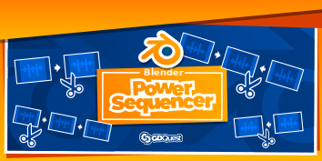

---
aliases:
- /blender/power-sequencer/
- /docs/documentation/power-sequencer
chapter: false
date: "2018-01-04T19:46:48+01:00"
description: The Free Blender add-on for video editors
title: Blender Power Sequencer
weight: 5
---

At GDQuest we edit all of our videos with [Blender](https://www.blender.org/). It's a powerful tool, but its default workflow can feel a little slow.

That's why we built [Power Sequencer](//github.com/GDQuest/Blender-power-sequencer/), a **Free and Open Source** add-on to help you edit faster with Blender's Video Sequence editor.

Power Sequencer comes preinstalled with Blender since version 2.81.

## Learn Power Sequencer ##

The following pages will teach you how to use Power Sequencer:

1. [Getting started](getting-started) will help you learn the basics.
1. [Features reference](reference) lists all the features and shortcuts in the add-on.

We also made some video tutorials:

1. [Intro to Video Editing with Blender's VSE](https://www.youtube.com/watch?v=Zcj4onvP06w), a general introduction to Blender's Video Sequencer.
1. [Power Sequencer Workflow tutorial](https://www.youtube.com/watch?v=xZoZaSsuhXw) is dedicated to the add-on and its editing workflow.

You can find more in our playlist [Free Blender VSE tutorials](https://www.youtube.com/playlist?list=PLhqJJNjsQ7KFjp88Cu57Zb9_wFt7nlkEI) on YouTube.

## Become a Contributor ##

Whether you want to contribute code, help with testing, design, user interface, tutorials, or communication, **all contributors are welcome**!

You can come and chat with us on [GDQuest's Discord server](https://discordapp.com/invite/KVaCsSP)!

See our [Contributor's Guidelines](http://gdquest.com/open-source/contributing-guidelines/) to learn about how to contribute efficiently to Free Software. If you're a developer, check our [Blender Python best practices](https://www.gdquest.com/open-source/guidelines/blender-python/). They can help you avoid programming issues.

Then, join the discussion in the [issues tab](https://github.com/GDQuest/Blender-power-sequencer/issues) anytime!

## Other add-ons ##

Here are other recommended add-ons for a better editing workflow:

Daniel Oakey's [rewrite of VSE Transform Tools](https://github.com/doakey3/VSE_Transform_Tools). This tool lets you animate and move strips from the video preview. The original add-on was abandoned a few years ago. Daniel fixed and rewrote it so now it's super slick!

Power Sequencer ships with two separate Python tools:

1. [BPSRender](https://github.com/GDQuest/BPSRender), a tool to render videos with multiple threads from the terminal.
1. [BPSProxy](https://github.com/GDQuest/BPSProxy), a program to render proxies fast using FFmpeg and, if your graphics card supports it, use hardware acceleration.

