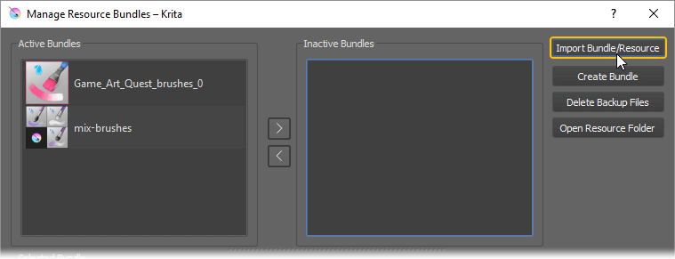

<!-- PAGE INNER NAVIGATION -->

    <a href="">
      <button type="button" class="btn btn-default btn-lg">
        <i class="fa fa-paint-brush text-success"></i> The brushes
      </button>
    </a>

    <a href="">
      <button type="button" class="btn btn-default btn-lg">
        <i class="fa fa-file text-info"></i> Installation guide
      </button>
    </a>

    <a href="">
      <button type="button" class="btn btn-default btn-lg">
        <i class="fa fa-question text-info"></i> FAQ
      </button>
    </a>
    <!-- <button type="button" class="btn btn-default btn-lg">
      <i class="fa fa-dollar text-success"></i>Buy the brushes!
    </button> -->
    
    <a class="gumroad-button" href="https://gum.co/game-art-quest-brush-pack" target="_blank">Buy the brushes!</a>

<!-- Pills example -->
<!-- <ul class="nav nav-pills nav-justified">
  <li><a href="#">Home</a></li>
  <li><a href="#">Menu 1</a></li>
  <li><a href="#">Menu 2</a></li>
  <li><a href="#">Menu 3</a></li>
</ul> -->

# The Game Art Quest Krita brushes {#the-brushes}

The Game Art Quest Krita brush pack was made for the backers of the eponymous [Kickstarter campaign](https://www.kickstarter.com/projects/gdquest/game-art-quest-make-professional-2d-art-with-krita). It is made by a 2d game artist, for game artists. Specifically, for people who create in-game assets. It also works great for digital painters in general.

It follows a few key concepts. The goal is to help you to work **fast**, and to allow you to **focus on your art**. It is a bloat free pack, filled with efficient drawing tools. I favor versatile tools and avoid brush redundancy so you don’t have to keep switching between them to achieve a variety of effects.

The presets are dry for the most part, so you can easily apply thick paint on the canvas. Need a softer blending effect? Use the I and O keys to tweak your opacity and make the brushes weaker. I am slowly building the pack as I draw all sorts of game assets and encounter new challenges. That way, I get to use every single preset in my work and to proof-test them in depth.

The first version features 6 blending and smearing brushes. Over time, I will add basic drawing and shading tools as well as reusable textured brushes to help you paint elements of nature faster (clouds, leaves, rocks…).

Here's how each family of presets works.

## Blending paintbrushes

Those presets are the most flexible ones in the set. They allow you to add color to the canvas, to blend colors together, and to achieve both dry and wet painting effects.

When you select the brush presets, the painting effect is at its maximum intensity. If you want to make it softer, you have to lower the opacity by pressing the I key 1 to 3 times. This will both reduce the amount of paint that is added to the canvas and make the blending effect duller. If you want to make the brush dry again, press the O key to increase the opacity.

Those brushes don’t work like usual pixel brushes with blending modes. To lighten, darken, recolor or erase pixels, use a basic brush.

**Strengths:**

- Can apply both dry and wet paint on the canvas
- Can both push paint and blend colors on the canvas
- Efficient from the blocking to polishing stage

**Weaknesses:**

- Gives your work a painterly quality
- Inefficient with blending modes other than normal
- Bad when used as an eraser

## Smear brushes

The smear brushes pull, push and blur pixels on the canvas. They behave a bit like your finger on charcoal or acrylic paint. They are a bit special and sometimes pointed out as bad tools by digital artists. The reason is that you can’t use them randomly. When you want to smear, you have to know exactly what you are doing. Those brushes can produce ugly results.

There are 2 use cases that I recommend. You can use them:

1.	To sculpt the silhouette of an object
2.	Or to blur out and pull edges

There are specific cases when you can use them for shading, but mastering those presets will take a lot of practice. As they blur pixels, they will remove details in your painting. If that’s not what you’re after, they won’t work for you.

I designed those presets so that they don’t apply any color on the canvas. They will only modify existing pixels. Hence you can use them to sculpt silhouettes.

**Strengths:**

- Can push, pull and soften edges

**Weaknesses:**

- Removes details
- Needs practice to master

## Thumbnails

The brush thumbnails are color-coded and follow Krita’s guidelines.

- Pink brushes use the color smudge engine in dulling mode. The strokes can both add paint on the canvas and blend with existing colors.
- Blue brushes use the color smudge engine in smearing mode. They drag existing pixels on the canvas, a bit like the finger tool in other drawing applications.

An example brush stroke is here to give you a sense of what each preset does.

- A completely white stroke means that the preset doesn’t add color on the canvas. It only moves existing pixels around or blends them.

A pictogram might be visible on the thumbnail. They are here to help you find certain types of brushes faster.

- The water droplet is for blending brushes.
- The finger indicates that the preset moves existing pixels on the canvas.

# Installation guide {#installation-guide}

 The brushes come as a bundle. To install them, go to the **Settings menu**, and to **Manage Resources**.

 On the window that pops up, click on **Import bundle/resources** in the top right corner.

 **Locate the bundle file on your computer**, confirm, and you will see it pop up in the Active Bundles tab.

 **Click on the OK button** at the bottom of the window to save your changes. The brushes are now available in the brush preset panel.

## Frequently Asked Questions {#faq}

####  Why are there no FX preset?

The pack doesn’t feature “FX” presets, that is to say variations of existing brushes set to a certain blending mode, to lighten or darken your pixels for instance. All of the most important blending modes have a keyboard shortcut by default in Krita. It is faster to use a key combination than load a different brush preset every time you need to change your blending mode. Also, there are many useful combinations of brush shapes and blending modes. Covering them all would make the set super heavy.
