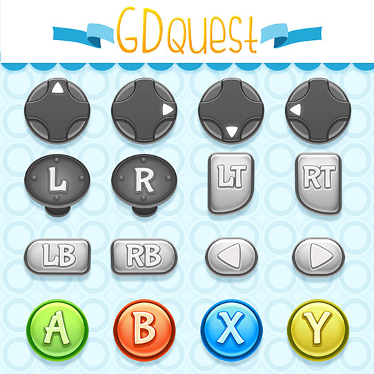

 <!-- DISCOVER -->
#  Open source assets {#free-assets}

  

    

      <strong>Space Adventures</strong> 
      5 electro-futuristic game soundtrack
    

    
    

      <!-- CC 4.0 BY LICENCE -->
       Space adventures by <a xmlns:cc="http://creativecommons.org/ns#" href="gdquest.com" property="cc:attributionName" rel="cc:attributionURL">GDquest</a> is licensed under a <a rel="license" href="http://creativecommons.org/licenses/by/4.0/">Creative Commons Attribution 4.0 International License</a>.
    

  

  

    

      <strong>Open Game Art</strong> 
      Game asset repository
    

    
    <strong>More coming in the future!</strong> In the meantime, check out my existing assets on <a href="http://opengameart.org/users/gdquest">OpenGameArt</a>!
  

