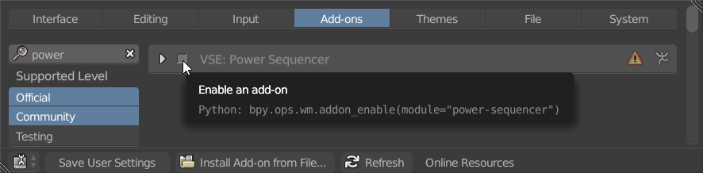
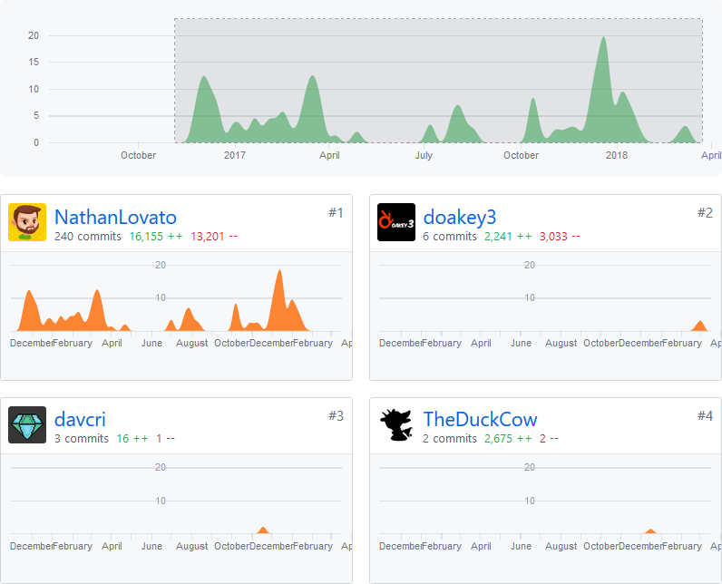

+++
chapter = true
date = "2018-01-04T19:46:48+01:00"
description = "The Free Blender add-on for video editors"
pre = "<b>X. </b>"
subtitle = "The Free Blender add-on for video editors"
title = "Power Sequencer"

[banner]
  alt = "Power Sequencer add-on logo"
  src = "banner-power-sequencer.png"

[[resources]]
  name = "banner"
  src = "banner-power-sequencer.png"

+++

At GDQuest we edit all of our videos with Blender. It's a powerful tool, but its default workflow can feel a little slow. That's why we built [ Power Sequencer ](https://github.com/GDQuest/Blender-power-sequencer/), a **Free and Open Source** add-on that's all about helping you work efficiently and comfortably.

  <h2 data-font="centered" class="no-margin">Edit at the speed of thought</h2>
  

      

          
          

              <h5>Cut, trim, and ripple with the mouse</h5>
              
Edit one or many strips at a time with your cursor! Auto locks on to channels and removes gaps based on where you click

          

      

      

          
          

              <h5>One key Import and Export</h5>
              
Load all local footage, pictures, and audio files with one keystroke. The add-on keeps track of imported files per-project.

          

      

      

          
          

              <h5>Automatic updates</h5>
              
Never worry about installing updates by hand! When a new version comes out, Blender will download it for you.

          

      

  

<h3 align="center">
And so much more!
</h3>

Faster playback, instant fades and crossfades, smart selection tools...

Power Sequencer adds over <strong>40 new functions</strong> to Blender's Video Editor



## Get Power Sequencer

Installation guide:

1. [ Download ](https://github.com/GDQuest/Blender-power-sequencer/releases) the latest release on GitHub
1. In Blender, go to File > User Preferences > Addons
1. Click "Install From File", find the .zip file from step 1. and click on "install"
1. Click the checkbox next to "VSE: Power Sequencer" to activate it
1. Click Save User Settings at the bottom



## Getting Started

1. Read our [docs page](docs) to learn about all the features in Power Sequencer
1. For video tutorials, check the [Power Sequencer playlist](https://www.youtube.com/watch?v=boAhi8hWBXc&list=PLhqJJNjsQ7KFjp88Cu57Zb9_wFt7nlkEI) on Youtube

Want to **give a hand**? Great! We write the docs and shortcuts straight in the [Power Sequencer source code](https://github.com/GDQuest/Blender-power-sequencer/).

## It's getting better

At GDQuest we work with and support open source software. Power Sequencer is a community-driven project. We add new features every time we get a chance. [Contributors](https://github.com/GDQuest/Blender-power-sequencer) are always welcome!

## Get in touch!

1. Want to write some Python and give a hand? Check our [to do list](https://github.com/GDQuest/Blender-power-sequencer/issues) or [open a new issue](https://github.com/GDQuest/Blender-power-sequencer/issues/new)!
1. Found a bug? Please tell us how to reproduce it [on GitHub](https://github.com/GDQuest/Blender-power-sequencer/issues/new)
1. You can also find GDQuest [on Twitter](https://twitter.com/NathanGDQuest)

## Excellent add-ons to use with Power Sequencer

1. [VSE Transform tools](https://github.com/doakey3/VSE_Transform_Tools) to move, scale, rotate strips in the video preview
  - Made by [Daniel Oakey](https://github.com/doakey3/), a big Power Sequencer contributor, med-school graduate and Python developer
1. [Blender Easy Logging](http://easy-logging.net/) for tags and 3-point edits
