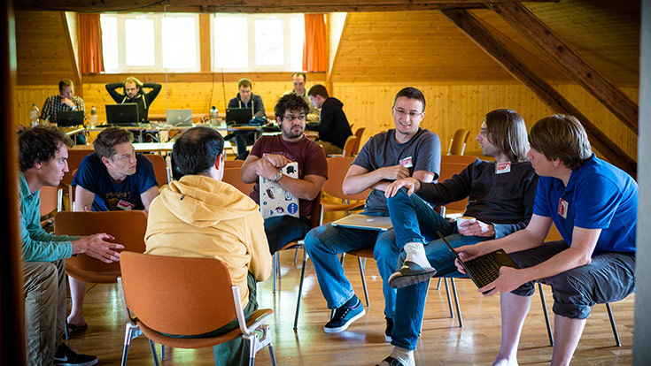
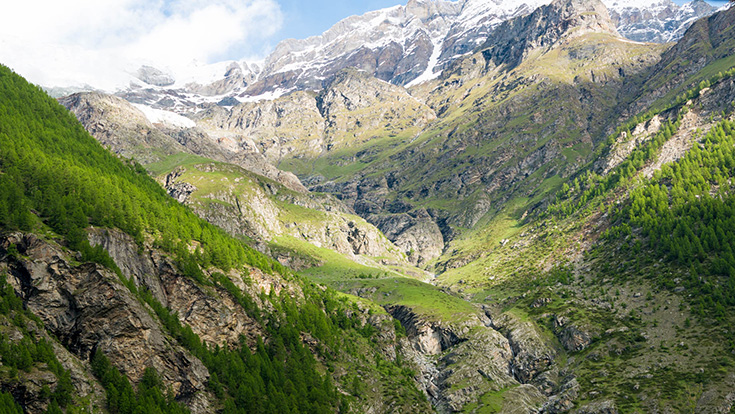
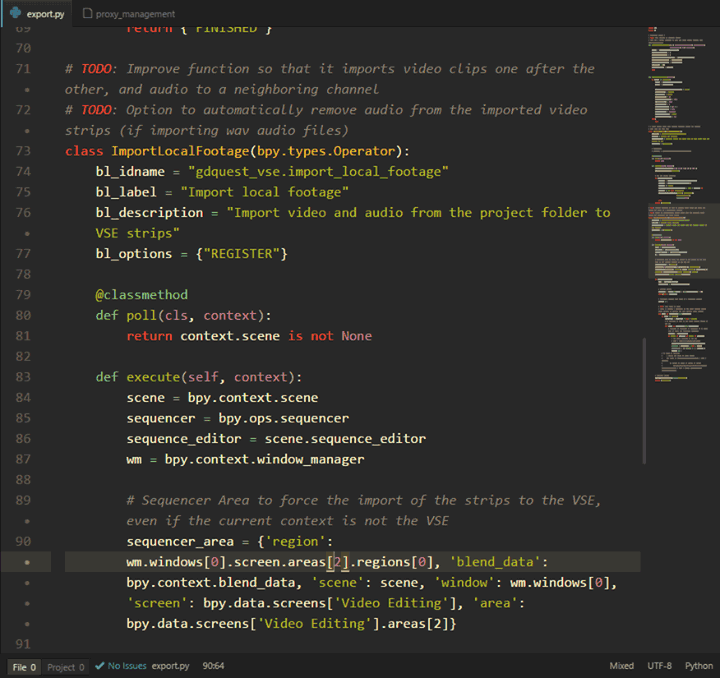

+++
aliases = ["/post/2016/kickstarter-news-june/"]
author = "nathan"
category = ["News"]
date = "2016-06-28T11:17:06+02:00"
description = "June has been a busy month. I went to the biggest yearly KDE development sprint in Randa, Switzerland, along with a few dozens of programmers, and made a series of tutorials on Krita 3's new features."
keywords = ["community"]
title = "June update: the Randa meetings"
type = "post"

[[resources]]
  name = "banner"
  src = "banner.jpg"
  [resources.params]
    alt = "Randa's surrounding mountains"

+++

We're getting to the end of June. It's time to sum up all that's been happening this month. The short version: I kept improving the website, went to the biggest yearly KDE development sprint in Randa, Switzerland, and added about 1h of tutorials dedicated to Krita 3's new features in the [Krita training](/tutorial/art/krita-tutorial-for-game-artists/). You can find more details about what happened in Randa, and what the plans are for July, below.

## Randa

From June 13 to 19, I was in Randa, KDE's biggest yearly sprint. KDE is a large community of free software developers and users. Krita is part of it, and it's certainly the most popular multiplatform KDE program today. Sadly, no one else from the team could make it to the sprint this year. They ran a hectic Kickstarter in May, and boud, Krita's maintainer, had too much work to do the trip.

Randa was an amazing experience for me. There, I didn't get to produce Krita tutorials. I mostly jumped around projects, learned about the whole KDE ecosystem, and helped with communication and UX design. It's incredible to get in touch with so many cultures at once. People came from all around the world. There was Joseph, from Kenya, who came to port KDEnlive on Windows. Lays and Ayrton, from Brazil, working on an open 3d printing program. Developers from India, Germany, Denmark... you name it.

All those people are so different... and yet they all work together to hopefully make the computer world a slightly better place. There was such a strong ambience there that we all worked very hard. I was up around 7:00 every morning, and went off to bed at 23:00. I spent the vast majority of the day working. And it was pretty much the same for everybody else.

The village we stayed at itself was peaceful and lovely. A perfect, undistracted place to both focus and relax.

_The view was gorgeous from my office_

## Time to make some money again

As I told you in a previous update, Game Art Quest became bigger than what it was supposed to be. With the Kickstarter, we raised enough money for six months of full-time work.

These six months are getting to an end, so I have to make a bit of money again. I'm getting new offers on a weekly basis, but until now, I almost declined them all. However, I accepted one job writing Krita tutorials for a magazine this month. It is a great opportunity as they asked me to work on animation, which I haven't covered yet in the training, thus it's not distracting me from daily work too much.

I'm looking to start working on and selling the next 2 volumes of the training in early access at the end of July. If I sell enough, I'll be able to keep working full-time on it. Otherwise, I'll dedicate one day per week to client work, which shouldn't slow down the production of the training noticeably.

## One video a week

[Omitted long matching line]

## This week

To wrap up June, I have to release a brush pack update. This new version will contain 4 new brushes, and I painted a new thumbnail for the blender brush, as the current one looks horrible.

Also, I'm working on the fourth chapter in the Krita training, to release it as soon as possible. It will introduce you to the game assets creation workflow. As soon as it is out, I will move on to the second volume of the training, which you will be able to access on Gumroad.

Moving into July, I have to get working again on the blender of VSE add-on. It is one of the main ways I can improve my productivity creating the video tutorials now. My goal is to add one new feature every single week, even if it's small. This week for instance, I'm working on an import feature that loads all of the project's video and audio files to the VSE in one click. As I get to create up to six videos in a single week, this feature will be a real time saver. And with that, I'll be able to release the first public version of the add-on.

_The import code is already there - it just needs to be refined_

That said, it's time to get back to work! Thank you all for reading. Thank you for constant support and your kind words. I read all of your comments on Youtube, on social networks, and the messages you send me via email. It's really heartwarming to see some of you following everything that's happening on a weekly basis. Big thanks!
