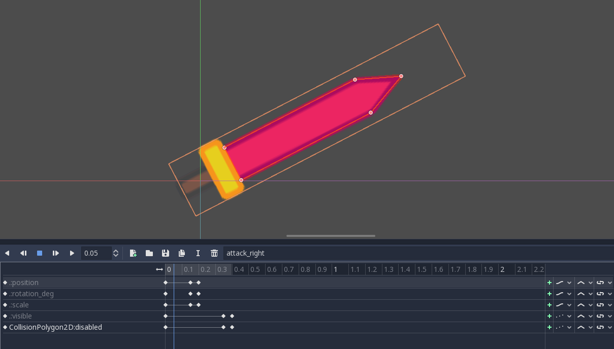
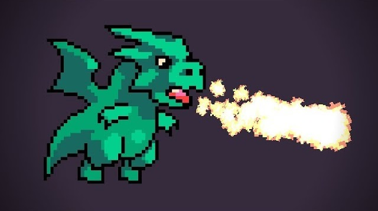
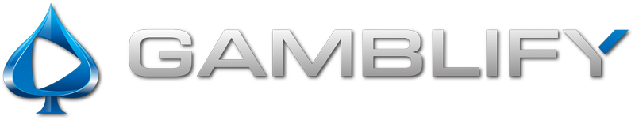
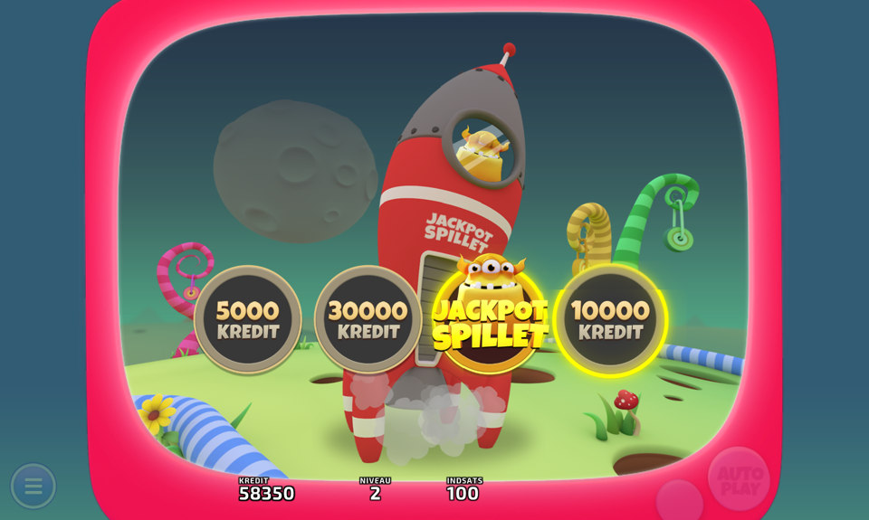
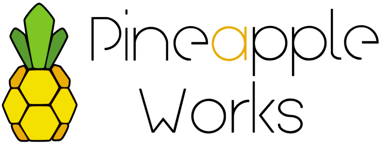
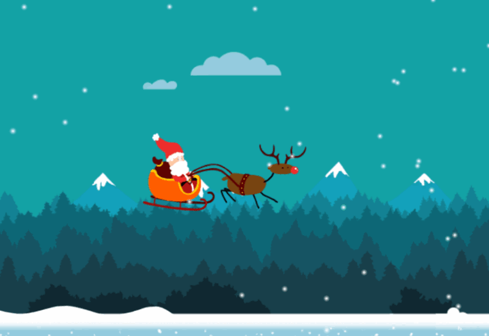
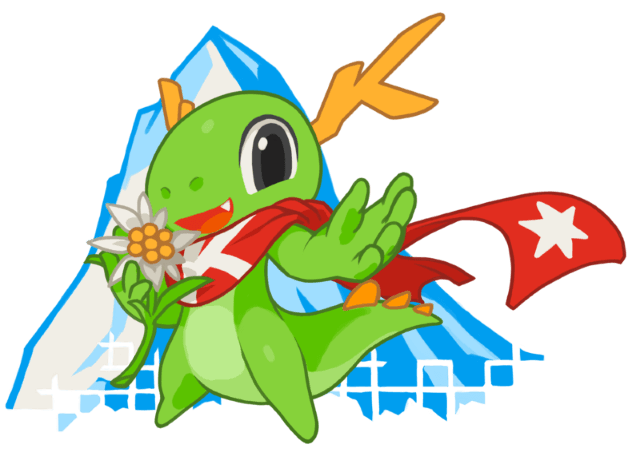

+++
aliases = ["/post/2017/10/godot-3-alpha-attack-tutorial/"]
author = "nathan"
category = ["news"]
date = "2017-10-24T08:10:10+02:00"
description = "We made two new Godot tutorials in collaboration with Heartbeast. Read this post to learn how to create close combat and ranged attacks!"
keywords = ["tutorial", "Godot 3", "Kickstarter", "Attack", "ranged attack tutorial", "sword attack tutorial"]
title = "Godot 3 Close and Ranged Attack Tutorials"

[[resources]]
  name = "banner"
  src = "banner.png"
  [resources.params]
    alt = "Godot Kickstarter banner"

+++

Last week we did a tutorial about attack mechanics in collaboration with Heartbeast. I got important feedback from you, the backers, and wanted to apply it to a self-contained tutorial. Consider it as a bonus while we're waiting for Godot 3 beta.

**Close combat attack**:

1. [Weapon Animation](//youtu.be/S7jBSs5j4-c)
1. [Weapon collision programming](//youtu.be/JBczf8qt04c)

**Heartbeast's tutorial**:

1. [Ranged attack: fireball](//www.youtube.com/watch?v=rY7wzK59-Jw)

It shows some of Godot's strengths:

- **Inherited scenes** act as a base class that child scenes derive from, but you control it all through the editor.
- **Gameplay controlled animation**. The two available weapons share a common Weapon.gd script. Their speed, the attacks' anticipation, their visibility, and their collisions are all controlled by the animation.

The powerful Call Function and Transform animation tracks are broken in the unstable releases. So I could not use them for the tutorial. We'll look into that in the course. As Ben released his last Game Maker course last month, he had a little bit of time to do a collab. That was a good opportunity to make some training material. The demo is also open source, available for the entire Godot community.

While we're at it, it's more than time to give a **shout out to the Kicsktarter's four sponsors**. Three company owners and Mario Fux, the organizer of the Randa Meetings, supported the campaign with important pledges. They also are Godot supporters.

## Gamblify

[Gamblify](//www.gamblify.com) is a software development company located in Copenhagen, Denmark. They build applications and games for the gambling industry, from slot machines to betting terminals. It’s a team of 26 persons, including 14 in the software department.

They worked with several engines in the past, starting with Ogre3D, Cocos and Unity. They now use Godot and are among the biggest donors. They not only helped to fund Godot 3.0 with donations in 2016 and this year: they plan to keep supporting the developers regularly.

Their latest game, Monsters from Outer Space, is a Godot game.

## Pineapple works

[Pineapple Works](//pineapple.works/) is a Polish software development company. They design and develop software, configure and deploy servers, build quality websites, but also games! Like Gamblify, they supported the Godot developers with a large donation. They already used Godot for client work and are looking to work with it again on future games.

## Echo86

[Echo86](//www.echo86.com) started out as a web design agency and grew in a full-service technology company. They are experienced with HTML 5 game design, and are looking to add Godot to the long list of technologies they use. They work with AngularJS, NodeJS, Pixi, Phaser, and more!

## Mario Fux

Mario is a kind, busy teacher, developer, and free software advocate. Every year he organizes the large [Randa meetings](//randa-meetings.ch/) in Switzerland for the KDE foundation. I joined them in 2016 to eat swiss delicacies give a hand and meet fellow developers. Along with the school he works at, they supported both Kickstarter campaigns.

## Get in touch!

Need to reach me? Send me a message anytime [@NathanGDQuest](//twitter.com/NathanGDQuest) on Twitter.

Want to know when a training series is on sale or when a new one comes out? Feel free to subscribe to the GDQuest shop:


