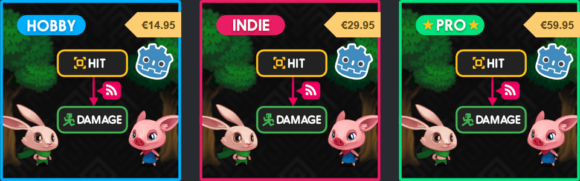

+++
aliases = ["/post/2017/11/godot-3-course-hobby-indie-out/"]
author = "nathan"
category = ["news"]
date = "2017-11-05T16:29:59+01:00"
description = "The new version is finally out! You will find improvements and an extra video in the Finite State Machine chapter, and a new Game Design chapter. This one includes 3 html-based course documents and 40 minutes of video."
keywords = ["tutorial", "Godot 3", "Kickstarter", "Attack", "ranged attack tutorial", "sword attack tutorial"]
title = "Godot 3 course: Hobby and Indie versions out in early access"

[[resources]]
  name = "banner"
  src = "banner.jpg"
  [resources.params]
    alt = "Course release 2 banner, with an isometric diagram of the game's elemental tetrad"

+++

The new version is finally out! You will find improvements and an extra video in the Finite State Machine chapter, and a new Game Design chapter. This one includes 3 html-based course documents and 40 minutes of video.

The missing two versions of the course are now out on Gumroad:

- [Hobby](//gumroad.com/l/vmPA), for hobbyists with some game creation experience, who'd like a deeper dive in Godot 3
- [Indie](//gumroad.com/l/XEULZ), for independent developers and students

**Disclaimer**: I can't produce videos for the main chapters until Godot 3 beta is out. It's planned for the end of November. So expect the first gameplay programming chapter in december.

I've also included the bonus collab tutorials we made with Heartbeast and the UI tutorials I wrote for the official docs as they're complementary to the course and funded by you. All this should keep you busy for a few good hours. Enjoy!

## New tier names: Hobby, Indie, and Pro

I changed both the name of the versions and color-coded the banners so they're clearer now:

- Essentials is now **Hobby**
- Pro is now **Indie**
- Premium is now **Pro**

It means no more confusing drop-down menu to select the right version and price change when you do so.

## What next?

**Godot 3 beta is still weeks away**. Beta stage means the API and the UI will be frozen, allowing me to record the new chapters. As we move closer to this release I'll get Godot demos ready to record, and produce the final tutorials as soon as possible.

Until then I'm working on some extra content for the game design chapter, and an open source Godot 3 presentation. It is a presentation template that anyone in the community can reuse, extend, modify and give anywhere around the world.

I'm giving this presentation for the first time in Toulouse [at the Capitole du Libre](//2017.capitoledulibre.org/programme/#developpez-des-jeux-video-pros-a-laide-du-libre). It's on Saturday, November 18th at 15:00. I'll also give it the next Monday in Lyon, at the E-ArtSup school in front of dozens of design students. It's on November 20th at 17:30, and it should be open to the public. Feel free to [send me a message](//twitter.com/NathanGDQuest) if you'd like to come to either event.
