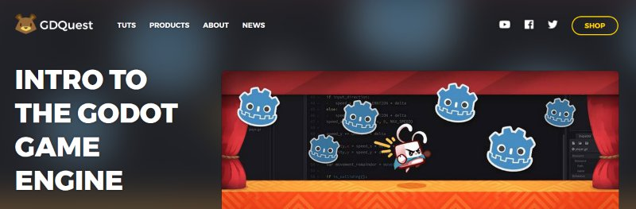
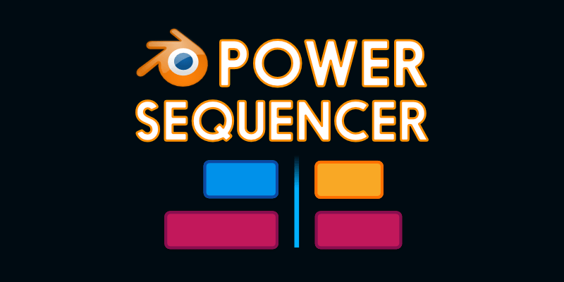

+++
aliases = ["/post/2018/03/godot-course-update-6/"]
author = "nathan"
categories = ["news"]
date = "2018-03-31T15:19:32+09:00"
description = "After moving and settling in Nara, Japan, I got back to GDQuest. This month's update is smaller than usual, but it's still out in time, as promised!"
keywords = ["gdquest", "godot 3", "godot course update", "astar", "pathfinding", "gamedev", "Nara", "Japan"]
title = "Godot 3 course: small March update"
type = "post"

[[resources]]
  name = "banner"
  src = "2018-03-release-6-banner.png"
  [resources.params]
    alt = "Godot course update 6 with the AStar pathfinding Godot project logo in front of cherry tree flowers"

+++

The new update is out! As announced in the last news post, it's smaller than usual. for two reasons:

1. I **moved to Japan**, took some time off and had a lot to do to settle down
1. I caught a cold and worked slower than usual for the past 10 days. Over the past week I **barely had any voice at all**

Work has still been busy until the end of the month: it not only took a while to get back to everyone, catch up with activity on GitHub, but also to get back up to speed in a foreign country. That's why are no new videos this time, aside from the free [bonus camera tutorial](//www.youtube.com/watch?v=lNNO-Gh5j78) released on YouTube.

You will find new and updated code examples. In the pro version (Premium Kickstarter tier and up) there's new challenge exercises to complete chapter 1 and 2.

Check out the [Godot 3 course on Gumroad](//gumroad.com/gdquest)!

I also rewrote the navigation 2d example and wrote a new [AStar demo](//github.com/GDQuest/Godot-engine-tutorial-demos/tree/master/2018/03-30-astar-pathfinding) to show how to code grid-based pathfinding in the engine.



You can use a tool like [DownGit](//minhaskamal.github.io/DownGit/#/home) to download any folder from a GitHub repository like this one.

## Coming in April

The second monster's tutorials are ready to record, and you'll see the code is in place for chapter 10's remake. That's next on the list along with as much as I can do this month.

On top of that, I’m looking to start working on the stretch goals starting around the end of April. The idea is to produce content that will benefit all of you, benefit the entire Godot community, and keep the YouTube channel going. I'll work on this in parallel to new course chapter.

### GDQuest.com 2.0

I hired Daniel Ramirez, a big Godot contributer who designed the new Godot engine website, to do the same with GDQuest. Better look, better foundations... there's still some content to add but it's here, and it's open source!

The website relies on [Hugo](//gohugo.io/), a powerful and blazing-fast static website engine.

### Power Sequencer 1.0

[Power Sequencer](//github.com/GDQuest/Blender-power-sequencer/) is a Blender add-on I initially wrote to edit videos faster for gdquest, and open sourced a few months ago.

[Daniel Oakey](//github.com/doakey3/), a medical school graduate and open source advocate, offered to contribute to the project. He has done outstanding work and has been a great help to help bring this Free Blender ad-on to the next level.

Solid source code structure, many new features, improved UX, docs from the source code, custom shortcut profiles...

We are looking to team up on a **tutorial** to help fellow tutorial makers and Blender users to learn to use its powerful video editing workspace. The tutorial will come with open source stock footage from Japan

See you soon for more content!
