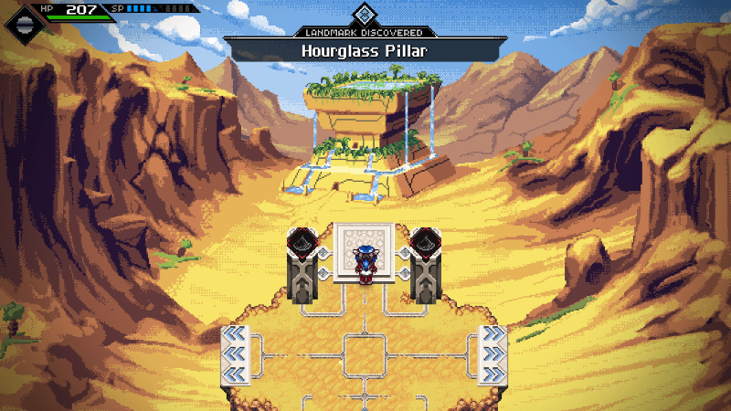

---
aliases:
- /post/2018/06/godot-course-update-7/
author: nathan
categories:
- news
date: "2018-06-01T18:19:32+09:00"
description: Like every month, the Godot 3 course got a new chapter. This time it's
  dedicated to boss creation, the State programming patterns and all the techniques
  you'll need to create a convincing pattern-based boss in Godot.
keywords:
- gdquest
- godot 3
- godot course update
- gamedev
- boss godot
- godot game engine
resources:
- name: banner
  params:
    alt: Godot course update 8 banner, with a large blue pig on a green background
  src: 2018-05-release-8.png
title: 'Godot 3 course: the boss chapter is out!'
type: post
---

In this month's update you get one new chapter in the course. This is the hardest and probably the biggest series I made so far: chapter 5 is dedicated to boss creation.

This builds upon chapters 1 to 3 and brings the [state programming pattern](//www.youtube.com/watch?v=Ty4wZL7pDME) to everyone, whether you've got the essentials, the indie, or the pro version.

As the boss chapter took twice the time I planned to invest in it, I couldn't finish the essentials version in May. I didn't want to cut on quality just to add more tutorials in this release.



## Stretch goals

We started working together with Guilherme, who makes Godot tutorials on Udemy. He is improving fast and his eager to produce high quality content. This made it possible to start working on the user interface stretch goal in parallel from the course.



We are also working on a **shaders tutorial series** in collaboration with [Bastiaan Olij](//www.youtube.com/channel/UCrbLJYzJjDf2p-vJC011lYw). We're looking to help you get started with shader programming in both 2D and 3D in Godot. (sorry Baastian for the delay on my end!)

## Bitsummit and Cross-Code team interview

I went to Bitsummit, a sizeable gaming event in Japan, on May 12th. The following Monday, we met with the crosscode team to shoot a short interview. They managed to keep the project going for seven years despite all working remotely. And their efforts resulted in a [highly polished](//store.steampowered.com/app/368340/CrossCode/) game!

## The last chapter will probably change

It's been one year since the Kickstarter campaign. Since then, the course evolved with your feedback and grew bigger than I intended to make it. Initially I thought it would be nice to cover refactoring in the last chapter, but it wasn't a good idea. It's better to cover these techniques as we need them in various chapters. So you will already find videos about re-factoring your code, improving your project structure, and best practices with Godot throughout the entire course.

Instead, how about a last series that starts with a small, yet complete game demo, and shows how to juice it or polish it? Juicing is all about improving the feel of the game. It's often an opportunity to review the gameplay and tweak the mechanics, the game's balance, but also re-factor some code at the same time.
For more info on juicing, I wrote a [long article](//gameanalytics.com/blog/squeezing-more-juice-out-of-your-game-design.html) on the subject in the past.

I already asked some of you on Discord what you thought about that and for now it seems people like it. But please tell me what you think.

There's a lot going on lately, more content to come in June for everyone.

But for now, stay creative, have fun, and see you in the next update!


