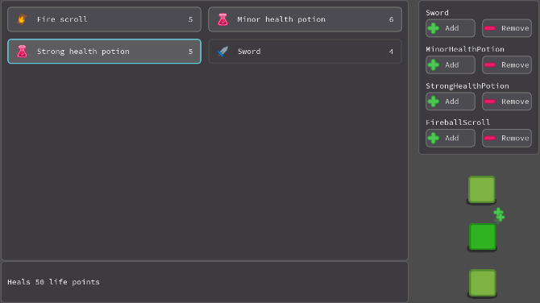

The UI course update is up! That's the biggest monthly release to date 😊

These **3.5 hours of extra tutorials** dedicated to **Game User Interface** will show you:

1. How to **separate the UI code from the gameplay**, using the node tree, signals, and yield features
1. How to **design reusable UI components** with Godot's theme system
5. How to create an **inventory system and item menu**

The first UI chapter is in both the [Indie](//gumroad.com/l/XEULZ) and [Pro](//gumroad.com/l/godot-tutorial-make-professional-2d-games) versions of the course. The Inventory and Item Menu chapter is **only available in the Pro version**.

## Chapter 7: Game User Interface



In this series, we first look at **Godot's pause system**, and how to create a simple pause menu. This gives us an opportunity to look at the reusable UI theme system. [Themes](//godot.readthedocs.io/en/3.0/tutorials/gui/gui_skinning.html?highlight=theme) are resources you can reuse across menus and across projects to save time with GUI design.

The second part focuses on life bars:

- Gauges that hook on monsters and playable characters, and update as they take hits
- A large bar with animated color and HP update, with some code trick I figured out recently!

It builds upon our lifebar animation basics tutorial:



## Create an Inventory and an Item menu

The inventory series is one of the most complex ones to date in the course. Alone, it contains **17 video tutorials**!

This is intermediate-level content. I've done my best to make it accessible to everyone and show good programming practices! But you should start with our Free Godot UI tutorials before you jump on to this series.

You'll learn some essential techiques to build scalable UI. The trick is to use Godot's signals, coroutines, and to work down the node tree to keep the UI code separate from the rest of the game.

As the series was already so long, I decided to delay the shop a little bit and to turn it into its own, extra chapter.



## GDQuest is on Patreon!



### Why Patreon?

We've worked hard over the years to provide you with hundreds of professional-grade tutorials for Free Software. We also provide open source code and contribute back to the projects we all love. I've done it out of passion for a long time, but making high-quality tutorials takes a lot of time and is a real challenge for us.

**We can only continue to built great learning material with your support**! 😊

The people who help us on Patreon get:

1. Access to our exclusive discord server, where I share insights on new techniques I just discovered with Godot, and that I don't always have the time to cover in tutorials
2. Early access to tutorials and videos released on the GDQuest channel
3. Early access to new training products, with a lower price

From the second tier level, you get to vote and suggest tutorials that you want. We will at least cover the most voted one every month.

And you can also get **your own mini-tutorials** on top of that if you pick the third tier.

For more information, check out our Patreon page!


