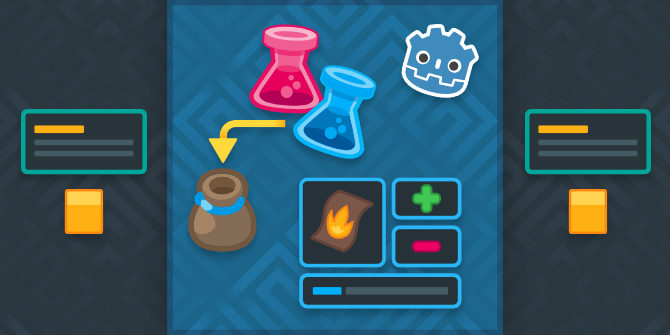

+++
aliases = [
  "/post/2018/10/godot-course-content-list/",
  "/product/godot/make-pro-2d-games/content/"
]
author = "nathan"
category = "Godot"
date = "2018-10-26"
description = "The Godot course is now complete! Here's a list of all the tutorials each version contains."
keywords = ["godot 3", "godot course", "video list", "course content"]
title = "Available content in the Godot Course"

[[resources]]
  name = "banner"
  src = "banner.png"

+++

The course comes in 3 versions. Indie contains all of Hobby, and Pro contains all chapters from Hobby and Indie, and extra resources:

<!-- TODO: refactor as a 3 columns call to action: use a parent container shortcode? -->

1. [Hobby](//gum.co/vmPA)
1. [Indie](//gum.co/XEULZ)
1. [Pro](//gum.co/godot-tutorial-make-professional-2d-games)

If you're only looking for UI tutorials, check out our standalone course:



You'll find some **free tutorial samples** below. I also released the [Finite State Machine](//bit.ly/godot-3-fsm-demo) demo open source, for the official Godot documentation. You can find the open source [A-RPG demo](//github.com/GDQuest/make-pro-2d-games-with-godot/) from the course on GitHub.

All versions come with source Godot projects so you can read the source code, learn from them and even reuse them in your own work! Want to skip ahead in a chapter? There are multiple checkpoint projects with `start` and `end` folders so you can pick up from a different video.

## Videos list

### (hobby) Chapter 1: The character controller

0. Project Structure Overview
1. [Create the Base Character Scene](//www.youtube.com/watch?v=PKGOWGw3blw)
2. Input Map
3. Input Direction
4. Player Walk And Run
5. Character Walk Anim
6. Simple State Machine
7. Bump State Collisions
8. Bump State Animation
9. Jump
10. Jump Part 2
11. Jump Bug Fix And Height Refactoring

### (hobby) Chapter 2: Combat mechanics: life, attacks and death

0. Intro
1. [Basic Attack Animation](//www.youtube.com/watch?v=TPJqJDCnxyg)
2. Simple Attack Sword Code
3. Simple Attack Connect With Player
4. Health
5. Health Improving Code Structure
6. Stagger
7. Death
8. Combo Animation
9. Combo Code Setup
10. Combo Input

### (hobby) Chapter 3: AI 1: Design 2 simple monsters

1. The Porcupine's States Overview
1. Spawn And Target
1. Follow
1. Arrive
1. Roam
1. Avoid
1. Spot And Attack
1. Refactor To Reuse Steering Code (Part 1)
1. Refactor To Reuse Steering Code (Part 2)
1. When Should You Refactor?
1. Coding The Flying Enemy
1. Coding The Nest That Spawns Flying Enemies

### (hobby) Chapter 4: AI 2: Add a pattern-based boss

This chapter covers the state programming pattern. It shows how to separate the monster's behaviors in code

01. First look at the state interface
02. Create the spawn state
03. Create the roam state
04. Create the state machine
05. Code a state sequence
06. The roam sequence
07. Code the charge sequence
08. Make the boss charge
09  Make the boss die!
10. Using the builtin owner feature
11. Dealing and taking damage
12. Simpler attack and hitbox demo
13. Boss phases

### (hobby) Chapter 5: Build levels with Tiled map editor

1. [Intro To Tile-sets](//www.youtube.com/watch?v=TdPgIagt9Yo)
2. Create A Tile-set
3. Auto-tiles
4. Working With Tile-maps
5. Auto-tile With 3 By 3 Bit mask
6. Intro To Tiled Map Editing
7. Intro to the new [Tileset Editor in Godot 3.1](//www.youtube.com/watch?v=F6VerW98gEc)

### (hobby) Chapter 6: Breathe life to the game: world animation and particles

1. Intro to particles2d
2. Intro to particles 2d 2
3. Charge dust
4. Walk and run puffs
5. Explosion
6. Rock crumbles
7. Smoke puffs
8. Firery cloud
9. Firery cloud sparkles

### (indie) Chapter 7: Design and code the game's User Interface

1. Coding and handling pause in Godot
2. Design the pause menu
3. Creating a reusable theme resource
4. In-game lifebar
5. Lifebar creator node
6. Spawn and connect lifebars in the game world
7. Adding dynamic colors to the lifebar
8. Lifebar animation

### (indie) Chapter 8: Learn the Game Design Workflow

*The first 3 lessons are text-based*

01. You are a designer
02. A game is made of 4 elements that support a theme
03. Dan the Rabbit: game concept example
04. Why And How To Analyze Games
05. Cross Code Analysis
06. Designer Insights Emmanuel
07. Designer Insights Fibretigre
08. Designer Insights Ed Atomic Racoon

### (pro) Chapter 9: Build an Inventory System and Item menu

01. Project overview
02. Item base class
03. Create potion and sword
04. Item database
05. Inventory part 1
06. Inventory part 2
07. Debugging inventory
08. Menu overview
09. Items menu design
10. Item button
11. Tips centering items in containers
12. Item button code
13. Connecting the inventory and menu
14. Description label code
15. User select menu
16. Connecting the two menus
17. Focus neighbours

### (pro) Chapter 10: Design pattern: implement Finite State Machines in Godot

1. Presentation: Introduction To Finite State Machines
1. Create The Base State Interface
1. Idle And Move State Examples
1. Jump State Class Overview
1. Code The State Machine
1. Hierarchical State Machine
1. Presentation: Going Further With Pushdown Automata
1. Pushdown Automaton
1. Pushdown Stagger State

### (pro) Chapter 11: Shop

01. Shop and purse
02. Design shop base ui
03. Menu base script
04. Player and merchant interaction
05. Buy and sell menus design
06. Opening buy and sell menus
07. Info panel
08. Description panel and fixes
09. Popup design
10. Popup code

### (indie) Chapter 12: Persistence, Polish, and Project Structure

This final series rounds out the techniques explored in the course with requests from the Kickstarter backers: looking at how to restructure a project as it grows in complexity, keeping persistent data and improving the game's feel with camera shake.

00. Intro
01. Project structure: 01.final folder structure
02. Project structure: 02.demo scene structure
03. Level loader: 01.levels and musicplayer
04. Level loader: 02.game node
05. Level loader: 03.final code overview
06. Save and load: 01.save game
07. Save and load: 02.create save file
08. Save and load: 03.load game from json
09. Save and load: 04.parsing vector2
10. Save and load: 05.saving and loading in practice
11. Audio: 01.intro to audio
12. Audio: 02.intro to audio buses
13. Audio: 03.sound options menu
14. Juicing: 01.camera screenshake
15. Juicing: 02.boss camera animation
16. Juicing: 03.boss camera shake
17. BONUS: Gui's intro to debugging tools
18. Outro

### Extras: Bonus content

These are free tutorials available to everyone on Youtube, funded by the project. They're designed to complement the course.

1. [Attack Tutorial 1: How To Animate The Sword](//www.youtube.com/watch?v=S7jBSs5j4-c)
2. [Attack Tutorial 2: Code the Sword Attack](//www.youtube.com/watch?v=JBczf8qt04c)
3. [Tool Mode: Draw In the editor's viewport](//www.youtube.com/watch?v=XPs-HGzElTg)
4. [Camera 2d And Grid Snapping](//www.youtube.com/watch?v=lNNO-Gh5j78)

### Extras: contributions to the official Godot docs

[Omitted long matching line]

You'll find some of the work I did bundled with the course.

#### New pages in the docs

Step by step guide:

1. [Introduction to Godot’s editor](//docs.godotengine.org/en/latest/getting_started/step_by_step/intro_to_the_editor_interface.html)
1. [Godot’s design philosophy](//docs.godotengine.org/en/latest/getting_started/step_by_step/godot_design_philosophy.html)
1. [Design interfaces with the Control nodes](//docs.godotengine.org/en/latest/getting_started/step_by_step/ui_introduction_to_the_ui_system.html)
1. [Design a title screen](//docs.godotengine.org/en/latest/getting_started/step_by_step/ui_main_menu.html)
1. [Design the GUI](//docs.godotengine.org/en/latest/getting_started/step_by_step/ui_game_user_interface.html)
1. [Control the game’s UI with code](//docs.godotengine.org/en/latest/getting_started/step_by_step/ui_code_a_life_bar.html)

Contributing:

1. [Docs writing guidelines](//docs.godotengine.org/en/latest/community/contributing/docs_writing_guidelines.html)
1. [Contribute to the Class Reference](//docs.godotengine.org/en/latest/community/contributing/updating_the_class_reference.htm) (rewrite)

#### Demo projects

1. [AStar pathfinding on a 2d grid](//github.com/GDQuest/Godot-engine-tutorial-demos/tree/master/2018/03-30-astar-pathfinding)
1. [Navigation2D](//github.com/godotengine/godot-demo-projects/tree/master/2d/navigation) (rewrite)
