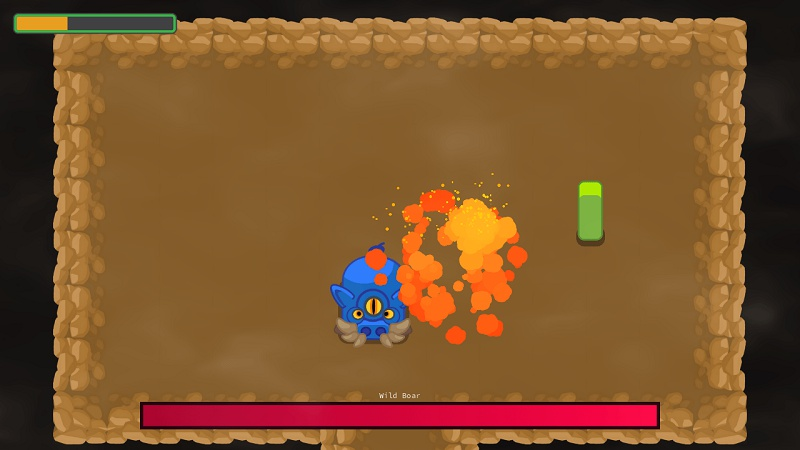

---
aliases:
- /post/2018/10/godot-course-final-release/
author: nathan
categories:
- news
date: "2018-10-28"
description: Our course is complete and out of early access! We're looking back at
  a year of free tutorials and open source contributions.
keywords:
- Godot 3 course
- Godot gdquest course
- Godot tutorial
- Godot free demos
- Godot RPG
- Godot Zelda-like
- Learn Godot
- Learn game creation
- Godot slideshow
- Godot presentation
resources:
- name: banner
  src: img/banner-github.png
title: The Godot Course's Final Chapter is Out
---

The last chapter of the Godot course is here! The project is now out of early access. 😄

[Make Professional 2D Games with Godot](//gumroad.com/l/godot-tutorial-make-professional-2d-games) is the **first intermediate-level course for the Godot Game Engine**.

Unlike many on-demand online courses, it is modular: you can watch the chapters in any order as they all focus on a specific topic.

In every series, you'll learn specific techniques like steering motion or how to code Finite State Machines, that will help you solve the many problems you'll encounter in your projects. As it's not for absolute beginners, **it's not always step-by-step either**.

The course is available in 3 versions to fit your budget and your needs: [Hobby](//gumroad.com/l/vmPA), [Indie](//gumroad.com/l/XEULZ), and [Pro](//gumroad.com/l/godot-tutorial-make-professional-2d-games).

I've done my best to share all the knowledge and techniques I could.

Is it perfect? No, no course is. But I learned a lot as a tutor along the way thanks to your feedback, and I hope the evolution showed between the chapters. Your feedback is welcome on the last course update, as usual! Please help make it better by reporting any errors you find.

## All this past year's Free content

760 backers made this project possible with their generous support back in 2017. Not only the course but also all contributions to the Godot docs and the content on YouTube that came along with it. Here are **all the tutorials and tools that came out for free in the past year**, thanks to your support.

### The A-RPG demo from the course

First, and as promised, the A-RPG game demo from the course is Free and Open Source. You can find it on GitHub: [Action-RPG Godot demo](//github.com/GDQuest/make-pro-2d-games-with-godot/)

Contributors are always welcome! I hope that some of you will join the adventure, help to make this demo look and feel better and that we'll get to create unique projects together moving forward 🙂

### The official Godot documentation ###

I organized 7 Write the Docs events to help take the API reference completion from 30% to roughly 65% as Godot 3.0 got closer to release. The goal was to get new people to learn to contribute as well as improve the coding references quality. Together with KidsCanCode and other contributors, we wrote writing guidelines for the manual to bring people style closer to one another and make the content more accessible to the users.

I became part of the documentation and the demo's reviewers and contributed a few long tutorials of my own. Mainly about Godot's complex and complete UI system. More recently we wrote a [guide to optional static typing with GDScript](//docs.godotengine.org/en/latest/getting_started/scripting/gdscript/static_typing.html) in Godot 3.1 with Guilherme.

I contributed to the Godot demos repository as well to answer some of the community's requests:

1. [Finite State Machine](//github.com/godotengine/godot-demo-projects/tree/master/2d/finite_state_machine)
1. [Grid-based movement](//github.com/godotengine/godot-demo-projects/tree/master/2d/grid_based_movement)
1. Rewrote the [2d Navigation](//github.com/godotengine/godot-demo-projects/tree/master/2d/navigation) demo and added one about [AStar Pathfinding](//github.com/godotengine/godot-demo-projects/tree/master/2d/navigation_astar)

### Free tutorials on YouTube ###

There has been a lot of free tutorials as well. Here are a few playlists to watch the Godot tuts we made during the course project:

1. [Godot 3 tutorials](//www.youtube.com/watch?v=bS-tX2HopW0&list=PLhqJJNjsQ7KF0o0ke_CA2QlqK8BxQNSFS)
1. [Introduction to shaders in Godot]({{ ref /tutorial/game-design/godot/introduction-to-shaders/ }})
1. [30 Godot 2.X tutorials in 30 days](//www.youtube.com/watch?v=eHtIcbrii2Y&list=PLhqJJNjsQ7KEr_YlibZ3SBuzfw9xwGduK)

We released 17 open source demos to go along with these tutorials on the [GDQuest Godot demo projects](//github.com/GDQuest/Godot-engine-tutorial-demos) repository. That makes it a total of 34 with the ones I made during the Kickstarter campaign. The demos got more complex and the code hopefully more robust as we dived deeper into the engine.

There's also been new types of videos like the one on [Staying Motivated](//www.youtube.com/watch?v=JCuRcO_OH3A) and learning how to code:



### Godot Slides 2.0 and the Power Pitch ###

Godot Slides as a drag-and-drop system to create presentations with Godot 3. It ships with an international pitch that anyone can give about Godot. It is already available in 12 languages!

[Godot slides 2.0 repository](//github.com/GDQuest/godot-slides)



## Away around the end of the month ##

First, I'm taking some time off to travel around Kansai, Japan. I haven't visited that many places since I arrived in early March. We're going on a 3 days trip to Shiga with a close friend. Then I'm taking a week with my family who is coming to visit during the first half of November. I may not get back to your messages during that time.

## What's coming next ##

I'm working on an [open J-RPG demo with Godot 3.1](//github.com/GDQuest/godot-turn-based-rpg/). Expect tutorials revolving around this project soon. 😉

One of the goals behind GDQuest is to bring people together to become better developers and designers. I firmly believe in Free education - even though in our world you need to make money to keep going. Sharing knowledge benefits everyone, including the person who's taking the time to share:

- It helps you solidify what you know as an individual, makes you a lot better at communicating your ideas and getting people to listen to you
- It gives you opportunities to get feedback, which is essential to grow and get better as a creator
- Moreover, if you take the time to do it right, sharing what you know helps others around you grow as well

I'm hoping that, over time, as the community develops, more people will join the open projects and that we can get to the next level together. 🐣

Moving into the next project, I want to spend a bit of time focusing on the channel and doing collaborative work. Expect more tutorials and demos by the end of the year.

Oh, look at the clock! Time to get back to programming. 😄

See you soon around the web.
