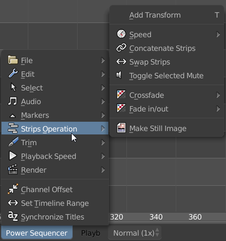

+++
aliases = ["/post/2018/12/blender-power-sequencer-1.2-out/"]
author = "nathan"
categories = ["news"]
date = "2018-12-27T10:32:04+09:00"
description = "This is the biggest update to our Free Blender VSE plugin for content creators. Tons of new features and improvements are waiting for you!"
keywords = ["blender vse", "blender power sequencer", "blender sequencer addon", "blender vse plugin", "video sequence editor", "blender sequencer", "blender 3d", "free blender plugin", "blender addon", "video editing", "open source"]
title = "Blender Power Sequencer 1.2 is Out"

[[resources]]
  name = "banner"
  src = "banner-power-sequencer-1.2.jpg"

+++

Our Free Blender add-on for content creators got a MASSIVE update.

New tools, UI, improvements and fixes all-around... [look at the changelog](//github.com/GDQuest/Blender-power-sequencer/blob/master/changelog.md#power-sequencer-12)!

## Release highlights

We've looked at the workflow we had in 1.1 already and thought about how to:

1. Reduce clicks and keystrokes
1. Improve tool discoverability for people getting started

We've focused on adding missing features to complete the plugin's base toolset. From there, we can spend some more time refining existing tools to give you a more comfortable editing experience.



### Auto-select

If you're hovering a strip with the mouse already, you shouldn't always have to select it first to cut it, apply a crossfade to it...

A fair amount of tools will now **automatically select*** the strips under the mouse cursor if you don't have anything selected. This works with delete (X), ripple delete, add crossfade, ...

### Discover tools and shortcuts in the menu

There's now a Power Sequencer menu in the Video Sequence Editor's toolbar. It gives you a list of available features and their shortcuts. It's here to help you discover new tools in the add-on.

### Edit to music

When you lock a strip, the interactive cut and trim tools now ignore it. So if you lock an audio track, you can edit to the beat!

### Fast proxies with BPSProxies

Blender's proxies are slow to render, heavy on the disk, and they don't look too great. That's why we've gotten help from [Francois Grassard], a video specialist, to help us generate great proxies for Blender.



Like our multiprocessor video render tool [BPSRender](//gitlab.com/razcore/BPSRender) before it, it's a standalone and Free command line program so that everyone can adapt it to their workflow.

The advantages:

  - **Fast proxy generation with FFmpeg**, the leading open source technology for video encoding
  - **Detects all videos in the folder and subfolders** you give it. You can generate proxies for all your footage as you shoot, before importing the videos in Blender
  - Detects existing proxies
  - **GPU encoding** with Nvidia graphics cards with the NVENC preset\*
  - Respects the **transparency** of PNG images
  - No need to set proxy settings on video strips in Blender!

*\*Nvenc isn't ideal for proxies. It can make proxy generation a lot faster in some cases but it may cause slight frame offsets when editing. It is best for videos like screencasts or vlogs when you don't need perfect precision.*

We're looking for help to [integrate it with Blender's interface](//github.com/GDQuest/Blender-power-sequencer/issues/302) in Power Sequencer 1.3!

### And so much more

There's a lot more waiting for you to read [in the release changelog](//github.com/GDQuest/Blender-power-sequencer/blob/master/changelog.md)!

## Putting the add-on to the test

We now edit all our videos with Blender at [GDQuest](/about). Tutorials, news videos, everything. I recently edited a short documentary about Japan with the add-on, to compare the experience with a video editing suite like DaVinci Resolve.



I had a blast! Automated selections and the ability to edit to music saved many clicks. This project also gave me some ideas on how to keep refining the core editing tools and where we could save extra sweat.

### Video import was a pain

It's the first time I edited a video that involved pulling from an extensive library of shots. We usually record footage for specific videos and keep everything in a self-contained project folder instead.

I've used [Digikam](//www.digikam.org/) to derush, organize, and browse through the 800 source shots for this project. Being unable to drag and drop many files at once on the Sequencer has proven to be limiting. Using Blender's File Browser on Windows has also been a pain as video thumbnails took a while to render. I have yet to find a good solution to speed up the process.

In this instance you can really see how bins and the derushing tools video editing programs traditionally provide can help to stay organized and save time.

There's always room for improvement, both on the sequencer itself and in the add-on. We'll keep working towards a 1.3 release while the VSE's new maintainer and contributors keep improving Blender's core.

## Become a contributor!

Power Sequencer is Free Software made by the community, for video creators. Contributors are all welcome! Developers, designers, testers, people who want to help us write mini tutorials! Get in touch anytime on our [Discord server](//discord.gg/dKUX7m3).

If you haven't already, be sure to [get Power Sequencer 1.2](//github.com/GDQuest/Blender-power-sequencer/releases/tag/1.2.0).
