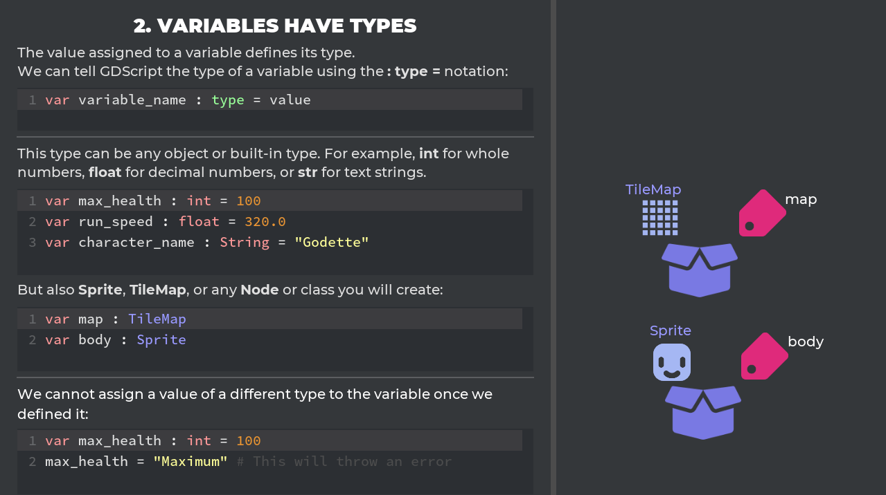

There's two days left to wrap up the campaign. With over 28,000€ in pledges already, taking PayPal into account, you unlocked all stretch goals! We're blessed to have such a supportive community. 🙂

## Last 48 hours

You only have two days left to become a backer on our new 2d and 3d game creation courses:



*Your pledges support both GDQuest and Godot.*



## Godot 3.1 New Features Tutorials ##

We'll make an official New Features in Godot 3.1 *video* series. Softbody physics, visual shader editor, new animation tools, and more: we'll cover Godot 3.1's new features in details for the official documentation.

That's on top of the [free game creation tutorials](//www.youtube.com/watch?v=7OGxzJQAKmw&list=PLhqJJNjsQ7KEHh1pfBLVnLftf0of-tHQu), [open source tools for gamedevs](//github.com/GDQuest/kickstarter-quest-3/) we're working on, and the other two stretch goals.

## Welcome Mannequiny!

We started working on Mannequiny with Luciano. He's created a prototype for the character and the rig. I tested it and cleaned up the mesh's topology in Blender 2.8. It's not perfect but it should be good enough to get started.

From there, we're going to take our time to create a solid animated game character. Luciano worked on the amazingly animated Alita, among other feature films. I can't wait to see what he'll do with Mannequiny!



## We made more tutorials than planned

We promised a new video every day during the campaign: we've gone past that already. At the time of writing, our playlist contains 26 videos: [Learn 2d and 3d Game Creation with Godot: 2019 Kickstarter Tutorials](//www.youtube.com/watch?v=7OGxzJQAKmw&list=PLhqJJNjsQ7KEHh1pfBLVnLftf0of-tHQu)

And we're not done yet! As I write these lines, Guilherme is working on a series about Game Feel, while Henrique is editing the long Intro to GDScript and game programming. 🙂
