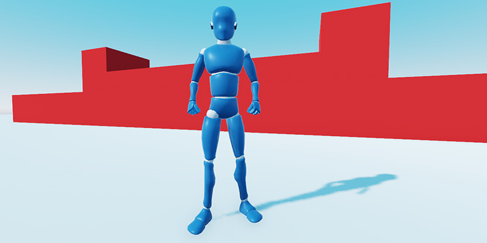

+++
aliases = ["/post/2020/01/mannequiny-released/"]
title = "Mannequiny: Free 3D character for Godot out"
description = "We made and released a Free and Open Source 3D character controller for Godot 3.2. Meet Mannequiny!"
author = "razoric"

date = 2020-01-17T15:00:00+00:00
weight = 5

categories = ["news"]
tags = ["godot", "godot engine", "asset", "3D", "controller", "character"]

[[resources]]
name = "banner"
src = "banner.png"
+++

As part of our [2019 Godot Kickstarter campaign](https://www.kickstarter.com/projects/gdquest/create-your-own-games-with-godot-the-free-game-eng), we promised to create an open-source 3D character controller to help you prototype 3D games. 

This project became Mannequiny, the Open 3D Mannequin for Godot.

It is Free and Open Source, released under the permissive MIT license. You can find it here: [Godot 3D Mannequin repository](https://github.com/GDQuest/godot-3d-mannequin/). As always, we welcome feedback and contributors!

The character works with a mouse and keyboard or a gamepad. It comes with a camera rig with an aim mode, auto-rotation, and that slides against walls and the floor.

You can download version 0.2.0 and the Blender source file now in the [Mannequiny GitHub releases](https://github.com/GDQuest/godot-3d-mannequin/releases). The character is also available in the [Godot asset library](https://godotengine.org/asset-library/asset/440).

## Credits ##

[Luciano Muñoz](https://twitter.com/lucianomunoz_), who worked on Blender open movies in the past, designed, rigged, and animated the character. We wrote the code with Josh, also known as [Cheeseness](https://twitter.com/ValiantCheese), and Francois Belair, also known as [Razoric](https://twitter.com/Razoric480). 

Thank you to all our backers who supported this open-source effort, and we hope to see this be useful to many among you.

See you next time, and keep working!
