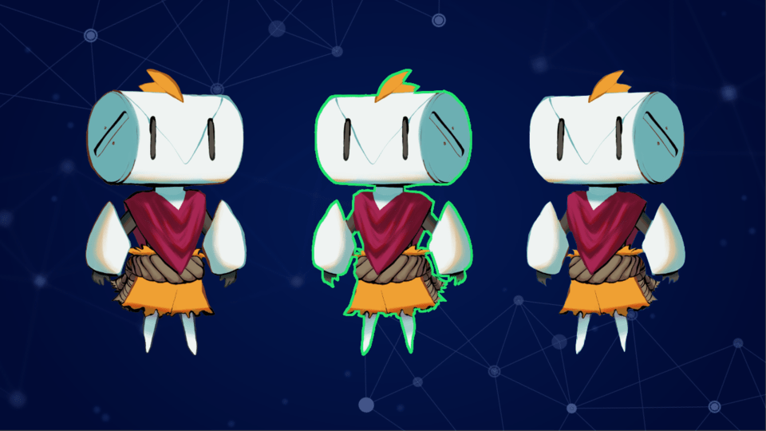

Today, we bring you a new tutorial series on key **shader programming tricks**. Learn to write professional shaders for games in the professional free game engine Godot.

You are going to create fun deformation and transition effects, full-screen filters, make particles spawn from your shaders, and more!

## What you will learn

This course will teach you to:

- Code real-world 2D and 3D shaders using Godot
- Create impressive and useful effects
- Optimize your shaders to balance visual quality and performances

## Pre-requisites

You should be comfortable working with code and with Godot's editor to follow this course successfully. We will explain some shader basics, although we expect you to be able to read and understand simple code.

Also, we made a [free shaders video series](https://www.youtube.com/playlist?list=PLhqJJNjsQ7KHqNMYmTwtsYTeTrqrRP_fP) to get you started. Check it out!

## Early Access

This course is currently in **Early Access**. You can get it now for a lower price as we create new tutorials. The price will increase with the next update. Once you got the course, you will get **lifetime free updates**.



You can look forward to these lessons for the next updates:

- 2D and 3D water
- Force field
- Wind
- Top-down view 2D cloud shadows

## Free and Open-Source

The code from this project is available under the MIT license. You can use it and modify it freely, even in commercial projects.



Be sure to star 🌟 the project on GitHub! It helps more people find it.

We hope you enjoy this course!
