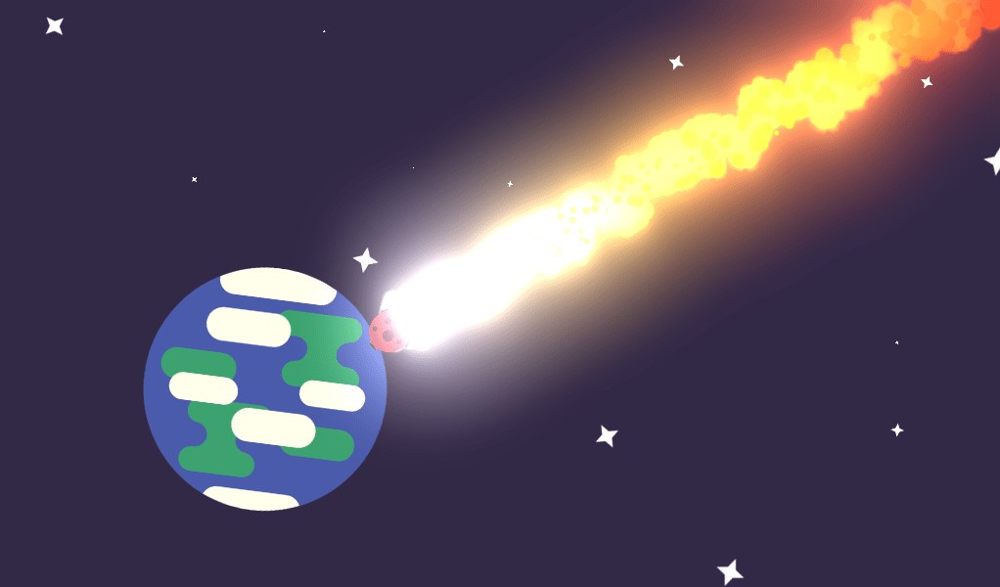

Our [Godot visual effects course](//gdquest.mavenseed.com/courses/godot-vfx-secrets) got its first complete release! It is now out of early access.

With this course, you will learn to create effects such as the laser beam, explosions, or smooth trails.

## What you will learn

You will learn to:

- Design advanced effects with Godot’s particle systems.
- Layer particles and texture to create professional visuals.
- Mix particles and GDScript to enhance your effects.

You should know how to work with Godot's editor and have GDScript foundations for some lessons, such as the laser.

If you have no experience with Godot, check out our complete [Free Godot guide for beginners](/tutorial/godot/learning-paths/beginner/) to get you started.



_The course comes with lifetime free updates and a 30 days refund warranty._



This release brings four new lessons:

1. The trail renderer, to create ribbon trails behind a projectile or a weapon.
1. Shockwaves and ripple deformation.
1. Fireballs.
1. Charging a powerful weapon.

## Free and Open-Source

The [Godot visual effects](https://github.com/GDQuest/godot-visual-effects) are Free Software, available under the MIT license. You can get the project on GitHub.

Be sure to star 🌟 the project! It helps more people find it.

We hope you enjoy this course and see you with the next update!
