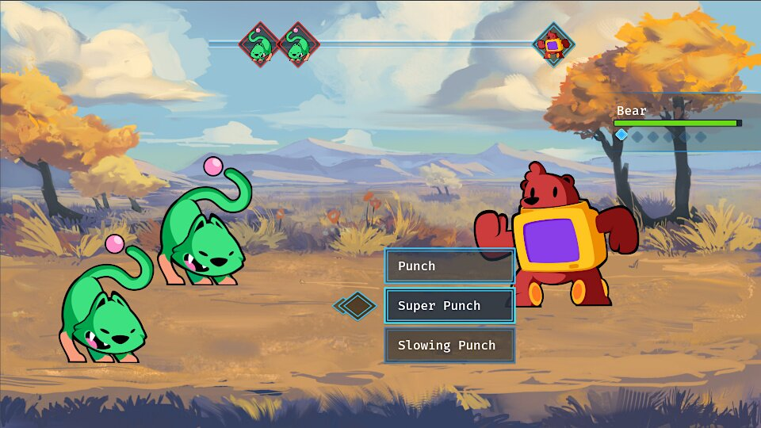

The first early access release of [Godot 2D Secrets](https://school.gdquest.com/products/godot_2d_secrets_godot_3) is out.

It comes with the Japanese RPG combat core series and its 21 tutorials. 



The second part of the JRPG series, dedicated to the user interface, will come out in the next update. 

We also wrote and released five "mini tuts" for this update. These are standalone tutorials on a given topic that we made available for free:

1. [2D Lighting with normal maps](/tutorial/godot/2d/lighting-with-normal-maps/)
1. [Limiting player vision with lights](/tutorial/godot/2d/limiting-vision-with-lights/)
1. [Smooth 2D camera zoom](/tutorial/godot/2d/camera-zoom/)
1. [2D Character customization](/tutorial/godot/2d/character-customization/)
1. [Game settings](/tutorial/godot/2d/settings-demo/)

## Coming next

We have many more projects and tutorials in preparation. Everyone except for me in the team is working part-time. As a result, other projects like the simulation game and the tower defense will take more time to come out. But you can follow their development here:

- Factorio-like [simulation game](https://github.com/GDQuest/godot-2d-builder)
- [Rhythm game](https://github.com/GDQuest/godot-2d-rhythm)
- [Tower defense](https://github.com/GDQuest/godot-2d-tower-defense/)
- [Tactical combat](https://github.com/GDQuest/godot-2d-tactical-space-combat)

