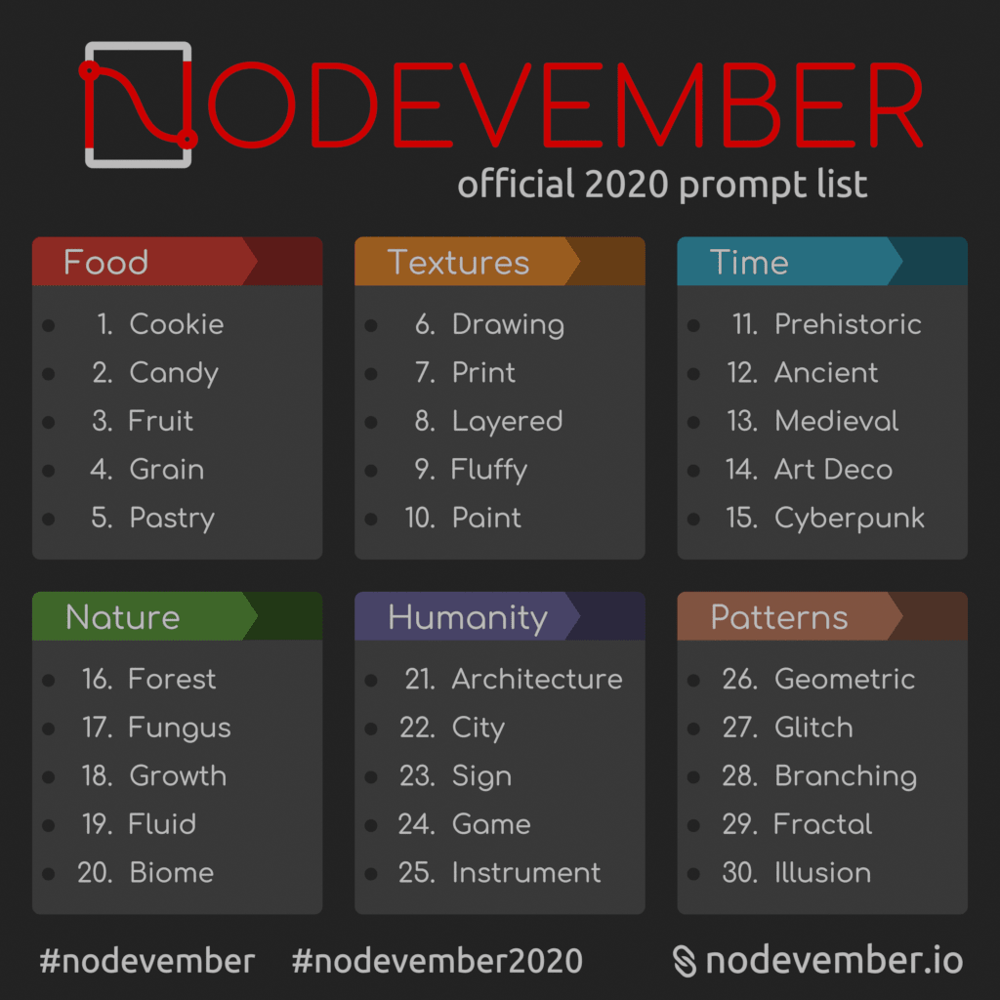

_The team behind the Nodevember event contacted us to raise awareness about it after a great start in 2019. We're all invited to challenge ourselves by doing procedural art every day with our favorite tools. You'll find all the details in their press release below._

Nodevember is a yearly event to encourage and promote procedural art.
The prompts are here! Get inspired to make intriguing procedural creations every day during the month of November!

Nodevember is a challenge, not a contest. No matter your field or skill level, any and all node-based/procedural creations are welcome!
In fact, Nodevember is a fantastic opportunity to challenge yourself to learn new things and advance your procedural abilities, or to just show off your node wizardry.

Participating is simple:

- Create awesome procedural stuff inspired by the prompt each day.
- Post your result, along with a screenshot of your nodes, on social media.
- Tag you post with #nodevember and #nodevember2020 so that everyone can see it.

The exact limit of what is procedural depends on your field and skill level, so we encourage you to define your own boundaries and goals at the beginning of the month.

These are our suggested boundaries for popular fields:

Shading/texturing:

- No image textures.
- No nodes that load external data.
- For an extra challenge, use only procedural lighting (no HDRIs).

Modelling:

- No manual sculpting/modelling.
- Basic primitives only.
- No nodes that load external data.

Music/sound synthesis:

- No samples or recordings.
- No nodes that load external data.
- Basic oscillators only (no wavetables).

But in the end it's up to you to set your own personal challenge, and decide how far you want to push yourself.
And above all, have fun!

For more info and updates, follow [@NodevemberIO on Twitter](https://twitter.com/NodevemberIO/) and [Instagram](https://www.instagram.com/NodevemberIO/), and check out [nodevember.io](https://nodevember.io/).
