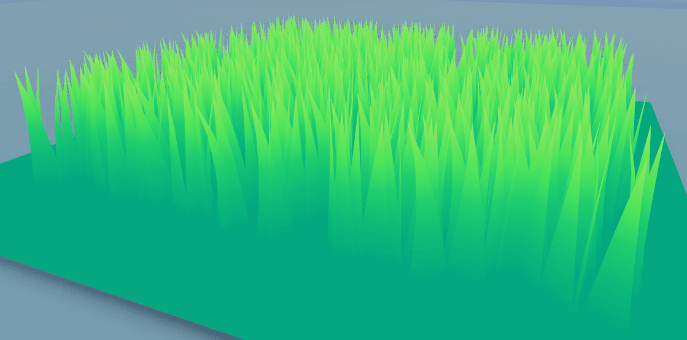
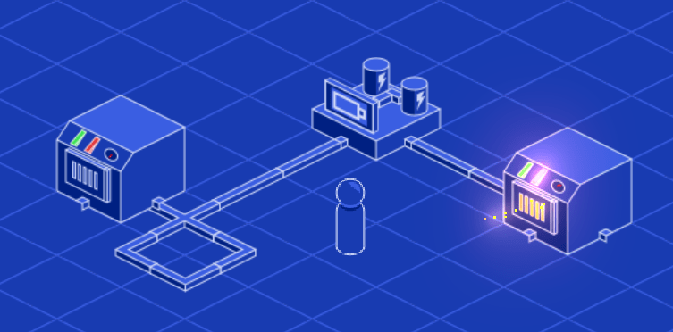
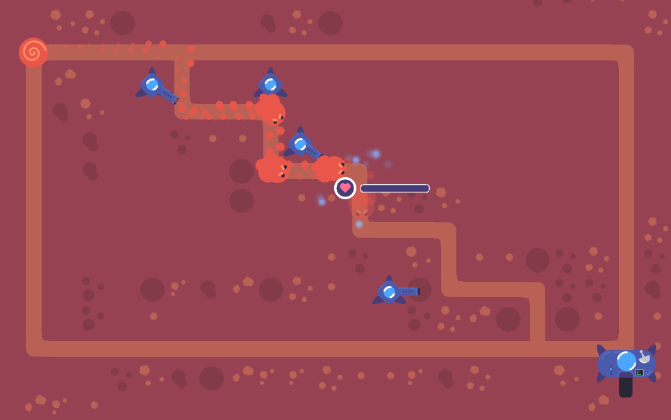
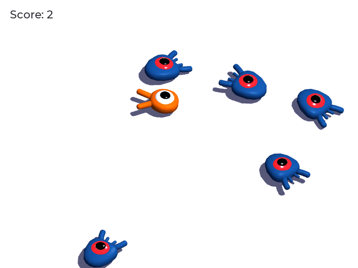
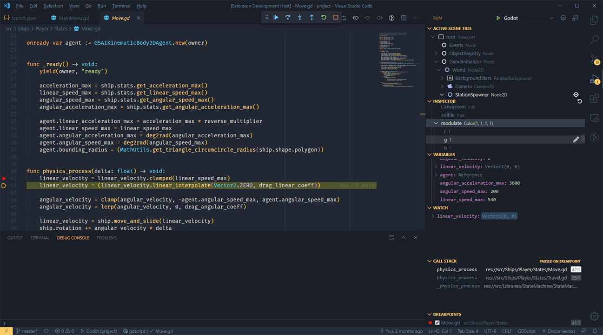

+++
title = "20 New Open Source Projects"
description = "In 2020, we created two dozens of free and open-source code repositories with game demos, assets like shaders and VFX, and tools to help you on your game development journey with Godot. Here's a run through all of them."
author = "nathan"

date = 2021-01-14
weight = 5

categories = ["news"]

[[resources]]
  name = "banner"
  src = "00.wires-and-smelting.png"

+++

Since the start, our goal at GDQuest has been to help you become a better game developer using Free Software.

Over the years, we made videos, [tutorials](), and we generally try to spend at least half our time producing free content. In 2020, we kept at it, focusing on creating open-source demos, assets, and more.

We created no less than 20 new GitHub repositories, with tons of resources and the same focus on code quality we always strive for.

## Shaders, VFX, and procedural generation

Creating shaders and procedural content generation (PCG) algorithms is time-consuming and often difficult. Thus, few persons work on those, and it can be challenging to find resources, especially when it comes to Godot.

Many of you told us you wanted to learn those topics, and we knew the community would benefit from a professionally made library of shaders and PCG demos. So we got to work.

The [Godot Shaders](https://github.com/GDQuest/godot-shaders) repository contains both 2D and 3D shaders with many examples ranging from beginner-friendly to more advanced techniques.

[Godot Visual Effects](https://github.com/GDQuest/godot-visual-effects) focuses on particle systems, VFX animation, and showing how you can use the engine's built-in features to create effects that look good.



The most emblematic one is probably the laser, for which we also made one of those one-minute tutorials.

We also worked on PCG algorithms and demo.

[Godot procedural generation](https://github.com/GDQuest/godot-procedural-generation) is about generating random levels, but not only. In there, we want to cover many aspects of procedural content generation. We already have a shader-based world map generator, infinite world generation in space, and procedural weapons with gameplay modifiers, as seen in Enter the Gungeon.

DevDuck showed in a video how he used our random walker demo as a starting point to make caves in his game dolphin.



We created three companion courses, [Shader Secrets](https://gdquest.mavenseed.com/courses/godot-shader-secrets), [VFX secrets](https://gdquest.mavenseed.com/courses/godot-vfx-secrets), and [PCG secrets](https://gdquest.mavenseed.com/courses/godot-pcg-secrets), to fund all that free code. We sold enough copies to keep those projects going, so you can expect more in 2021!

## Game demos

Since last year, we have produced many game demos, from small to relatively large. They are for educational purposes, and most of them are funded by our course [Godot 2D Secrets](https://gdquest.mavenseed.com/courses/godot-2d-secrets) and the 650+ Kickstarter backers who made it possible.

I'll run you through the projects quickly as there are many.

The [tactical space combat demo](https://github.com/GDQuest/godot-2d-tactical-space-combat) is a clone of [Faster Than Light](https://subsetgames.com/ftl.html). It covers a real-time tactical combat system.

The [2D JRPG combat demo](https://github.com/GDQuest/godot-2d-jrpg-combat) is the successor to our old project Godot open RPG, but with a more focused scope and cleaner code.

The [2D builder](https://github.com/GDQuest/godot-2d-builder) is a simulation game inspired by titles like Minecraft and Factorio, taking place in a 2D isometric world.

We made a [mobile rhythm game demo](https://github.com/GDQuest/godot-2d-rhythm) that's a clone of [Osu](https://osu.ppy.sh/home)! and Elite Beat Agents.

Pigdev has been working on a [tower defense demo](https://github.com/GDQuest/godot-2d-tower-defense), a classic genre we played back in the Flash days.

We got quite a few requests for tactical RPGs, so we worked on a [Tactical RPG board demo](https://github.com/GDQuest/godot-2d-tactical-rpg-movement). As we already have many complex tutorial series to tackle already, we decided to make a more beginner-friendly one focused on unit selection, grid movement, and pathfinding.

We are working on an [action platform game demo](https://github.com/GDQuest/godot-2d-action-platformer) to cover shooting mechanics and offer a text-based tutorial series for side-scrolling games.

There's a [visual novel demo](https://github.com/GDQuest/godot-2d-visual-novel) in the works to cover dialogue systems and sequencing game events.

The [Godot mini-tuts](https://github.com/GDQuest/godot-mini-tuts-demos) are our new general repository for small and problem-focused demos. Each of them is about solving a specific problem we found in the community.

Finally, our biggest demo last year was the [Godot 2D space game](https://github.com/GDQuest/godot-2d-space-game). We made it to showcase how our Free [Godot Steering AI framework](https://github.com/GDQuest/godot-steering-ai-framework) works and what you could do with it. Things like soft landing on a round surface with your ship, flocks of enemies that pursue you while avoiding one another, and much more.

## Contributions to Godot

In late 2020, the Godot team hired me to work on the official Godot documentation. I reorganized the docs and rewrote the getting started series, among other things.

You can see all that in my [docs improvements report](https://godotengine.org/article/godot-docs-improvements-report).

In particular, I got to write a complete [beginner-friendly 3D game series](https://docs.godotengine.org/en/latest/getting_started/first_3d_game/) based on the 2D "dodge the creeps".

We also worked on two code editor plug-ins.

[Razoric](https://twitter.com/razoric480) added debugger and code formatter support to the [VSCode plug-in](https://github.com/godotengine/godot-vscode-plugin). You can now debug and inspect your GDScript code directly in visual studio code.

We also developed Godot and [GDScript package for Emacs](https://github.com/godotengine/emacs-gdscript-mode) and donated the repository to the Godot Engine organization. It's a complete package supporting all the essentials like language syntax, indentation, code navigation, folding, and more.

We also sponsored work on Godot to allow editors other than VSCode to support the GDScript language server. This enables the addition of rich auto-completion in other code editors like Emacs or Vim. We already added language server support for GDScript in the Emacs LSP package.

Our package also has debugger support since two months ago.

## Godot design patterns

Recently, we started a repository of **design patterns implemented in GDScript**: [Godot design patterns](https://github.com/GDQuest/godot-design-patterns).

It's still an early work-in-progress, but that's one you'll want to bookmark!

We experiment a lot with the techniques we can use in Godot for our tutorials and courses to bring you the most value.

In general, we try to _avoid_ using design patterns.

This might surprise you as they are often presented as _"best practices"_.

However, their purpose is to solve _specific_ problems, and often they work around a limitation of the language or framework you're using.

When coding, I always recommend using the **simplest solution possible** in your project's context. 

Different technologies allow you to use other solutions to the same problem, and often, in Godot, you don't need the design patterns you would have to use if you were writing plain C# or C++. For example, Godot has the singleton and observer patterns built-in in the form of autoloads and signals, respectively.

With that said, **patterns are valuable**. Sometimes you just need to use a finite state machine or to turn objects into commands.

That's why we created this repository. We're collecting all the design patterns we find useful in Godot and share our take on their implementation with examples.

As usual, we decided to share the code under the MIT license.

## Tools and plug-ins

To wrap up this rapid tour of our open source projects in 2020, we released some more tools. They're for people who make plug-ins or libraries for Godot, game artists working with Krita, and people who would like to do tutorial series like us.

Godot 4.0 will have a tool to generate documentation for your GDScript code in the engine. But as it was a long way off, we created a Python program to fill that feature gap in the meantime: [GDScript Docs Maker](https://github.com/GDQuest/gdscript-docs-maker).

It creates markdown documents from your GDScript code. Some projects, like the [Godot card game framework](https://github.com/db0/godot-card-game-framework), use it for their documentation.

We made a tool to batch export game sprites and layers or groups of layers as image files for Krita: [Krita batch exporter](https://github.com/GDQuest/krita-batch-exporter).

The plug-in is now official and comes built into the latest releases. It is inspired by Photoshop Generator, a system that gives game artists a lot of flexibility with organizing and exporting game assets.

Finally, [GDQuest Product Packager](https://github.com/GDQuest/product-packager) is a collection of command-line scripts we use to create our courses. There are tools to resize and compress pictures and videos or to highlight GDScript code and markdown documents. Also, we have a script that uses the document converter Pandoc to translate markdown into standalone HTML files and PDFs.

While you can use the scripts individually, we also provide an example of our build system, a simple makefile that runs those commands on our courses' source files. We made them for our Godot Secrets courses, and it saved us a lot of work.

All of that is only possible thanks to our Godot courses.

## GDQuest Godot courses

If you want to further your Godot skills, advance to the next level as a game developer, and support our work _all at the same time_, we create **in-depth** training series that cover techniques you will not find elsewhere.



They come with a **60-days refund warranty**, DRM free downloadable lessons, and questions and answers.

We even have an [ultimate Godot course bundle](https://gdquest.mavenseed.com/courses/ultimate-gdquest-bundle) that gives you free access to all our current and future Godot training series at a discount.

