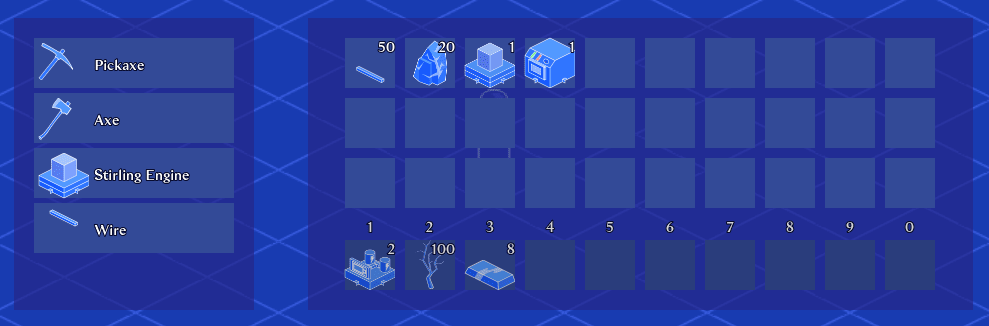
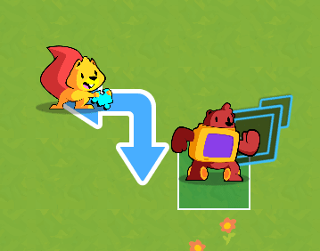

The 10th early-access update of [Godot 2D secrets](https://school.gdquest.com/products/godot_2d_secrets_godot_3) is out now!

It adds a chapter that covers a **Factorio-like inventory system in-depth**.

We also rewrote the finite state machine tutorial and added a new guide dedicated to the **mediator design pattern**, one we often use for user interface, but not only.

You'll also find **two new challenges** and their respective solutions in the JRPG combat and Tactical-RPG movement courses.

## Going the extra mile with our new review process

With the first release of 2D Secrets, we got some constructive feedback from you. As we're working on complex projects for tutorials, more than ever before, we got more bug reports than we would've liked.

Even if we're careful, typos and minor bugs happen, especially with the complexity of the tutorials we're writing.

We make sure to fix them as soon as you report them to us, and we're really thankful that you take the time to do so.

Still, we wanted to improve our workflow to catch more errors before release and minimize friction for you.

We now always work in a duo on new courses and do up to **4 complete review passes** on a given series:

1. For every lesson he writes, Razoric follows all his own instructions. He then sends me the chapter to proof-read from start to finish.
1. While doing that, I **play the role of a student** and leave many questions on the lessons.
1. Razoric goes back in for another writing and testing pass, addressing all my notes and questions. 
1. Then, he sends me the result. Starting from the first tutorial, I follow every step again, checking that our resulting code matches at the end of every tutorial.

I take this opportunity to improve phrasing again and, if I need anything, Razoric stays available to help.

This review process spans over a full week for one chapter and takes dozens of extra work hours.

But since we started following this process, all you reported were a few minor typos.

So, we're happy to invest that extra time if it improves your learning experience!

## More to come

We still have one chapter planned in the simulation series, dedicated to crafting and adding new machines.

Johnny, Henrique, and Razvan are working on the rhythm game, tower defense, and FTL-like tutorial series.

It will still take us time to complete the course as we're producing a massive amount of content and adding bonuses as we go, like the best practices and design pattern chapters.

We already wrote 80 lessons VS the minimum of 40 we promised during the Kickstarter campaign.

I also want to resume work on YouTube videos. As we've been focusing on 2D Secrets for several months, we left the channel for dead in the meantime. Like other subscribers, I'm sure you would appreciate seeing some new videos that complement the course.

So, I will allocate some time to making videos and free content while building the course in parallel.

We have a solid workflow right now, so you can rest assured that it won't affect our monthly updates to 2D secrets.

With that, I'll see you in the next update.

You can already enjoy the new release of [Godot 2D Secrets](https://school.gdquest.com/products/godot_2d_secrets_godot_3).
