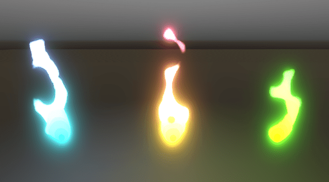
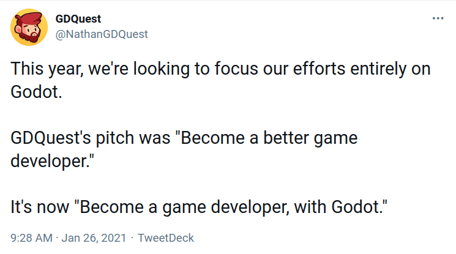

2020 has been a tough year for everyone, having to stay so much at home with the pandemic.

Many of you turned that into an opportunity to teach themselves new skills, like game creation.

In 2020, Godot saw steady growth in its userbase. It's become more powerful, its ecosystem's starting to grow as well, and there are more and more learning resources for it.

**It's been a year of a kind for us as well, learning to work more closely as a team and open-sourcing all our code.**

We've tried to make the most of it. Among other things, last year, we created [20 new open-source projects](/news/2021/01/20-new-open-source-projects/).

We released a mix of assets for game developers, demos to study good programming practices in Godot, and tools like our steering AI framework.

_Stylized fire shader by QBieShay, based on a Unity guide by [MinionsArt](https://twitter.com/minionsart)._

We also released [6 Godot courses](https://gdquest.mavenseed.com/courses/) to keep our revenue flowing and compensate for sales going down.

As a result, we released fewer videos than I would have liked. That's something we'll change in 2021.

## How much we earned in 2020

While GDQuest is a little company, it is also a free software project. Since the beginning, my goal has been to support free software and spread that mindset of sharing and learning together.

**Money is a means to an end.** As our budget grows, I can hire people and stay working full-time, as the growing amount of content and open-source code we release shows.

**It's essential for free software projects to get funding** because the time and number of persons who can work on the project are **hard limiting factors**.

If you look at the successful programs we use like Krita, Gimp, or Godot, they all have substantial budgets and full-time developers. They also do a lot with a little: while hundreds of thousands of dollars a year can seem like a lot, proprietary tech companies usually operate with millions.

Becoming a team over allowed us to improve our tutorials' quality steadily, among other things. With several programmers working together, we can review and correct each other's code, learn from each other, and develop complementary skills.

But that has a cost. And so, to keep going in that direction, I want our budget to increase as well.

**In 2019, GDQuest had gross revenue of €66,500.**

As we are a social business, 100% of that goes to our salaries, hardware, and professional expenses (_for example, going to GodotCon or paying an accountant_).

In 2020, the number went up to **€90,000, a 35% increase**. Our spendings also went up roughly €24,000, as I spent almost all the extra income to pay people.

Our 2020 revenue came from three sources:

1. We got outstanding support from our latest Kickstarter's backers, once again, and could raise over €32,000. That single crowdfunding campaign made up roughly 36% of our yearly revenue.
1. A little under 10% came from our contract with HeroicLabs and my work on the official Godot documentation.
1. The rest came from our courses' sales. To achieve that, we had to release 6 new products and 2 new bundles.

That increase in revenue allowed me to bring three new persons working part-time with us:

1. Azagaya, creator of Laigter.
2. Ilaria, who's been working with Godot for years. She's working with us as a VFX artist.
3. And Rafael, who teaches Godot to young people in difficult situations in Spain.

Some other team members could also work more hours than before.

## My goals in 2021

This year, I want to increase our revenue by another third, **going past €120,000**.

As mentioned above, _this is a means to an end_.

With that money, I could hire someone full-time or close to full-time moving forward hopefully, and, in turn, support our other goals. 

Those are the things that matter most to me. This year, I want us to achieve, _at least_:

- **26 new Godot videos**.
- **50 new free guides and tutorials** on the website.
- A successful crowdfunding where you back us to produce a ton of free content for Godot. A challenge I've been looking to tackle since a few years.
- One educational game, no matter how small.

And more.

All that with a focus on **quality over quantity**. The video count may not seem much, but when we make a 2-hour course, that's just one video and it may take us weeks to do right.

I also announced that we would focus on Godot this year. And by doing that, I hope we can surpass all those goals. 

We can become more efficient, more demanding with our work, and better listen to your needs and wishes.

As for money, we launched a new offer of an [ultimate Godot course bundle](https://gdquest.mavenseed.com/courses/ultimate-gdquest-bundle/) that is currently selling well and that, I hope, will support our funding goals.

I hope that this year again, you will follow us, learn from our tutorials, and keep improving your game development skills.

Since the start of the year, we haven't stopped working. We have already released a few new free tutorials, like our complete [tactical RPG grid-based movement series](/tutorial/godot/2d/tactical-rpg-movement/) or our [finite state machine guide](/tutorial/godot/design-patterns/finite-state-machine/) for Godot. It's just the start. There are many more to come.

If you want to receive new tutorials, you should really [subscribe to our channel](https://www.youtube.com/c/gdquest/) and [follow me on Twitter](https://twitter.com/NathanGDQuest).

We're already planning new videos, and we will keep releasing new content.

_Be creative, have fun, and we will see one another in the next one._
