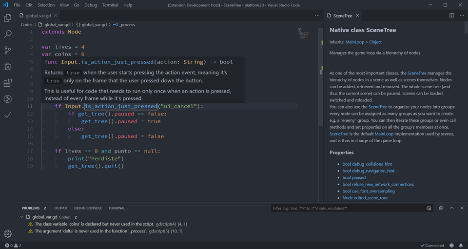
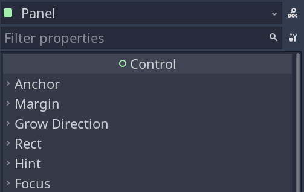
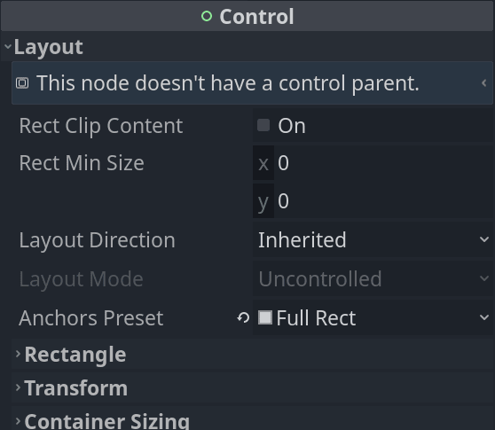
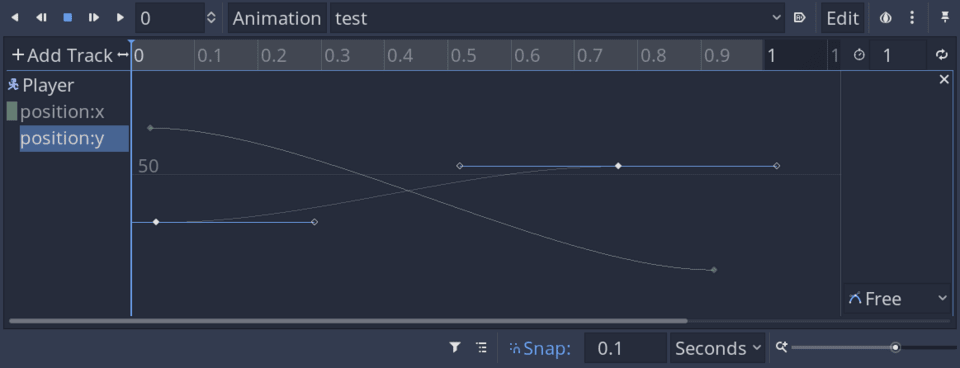
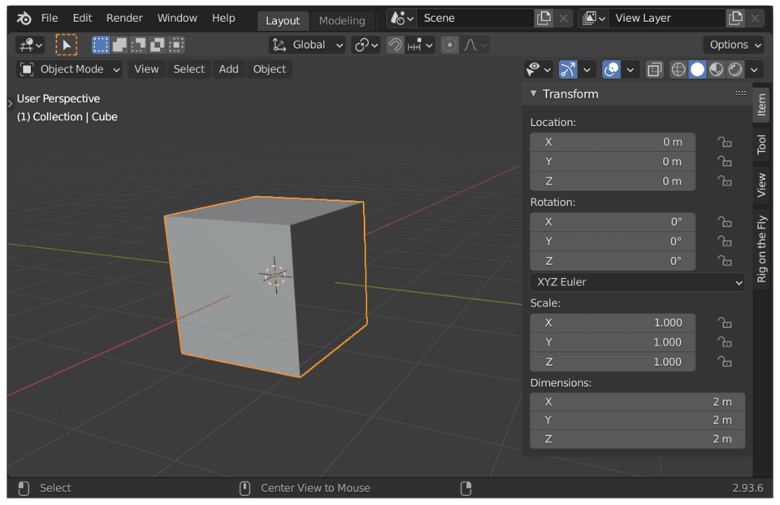
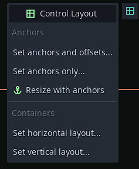
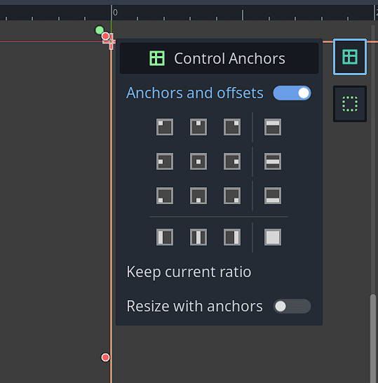

Thanks to your support, we were able to hire two Godot developers. As they're two, they can work in parallel on different areas of Godot, accelerating contributions.

The two developers we chose to hire are Yuri, a.k.a. pycbouh, and Razoric.

Yuri has been contributing to Godot benevolently for two years. He's behind the theme editor's redesign and many other improvements like the visual scripting's mini-map.



We hired him to work on Godot's User Experience (UX) and User Interface (UI) design as it's his specialty.

Razoric has been part of the GDQuest team for over two years now. He's the author of our open-source simulation game demo and worked on some of our advanced-level tutorials.

We sponsored him on some important contributions to Godot's language server. The language server is a technology that allows you to code in GDScript in external code editors like Visual Studio Code or Emacs with many nice features.

He is now helping to improve and redesign the animation graph editor.

## Making it easier to create UIs in your games

Yuri's first job was on fixing the confusing experience editing Control nodes. They're the building blocks of UIs in Godot games. 

Godot has a powerful system to create a user interface for your games. However, the Control nodes have tons of properties, many of which only work in a specific context.

The current control node inspector categories look like this:

Most of the time you don't need the _Anchors_, _Margin_, and _Grow Direction_ options, yet they're the first.

Here's the problem in Godot 3.4:

- Sometimes, you change properties in the editor, and it appears to work, but the interface gets reset once you play the game.
- The inspector does not tell you which properties are valid in different contexts.
- The most important properties are not at the top of the inspector, and sometimes they're a bit hard to find.

With Yuri's first contribution, this is all much more straightforward and more efficient to use.

The properties are now filtered to show only what makes a difference in the current context.

Everything you care about regarding layout is now in a single _Layout_ category.

This redesign comes with many small changes to make your experience creating UIs faster like the help message at the top of the inspector.

Here's the pull request for all the above: https://github.com/godotengine/godot/pull/55157

## Improvements to the animation graph editor by Razoric

Godot comes with a powerful animation system and an animation graph editor. It's something animators work with a lot and that you find in every 3D animation program.

Godot's graph editor has never been too user-friendly. It's always lacked a couple of key features to make it productive to use.

Juan, Godot's co-author, made an [interesting proposal](https://github.com/godotengine/godot-proposals/issues/3141) to make many improvements based on people's requests.

We felt that would benefit the community, and no core developer could do it, so we also decided to fund work on this.

Here are the main improvements Razoric made:

- You can now see all animation curves in the scene at once. Until now, you could only see the selected node.
- You can select animation tracks by clicking anywhere on a curve instead of having to select it from the left margin.
- Pressing Ctrl-A and Ctrl-Shift-A will respectively select and deselect all keyframes.
- You can now toggle the visibility of curves, solo them, or lock them.
- You can now press F to zoom to fit the selected portion of the curve instantly.
- Curves now have correct colors, like red for the X axis, green for Y, and blue for Z, like in the rest of Godot.

Razoric also made more bug fixes along the way.

He is already working on an exciting new feature: the ability to create auto-balancing keyframes.

Those automatically change orientation as you update surrounding keyframes to give you a smooth animation curve. You find them in programs like Maya, Blender, or AfterEffects.

You can find the pull request for the graph editor improvements here: https://github.com/godotengine/godot/pull/55030

## Side drawers in the viewport or "vertical toolbars"

Yuri is making an experiment and proposal to add "vertical toolbars" to the viewport: https://github.com/godotengine/godot-proposals/issues/3550

There is a problem with Godot's toolbar. Over time, developers want to add more and more contextual options to it, and they can't. Otherwise, it gets too crowded.

As it has limited horizontal space, you can't put many text labels, making things difficult to learn.

Programs like Blender 3D use side drawers to show the properties of selected objects and contextual options in their 3D viewport.

The idea is to have something like that in Godot. Depending on the node you select, different tools appear.

Mind that at this stage, this is a proposal. It's still subject to approval and improvements.

Finally, Yuri also took the opportunity to implement another proposal by Krystof: presenting the UI layout options in a grid instead of a drop-down menu.

It makes it convenient to move and anchor UI widgets to different corners.

The two developers we hired are both experienced and very efficient, as you can see. 

You can expect them to do quite a bit more with the money. This is just the start of what your contributions will fund.

In parallel, we are already working on the course curriculum and the app. That will be the topic for the next update.

Kind regards,
Nathan
