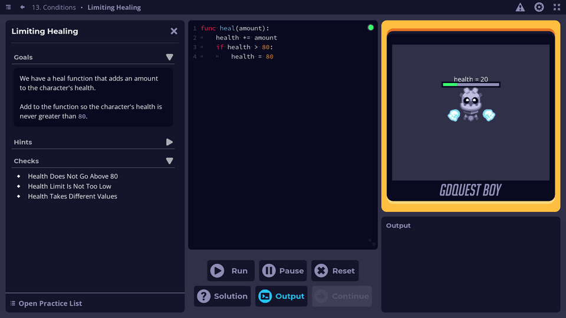

We are proud to announce the release of our new app designed to help people learn the GDScript programming language used in the popular open-source game engine Godot. This app is completely free and open-source, and the source code is available [on our GitHub page](https://github.com/GDQuest/learn-gdscript).

Our app is designed to be accessible to people with no programming experience. It provides a step-by-step guide to learning GDScript, starting with the absolute basics and gradually introducing more concepts. 

The app is easy to use and intuitive, making it a great resource for anyone interested in learning game development.

You can try out the app for yourself by clicking the button below:



We also have downloadable versions available [on itch.io](https://gdquest.itch.io/learn-godot-gdscript) for desktop users.

We plan to update the app to work with the upcoming Godot 4 release. This will ensure that it stays relevant and useful for anyone looking to learn Godot in the future.

We hope the app will be a valuable resource for anyone interested in learning GDScript and Godot. Happy coding!
