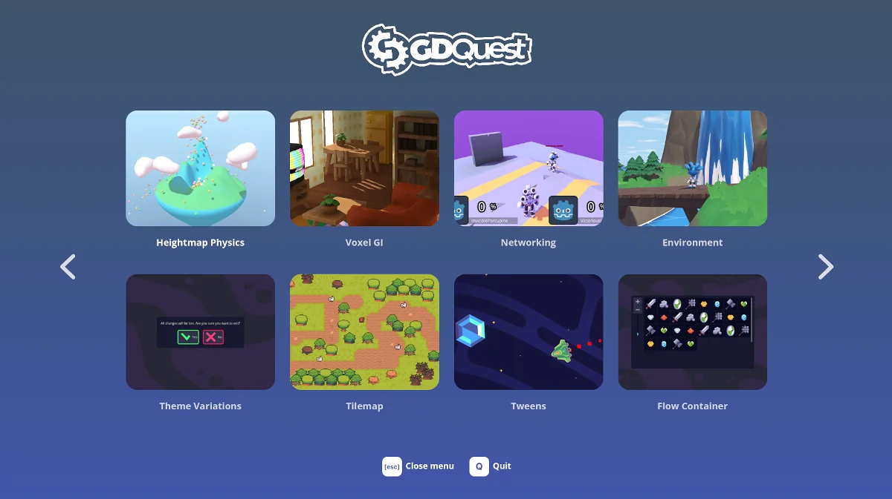

After years of hard work, Godot 4.0 is out! It is *almost* a brand-new engine, with rendering rewritten from the ground up, a modernized core, and no stones left unturned.

It comes with three Vulkan and OpenGL rendering backends, an improved game-specific 2d and 3d physics engine (Godot Physics), boosted graphics and VFX, drastically improved 3D, 2D, multiplayer and XR workflows, as well as wider localization, accessibility, and platform support.

Though fear not, if you know Godot, it's still familiar, just *much* better. 4.0 frees you from many limitations of Godot 3 without becoming heavy and bloated.

You can find all the highlights and new features in this *30-minute* video.

Yes, there are *that* many things to talk about!



## The beginning of a journey

Godot 4.0 is an enormous milestone, but it's also the beginning of a journey. There are many more improvements left to make following this major update.

Among other things, there's room for more performance optimizations. The new 3D OpenGL renderer for low-end devices has yet to support shadows or other effects. It works great in 2D, though. (Of course, that's aside from the default Vulkan renderers which work great).

The developers are working on a roadmap focused on polishing and performance for the coming months.

We've tested the new engine and editor over the past months, working on all kinds of open-source demos, and the experience was great.

## Console support is officially coming

The lack of official console support was always a concern for studios looking to make games with Godot.

With Godot 4, this shouldn't be an issue anymore. W4 Games, a company founded by veterans of the Godot development team, announced upcoming console support for the engine. You can learn the details in [their article](https://w4games.com/2023/02/28/godot-support-for-consoles-is-coming-courtesy-of-w4-games/).

## Get 20 free Godot 4.0 demos

You can find all the open-source demos we made for the release video here: https://gdquest.com/demos/godot-4.0-new-features

You'll find examples of the new 3D rendering, AI navigation links for agents to use navigation links, particle trails and collisions, and much more.

If you want to support more work like this, consider buying one of our courses! All our Godot courses are 50% off until March 8, 2023, with the coupon code **GODOT4**.


