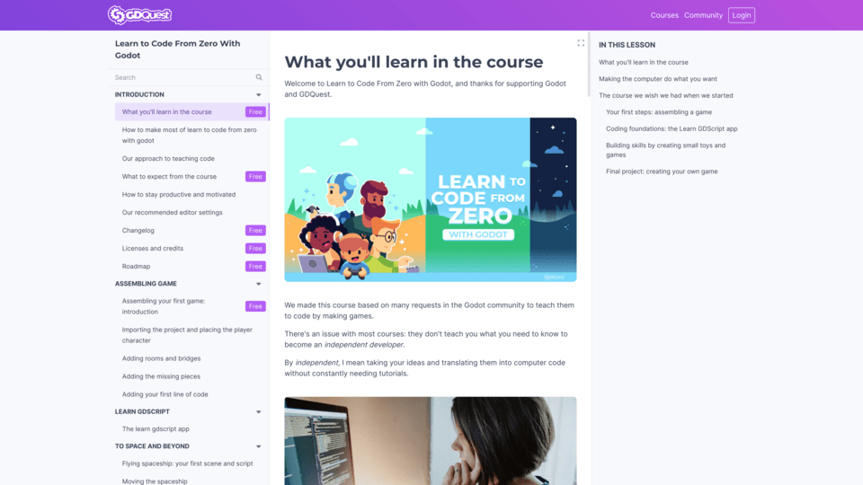
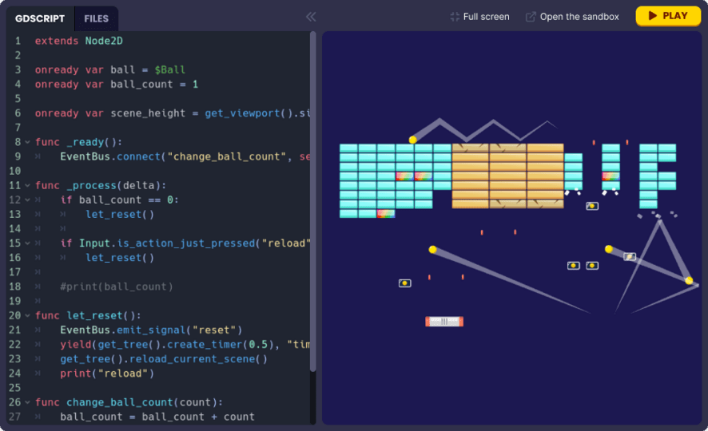

## As of July 15 at midnight UTC, we’re discontinuing the Ultimate Bundle.

**What’s the Ultimate Bundle?**

So far, for anyone in the know, it’s been possible to get unlimited lifetime access to all present and future Godot courses and learning resources. This golden ticket of sorts is what we’ve called: The Ultimate Bundle. It has been available on our website for about USD 379.95 (with purchasing power parity depending on the country you’re from).

**Wait, what if I already bought the Ultimate Bundle?**

A promise is a promise, so nothing changes for you. You will always have access to all the Godot courses GDQuest has and will ever create in the future.

**Shoot. I wish I’d known earlier. Can I still get a lifetime pass?**

Yes, for another few days. Until July 15th at midnight UTC.

**Sounds like a good deal. Why are you stopping it?**

The Ultimate Bundle has been a great offer. It’s helped many people become game developers and supported our teaching mission at GDQuest. This said, like most of you, and like Godot itself, we’ve grown to take on bigger challenges and create better learning tools.

We’re working on multiple learning pathways with many new Godot courses planned and we’re developing several new technologies both for GDQuest and Godot.This effort requires constant development for which a lifetime subscription model is not a good fit.

**Will you ever bring back a GDQuest golden ticket?**

We’re not sure yet. We may exceptionally do so, as part of flash promotional or crowdfunding campaigns, but no promises. We haven’t looked into it yet, nor evaluated a price point for it. If we ever do, our [Discord Server](https://discord.gg/87NNb3Z) is the best place to find out and stay up-to-date.

**What are GDQuest’s plans then? Let’s hear it.**

Lots of exciting things are happening at the moment. Godot 4 is a turning point for GDQuest too.

We’re continuing to produce high quality [free and open source game assets](https://github.com/gdquest-demos/3D-Characters-Repository/), [Godot 4 demos](https://github.com/gdquest-demos/), and video content.

In case you’ve missed it, we recently released Gobot, our latest 3D Godot character inspired from the Godot mascot.



We’re creating new Godot 4 courses, introducing learning pathways, and working on multiple new technologies to support Game Dev education.

There will be a learning pathway for beginners starting from how to think like a game dev and how to code all the way to separate courses that focus on teaching you how to make a specific type of game. 

There will also be a learning pathway for experienced game devs, with a large library of resources focusing on specific game mechanics and systems. 

The artists and designers among you will also have their own learning pathway more focused on the visual aspect of game development. 

Finally, we’re partnering up with schools to extend our courses as part of a curriculum for public and private learning institutions. We recently met with award-winning school [Pôle 3D](https://pole3d.com/en/homepage/) to help them cover Godot and use it for their VR research program.

The above is a gigantic undertaking. It's a plan we'll gradually work on over the next couple of years. In 2023, we're working in parallel on the beginner and experienced developer pathways.

Very soon, we’re phasing out our reliance on third-party course hosting platforms like Mavenseed and we’re testing and launching our own interactive learning platform tailored to game dev education.

It will include GDPen, an exciting new learning tool we’re creating for Godot. The new technology allows you to run Godot demos directly in the browser and view and edit scripts live, and even share it with others for reference or review.

Thanks for your ongoing support of GDQuest, Godot, open education and open source software development. Your choices help preserve the independence of the game development field.

Remember the Ultimate Bundle will continue to be available for another few days until July 15 at midnight UTC.
