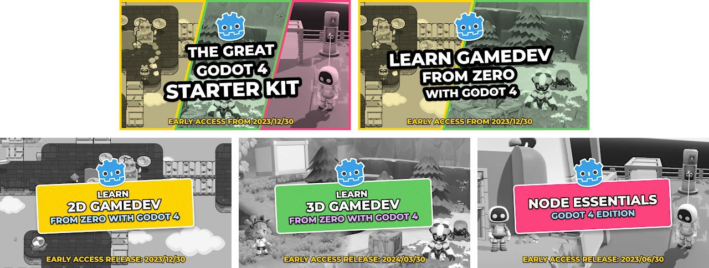
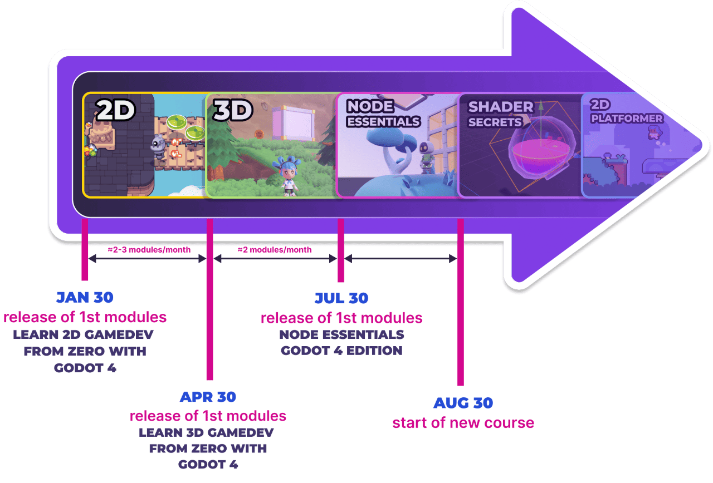

Godot 4.2 just came out, and it is definitely a version we can teach. We started applying some of our own new ed-tech (educational technology) to course content. With this, we're glad to announce the continuous roll-out of [Godot 4 courses](https://school.gdquest.com/godot-4-early-access) starting Jan 30.

Anyone who starts their course in Early Access can save up to 50% on the price of the full version as a token of our gratitude for being an early adopter and for helping fund course production.

**Check out the release plan of our Godot 4 courses:**

In related news, we're introducing an exciting new bundle: **[The Great Godot 4 Starter Kit](https://school.gdquest.com/products/bundle_godot_4_starter_kit)**.  
It takes you from zero to 2D and 3D gamedev and on to Godot game mechanics pro. In short, it's a great kit if you're really serious about learning Godot.

Note that if you already bought Learn to Code From Zero and Node Essentials for Godot 3, you will already get 2 out of the 3 courses in this bundle for free: [Learn 2D Gamedev From Zero](https://school.gdquest.com/products/learn_2d_gamedev_godot_4) and [Node Essentials Godot 4 Edition](https://school.gdquest.com/products/node_essentials_godot_4), respectively.

In that case, we would recommend getting the [3D course](https://school.gdquest.com/products/learn_3d_gamedev_godot_4) separately instead of the bundle.

## For a limited time, you can save up to 50% by pre-ordering Godot 4 courses

At the moment, you can add the extra Godot 4.2 coupon **EARLYBIRD** to the existing presale to save even more.

If you know anyone who's learning, this might be a good opportunity to share with them.

## We're moving to GDSchool by the end of the year

Our new courses will launch directly on our own new learning platform, [GDSchool](https://school.gdquest.com).

In case you're wondering, we're not switching to a subscription model!!

Simply put: existing course hosting sites are just not a good fit for our teaching method, so we've made our own. The aim is a learning experience more adapted to game dev and specifically to the format of GDQuest courses.

## Your Questions

**I bought the ultimate bundle in the past. Do I need to buy these new courses separately?**

No! You will get all future Godot courses at no extra cost.

**I have an account on your previous website, gdquest.mavenseed.com, will my purchases be transferred to the new website?**

Yes, we will transfer all accounts and courses from [gdquest.mavenseed.com](https://gdquest.mavenseed.com) at the end of the year. You do not have to do anything for that.
If you'd like to purchase a new Godot 4 course separately, you will need to register an account on [school.gdquest.com](https://school.gdquest.com), our new website, using the same email as on gdquest.mavenseed.com.

Then, when we migrate accounts at the end of the year, we'll bring all your past purchases over.

**I bought Learn to Code From Zero with Godot 3 in the past, will I get a free upgrade?**

If you purchased Learn to Code From Zero with Godot 3 before Nov. 30, 2023, you will get [Learn 2D Gamedev From Zero](https://school.gdquest.com/products/learn_2d_gamedev_godot_4) for free. This is the upcoming Godot 4 remake of the course. This will happen automatically when we port your course to the new website at the end of the year.

**I bought Godot Node Essentials in the past, will I get a free upgrade?**

If you purchased Godot Node Essentials (Godot 3) before Nov. 30, 2023, you will get [Node Essentials Godot 4 Edition](https://school.gdquest.com/products/node_essentials_godot_4) for free. This will happen automatically when we port your course to the new website at the end of the year.