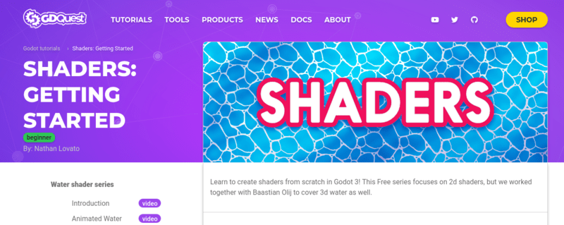
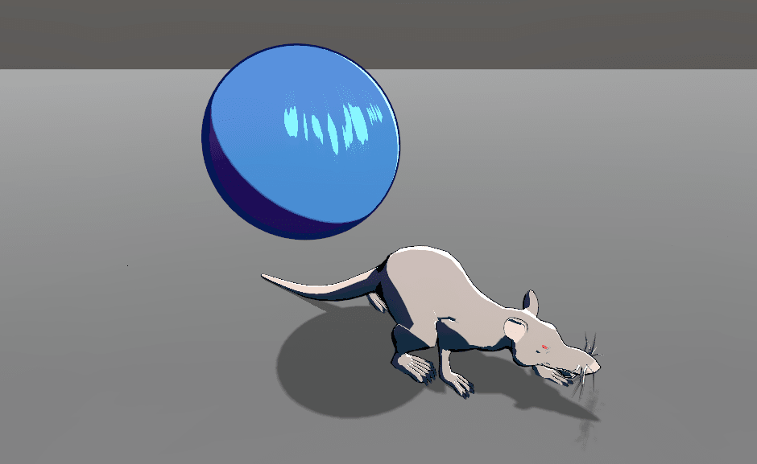
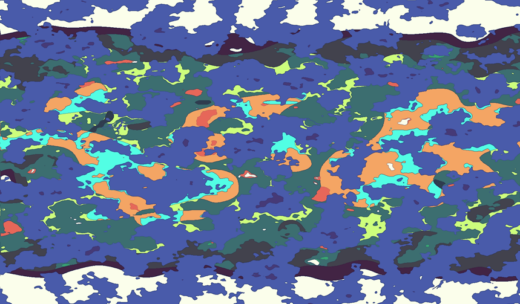
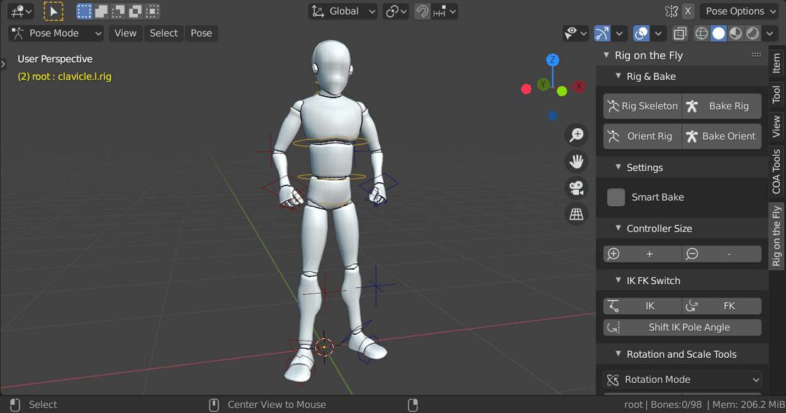

+++
author = "nathan"
date = 2020-07-02
description = ""
weight = 5
title = "GDQuest weekly 01"

draft = true
+++

Welcome to our first newsletter! In it, you will find:

- New tutorials and open-source tools we released or on which we're actively working.
- Game creation tips.
- Interesting projects you should check out.

## Website makeover

We redesigned our website, [GDQuest.com](https://www.gdquest.com/) to be able to release **more free tutorials**, text-based ones in particular. It now offers better navigation, mobile-friendly menus, faster page loading times, and much more.



Here are two tutorials we released recently:

1. Shaders: [Creating an animated 3D flag](https://www.gdquest.com/tutorial/godot/shaders/flag-shader-3d/)
2. Procedural generation: [Heightmap-based world map](https://www.gdquest.com/tutorial/godot/pcg/world-map/)

_Did you know? All our code is free software, including our website. And all our free tutorials, guides, and graphic design are under the [CC-By 4.0](https://creativecommons.org/licenses/by/4.0/) license. You can find the source code [on GitHub](https://github.com/GDQuest/website/)._

## Advanced toon shader and procedural world map

We've been active on GitHub with our shaders and procedural generation tools.

[Godot Shaders](https://github.com/GDQuest/godot-shaders) is getting an advanced 3D toon shader material, complete with metallic and specular reflections.



It's a work-in-progress, but it already supports more features than the built-in toon shader. For instance, our toon objects cast shadows onto one-another.

As for [procedural generation](https://github.com/GDQuest/godot-procedural-generation) algorithms, Razvan added a world map data generator with biomes, rivers, and a heatmap.



While at first glance, the result is "just an image", this is the back-bone of complex world generation. You can use those pixels as input data to produce huge 2D or 3D worlds with different biomes. Using shaders has two advantages:

1. You can visualize the output data.
2. Calculations with the graphics card are fast!

The only slow part in this algorithm is due to some image processing we're doing in GDScript.

Next, Razvan is working on a dungeon generator based on physics and minimum sparse trees that generate cool layouts and dungeons.

## Recommended projects

This week, I have two projects to recommend you: 

1. The Weekly Wait, a Godot newsletter
2. Rig on the Fly for Blender

[The Weekly Wait](https://weeklywait.substack.com/) is a **weekly recap** of what is happening around the Godot community and development. It's short and to the point. You can [read the second issue](https://weeklywait.substack.com/p/the-weekly-wait-2).

If you make 3D games and need to animate characters, check out [Rig on the Fly](https://gitlab.com/dypsloom/rigonthefly/)! This free Blender add-on adds support for the rigging workflow used on games like Halo 4 and Destiny. In short, it allows you to generate simple, animation-specific rigs for your characters, and to bake the animation data. It takes some getting used to, but it simplifies rigging and animation a **lot**.

We are now using that method on the [Open 3D Mannequin](https://github.com/GDQuest/godot-3d-mannequin), allowing anyone to animate it.



## Tips of the week

Here's a trick to control other nodes in setter functions.

Setter functions are a great way to create switches that affect child nodes in a given scene. For example, to make an animation and process start and stop when toggling a boolean value.

Here is an example. Imagine you have some lamp that the player can turn on and off. You want it to play some animation where the light blinks a bit.

The following code will cause an error:

```gdscript
export var is_active := false setget set_is_active
onready var anim_player := get_node("AnimationPlayer")


func set_is_active(value: bool) -> void:
    is_active = value

    # This will cause an error at startup because setter functions get called when objects
    # are created, before they  are added to the tree.
    if is_active:
        anim_player.play("on")
    else:
        anim_player.play("off")
```

It would be great if we could just have all that code in one function. Here's how:

```gdscript
export var is_active := false setget set_is_active
onready var anim_player := get_node("AnimationPlayer")


func set_is_active(value: bool) -> void:
    is_active = value

    # Wait for the owner to emit the "ready" signal
    if not is_inside_tree():
        yield(owner, "ready")

    if is_active:
        anim_player.play("on")
    else:
        anim_player.play("off")
```

You want to use the `yield()` keyword to wait for the owner, that is, the root node of the current scene in most cases, to emit the "ready" signal before accessing children.

Because nodes are added child-first to the tree, this guarantees that the animation player is ready as well.

That's it for this week. If you have any question or suggestion to improve the newsletter, please send me a message!
