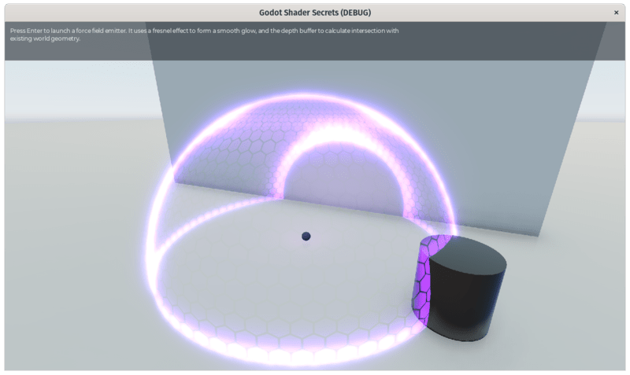
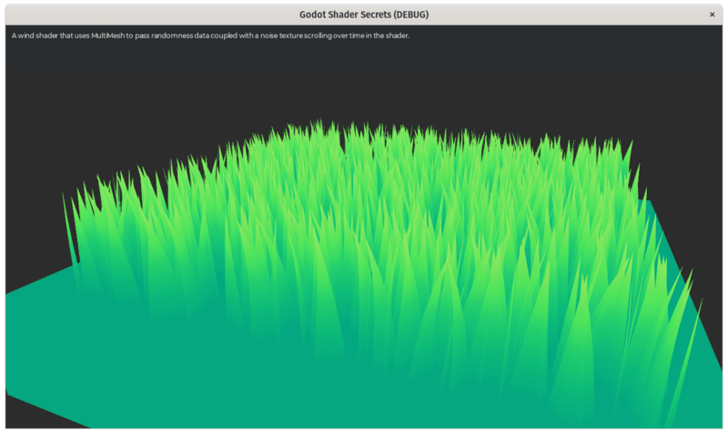
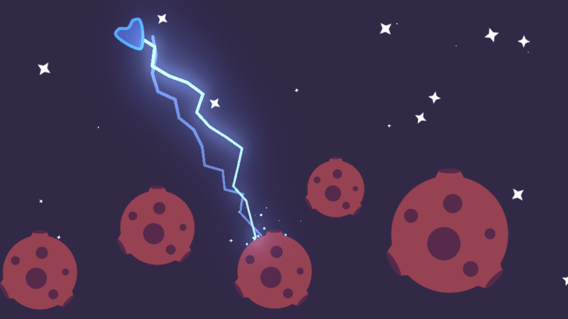
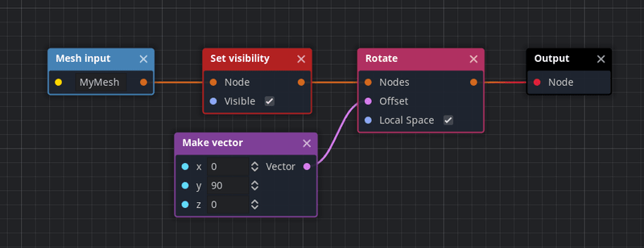

This week, we're coming to you with new Godot tutorials, shaders, and visual effects.

In short:

- [Godot Shaders](https://github.com/GDQuest/godot-shaders) got five new shaders.
- We released five new [Godot tutorials](), four dedicated to audio, one for shaders.
- We are preparing a new Kickstarter campaign to produce a lot of free content. More on that next week.

## New shaders

We have [new Godot shaders](https://github.com/GDQuest/godot-shaders) to share with you:

1. The **advanced toon material** now comes with a plug-in that allows you to use its deferred rendering model straight in the editor. It also has some subtle Rim lighting. It offers multiple features that the built-in material lacks.
1. There's a 3D force-field shader that interacts with existing geometry. Great for your sci-fi shields.

1. Razoric worked on a **procedural grass shader** that animates a grass field using some noise data.

1. The **2D side-view water** is probably worth mentioning as well, it shows how to do multiple effects like 2D reflections and perspective projection in a 2D shader.

## Godot mini-tutorials

We started working on a collection of free and open-source tutorials, the Godot mini-tutorials. They all go straight to the point. They present one problem and provide an efficient solution.

We looked around the web to see what was missing and felt there weren't many audio resources, so we started with that. Here are the first four mini-tutorials:

1. [Persistent background music](https://www.gdquest.com/tutorial/godot/audio/background-music/).
1. [Crossfading music with animations](https://www.gdquest.com/tutorial/godot/audio/background-music-transition/).https://www.gdquest.com/tutorial/godot/shaders/gradient-map/
1. [Avoiding cutting sound effects](https://www.gdquest.com/tutorial/godot/audio/pickup-sound-effect/) using the animation player.https://www.gdquest.com/tutorial/godot/shaders/gradient-map/
1. [Audio sliders](https://www.gdquest.com/tutorial/godot/audio/volume-slider/) to create audio options for your game.https://www.gdquest.com/tutorial/godot/shaders/gradient-map/



Johnny also worked on a shader tutorial dedicated to [gradient mapping](https://www.gdquest.com/tutorial/godot/shaders/gradient-map/), an essential technique used in many shaders.

The demos we made for these tutorials are, as usual, free software. You can find them now on GitHub: [Godot mini-tuts demos](https://github.com/GDQuest/godot-mini-tuts-demos).

We want to keep producing free learning resources like these for you. To do so, we're preparing a new crowdfunding campaign and our next big project. I'll let you know more in the next GDQuest weekly.

## Lightning!

Johnny and Henrique are working on new special effects.

This week's highlight is lightning. Johnny is working on adding the ability to chain lightning strikes between neighboring targets.

You can already play with it: it's up in our [Godot Visual Effects](https://github.com/GDQuest/godot-visual-effects) repository.

## Recommended projects

[ConceptGraph](https://github.com/HungryProton/concept_graph) is a procedural modeling application made entirely in Godot. It started as an add-on, and the author is now turning it into a standalone program. You can learn more in this [video preview](https://www.youtube.com/watch?v=RVSum5m2suU)

## Tips of the week

This week's tip is about efficiency and optimization: when working with Godot, you should **favor built-in nodes** over custom GDScript or C# code!

There are at least three reasons to pick built-in nodes first:

1. They save you time. Nodes like `Camera2D` or `KinematicBody` come with many features upon which you can build more complex behaviors. They help you keep your code short and easy to maintain.
1. Built-in classes run compiled C++ code on the back-end. Widely used nodes benefited from the attention of multiple developers and should generally be optimized.
1. Built-in nodes also get tested by many users, so they tend to account for many edge cases. It takes time to reach the same level of stability.

When it comes to performances, some examples might surprise you. For example, using _Area2D_ can be way faster than checking the distance between nodes using code like `global_position.distance_to(target_node.global_position)`.

You still want to be thoughtful and **only use built-in nodes if they solve your problem**. That's why I recommend you to _favor_ them. There are cases when a built-in feature might not quite provide the logic you need. For example, the state machine built into the _AnimationTree_ can be useful to manage animations, but it's not design to offer a complete finite state machine to write gameplay logic.

And that's a wrap for this week. See you in the next one!
