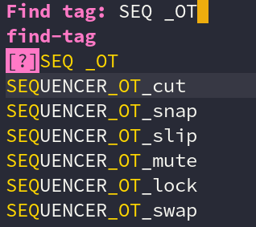

This is a living guide to help you write solid Python code for Blender. 

It will help you write code that's **easy to read**, easy to review, and easy to maintain without compromising on performances.

For tips on testing and debugging your code, and performances with Python, check these two official guides:

1. [Blender Python best practices](https://docs.blender.org/api/current/info_best_practice.html)
1. [Blender Python tips and tricks](https://docs.blender.org/api/current/info_tips_and_tricks.html)


This guide is a work-in-progress, [feedback is welcome](https://github.com/GDQuest/GDQuest-website/issues/81)! 🙂


## Code conventions for Blender Python ##

To work together on Free Software efficiently, we need to follow some conventions. This helps to make the code easy to read and to explore for everyone. This makes it easy for new contributors or fellow developers to fix bugs in your code.

Here's a complete class that follows all the conventions below, with some code removed so it's not too long to read:


class POWER_SEQUENCER_OT_gap_remove(bpy.types.Operator):
    """
    Remove gaps, starting from the time cursor, ignoring locked strips
    """
    bl_idname = 'power_sequencer.gap_remove'
    bl_label = 'Remove Gaps'
    bl_description = 'Removes gaps, starting from the time cursor, ignoring locked strips'
    bl_options = {'REGISTER', 'UNDO'}

    ignore_locked: bpy.props.BoolProperty(
        name="Ignore Locked Strips",
        description="Remove gaps without moving locked strips",
        default=True)
    all: bpy.props.BoolProperty(
        name="Remove All",
        description="Remove all gaps starting from the time cursor",
        default=False)
    frame: bpy.props.IntProperty(
        name="Frame",
        description="Frame to remove gaps from, defaults at the time cursor",
        default=-1)

    @classmethod
    def poll(cls, context):
        return (context.sequences and len(context.sequences) > 0)

    def execute(self, context):
        frame = self.frame if self.frame >= 0 else context.scene.frame_current

        sequences = context.sequences
        if self.ignore_locked:
        sequences = [s for s in context.sequences if not s.lock]
        sequences = [s for s in sequences
                     if s.frame_final_start >= frame
                     or s.frame_final_end > frame]

        sequence_blocks = slice_selection(context, sequences)
        if not sequence_blocks:
            return {'FINISHED'}

        gap_frame = self.find_gap_frame(context, frame, sequence_blocks[0])
        if gap_frame == -1:
            return {'FINISHED'}

        first_block_start = min(sequence_blocks[0], key=attrgetter('frame_final_start')).frame_final_start
        blocks_after_gap = (sequence_blocks[1:]
                            if first_block_start <= gap_frame else
                            sequence_blocks)
        self.gaps_remove(context, blocks_after_gap, gap_frame)
        return {'FINISHED'}

    def find_gap_frame(self, context, frame, sorted_sequences):
        """
        Takes a list sequences sorted by frame_final_start
        """
        ...
        return gap_frame

    def gaps_remove(self, context, sequence_blocks, gap_frame_start):
        """
        Recursively removes gaps between blocks of sequences
        """
        ...

    def move_markers(self, context, gap_frame, gap_size):
        ...


### Class names ###

Name classes as `CATEGORY_TYPE_name`:

1. `CATEGORY` is what the class works with or operates on. It can be `OBJECT`, `ACTION` for animation actions, `ARMATURE` if it affects an armature, `SEQUENCER`, etc.
1. `TYPE` is a two letters acronym that represents the nature of the class. You will use `OT` for operators, `MT` for menu templates, PT for panel templates, UL for UI lists, etc.
1. `name` is the name for your operator or UI element in `snake_case`. Find a clear name that represents the action the class will perform or the UI element that it represents.

This naming scheme makes it easy to find features in the codebase. You can search for `CATEGORY*operator_name` using tags or a search tool to find the source code of any operator listed in the program's keymaps.

In my code editor, searching code tags for `SEQ _OT`, I instantly get the list of all of the sequencer's operators:



Some class name examples from Blender's source code:

```
OBJECT_OT_duplicate_move, duplicates and moves selected objects, when you press Shift D in the 3D view
ACTION_OT_select_all, selects all 
VIEW3D_MT_mesh_add, the Add -> Mesh menu in the 3D view
```

## 5 techniques to write clean code ##

If you have quite a bit of programming experience already, you will notice that these tips are or build upon fundamental principles of Object-Oriented and Functional programming. They are general techniques that you can use to write great software. Software that:

1. Does what the users need and want
1. Is flexible
1. Mitigates risks

<!-- ### Single responsibility ### -->

<!-- ### Write pure functions and avoid mutating state ### -->

### Avoid calling other operators ###

It feels natural to make new operators by calling lots of other operators that are included in blender. Whenever you can, you want to avoid that.

There are at least 3 reasons to avoid operators:

1. They **add dependencies to your code**, giving it more reasons to change
2. They **require you to change and restore the user's selection**, which can lead to unexpected bugs
3. They **require you to mutate the scene's data**, which can also lead to bugs or sometimes cause performance issues

Calling other operators create a dependency between your class and that operator, which is another class in the source code. Built-in operators can change between versions of blender, breaking your code.

Built-in operators often work with the user's selection or scene data in Blender to work. To use them in your code, you end up changing the user's selection and having to restore it at the end of your script. This is easy to forget, leading to unexpected bugs, and adding extra maintenance work for you.

Even though most built-in operators are written in fast C code, changes like moving the time cursor in the sequencer can force the view to refresh, slowing down your operator for the user.

Imagine you want to code an operator to offset all strips after the time cursor by 30 frames, ignoring locked strips. Using the built-in `transform.seq_slide` operator, your code would look like this:


FRAME_OFFSET = 30

initial_selection = context.selected_sequences
sequences_to_move = [s for s in context.sequences \
                     if not s.lock \
                     and s.frame_final_start > context.scene.frame_current]
bpy.ops.sequencer.select_all(action='DESELECT')
for s in sequences_to_move:
    s.select = true
bpy.ops.transform.seq_slide(value=(FRAME_OFFSET, 0))
bpy.ops.sequencer.select_all(action='DESELECT')
for s in initial_selection:
    s.select = true


The code above stores, modifies, and then restores the user's selection. You can get the same result, without having to mess with the selection, like so:


FRAME_OFFSET = 30
sequences_to_move = [s for s in context.sequences \
                     if not s.lock \
                     and s.frame_final_start > context.scene.frame_current]
for s in reversed(sorted(sequences_to_move, key=lambda s: s.frame_final_start)):
   s.frame_start += FRAME_OFFSET


In this case, it both simplifies the code and removes the dependencies on built-in operators.

The `sorted` function sorts the `sequences_to_move` by their start frame. We need to sort the sequences in this case to ensure that we will move them in the correct order. Otherwise, the sequences can end up moving to different channels. The `lambda` feature creates an inline function that takes each sequence in `sequences_to_move` as `s` and returns its `frame_final_start`.

If you find this code hard to read, you you can always create one or more functions to make your code more expressive:


def get_sorted(sequences=[], attribute=''):
    return sorted(sequences, key=lambda s: get_attr(s, attribute))

def get_sorted_reversed(sequences=[], attribute=''):
    return reversed(get_sorted(sequences, attribute))


Turning the line 


for s in reversed(sorted(sequences_to_move, key=lambda s: s.frame_final_start)):


Into:


for s in get_sorted_reversed(sequences_to_move, 'frame_final_start'):



There is an operator in blender 2.80 to offset sequences after the time cursor. But it moves locked sequences like any other. That's why if you want to add that feature and avoid relying on this built-in operator, you have to code your own.


<!-- ### Don't write features nobody needs ### -->

<!-- ## Naming conventions and tips ## -->

### Tips to make your own code easier to read ###

The convention inside Blender is to use words common to several properties or methods as a prefix of the property or the function's name. For instance, the property names of sequences in the VSE  related to climb on duration in frames all start with frame: `frame_start`, `frame_end`, and `frame_duration` rather than `start_frame`, `end_frame`, and `duration_frame`.

Even though the last three names are a bit more natural to read in English, when you are programming, it will be much easier to find all the *frame* related properties thanks to your code editor's autocomplete feature.
