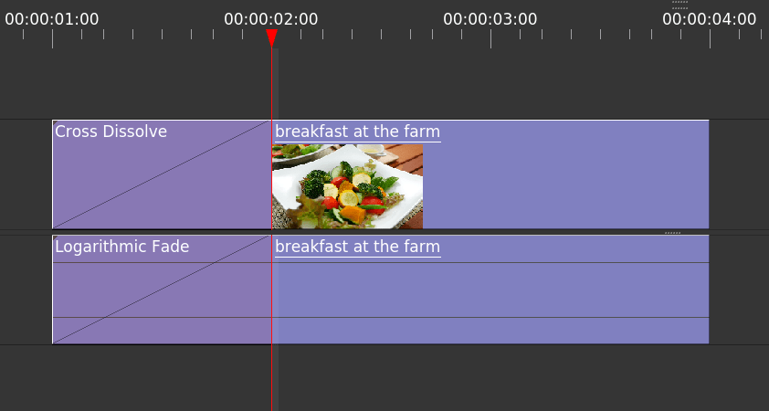

+++
aliases = ["/open-source/contributing-guidelines"]
author = "nathan"
date = "2018-11-05T09:30:19+09:00"
description = "Do you want to become a Free Software contributor? This guide is here to help you learn everything you need!"
title = "Contributing to GDQuest's projects"
type = "post"

+++

If you want to **become a Free Software contributor** and be part of our projects, this is the place to get started! 

This guide will tell you everything you need to know to get your improvements integrated into the projects as fast as possible.

We use these guidelines at GDQuest as well to **work efficiently together**.

To make it a smooth and pleasant experience for everyone working together, we'll ask you to:

1. **Communicate**. Let people know what you're working on, join discussions on the issues tracker, and open your own issues!
1. **Be mindful of the contributors' and the maintainers' time**. Most people are helping benevolently. Help us all save time by writing precise bug reports and feature requests.
1. **Be kind and supportive**. We're building a welcoming community and want to get people to work together. 🙂

## In short ##

We ask everyone to follow 3 steps to work smoothly and productively together:

1.  **Communicate beforehand**
    -   Open an issue on GitHub before you code a new feature or make a big change.
    -   Reply to issues you'd like to tackle. Ask any info you need to make it work within the project's design and scope.
2.  **Follow the code style guide**
    -   We designed it to keep the code clean, easy to read, and consistent.
3.  **Create neat Pull Requests**
    -   Writing a clear title and commit only relevant changes. This takes no time at all, but it helps everyone else quite a lot!

/Every one of us is responsible for making work go smoothly for everyone else. Let's keep in touch with one another, be kind to one another, write great code, keep the project's scope and design targets in mind, and create clean pull request./

## How to communicate well as a contributor ##

**We want to build a friendly and a welcoming community** at GDQuest. One that is inclusive for everyone, regardless of our experience, origins, or opinions. We should do our best to get newcomers to want to learn more about Free Software and become contributors.

We have one key rule when we talk to one another: **be kind and supportive**.

You can find more details about it in our [Communication Guidelines]({{ ref /open-source/guidelines/kind-communication-guidelines/ }}). They're based on the GNU project's *Kind Communication Guidelines*.

### Help us help you ###

Review work is time-consuming. By communicating upfront, letting us help you as you contribute, and respecting the code style that we all use, you can save both yourself and the reviewers a lot of time.

In short, you should explain the problem that you are trying to solve and the way you intend to solve it before you get started on the issue tracker. We likely have code in place already and ideas to keep your code simple which can save you a lot of work!

We are here to review your Work-in-Progress (WIP) code, to help if you have any trouble with the git workflow, or if you get stuck along the way.

If you want to work on an open issue, make sure that you understand it well by asking for all the information you need in order to tackle it efficiently.

You can also get in touch on the [GDQuest Discord server](https://discord.gg/uzSR7jB).

## Code style ##

There are **many ways to structure code** and many ways to solve a given problem. Thus it's important that we **follow the same guidelines so our code remains easy to read and to maintain**. We chose code styles that are accessible to other developers, so we can build great projects together.

These guidelines are separate guides:

1. [Godot GDScript: best practices]()
1. [Blender Python: best practices]()

Before you write your own code, **read the existing code in the project** to get a sense for the style and architecture. We write docstrings in our code to help you understand the purpose of different classes and functions/methods.

## How to create great Pull Requests ##

### Create meaningful commits

**Squash your commits**!

When you are working on your computer and local fork, you may use as many commits as you want so that you can jump back in your code's history. But once you publish your own changes and submit your pull request, you should squash your commits so that the project's history stays easy to browse.

A new feature can be a single commit. A bug fix or an improvement can be one commit. A commit can range from a small change to hundreds of lines of code. It should just be a clear and a coherent step in the project's history.

## How to write great bug reports and requests

When you report a bug or request a new feature or an improvement, we need information to fix it.

### Writing a great bug report

Finding and fixing bugs can be time-consuming. if you help us spot the bug and reproduce it faster than we could on our own, we can in turn respond and solve it quickly:

1. Provide a **list of actionable steps** to reproduce the bug
1. Provide the version of the project, of the program, e.g. Godot 3.1, and the operating system you are working with
1. If the program prints an **error in the console**, copy it as text (preferable) or take a screenshot
1. Tell us what result you expect to get instead

On GitHub, you can surround code or error messages with triple back-ticks: \`\`\` to create a code block:

```
Three backticks surround this line of text
```

Here is an example of a great bug report: 


Title: Trimming video gives an error if time cursor doesn't overlap any sequence

**Program version**:

- Power Sequencer 1.3
- Blender 2.80 RC1

**Steps to reproduce**:

1. Place the time cursor so that it doesn't overlap any sequence
2. Press T to use the trim feature

**Expected result**: 

No error

**Traceback**:


File "/home/gdquest/.config/blender/2.80/scripts/addons/power-sequencer/operators/trim_left_or_right_handles.py", line 63, in execute
ripple_start_frame = min(sequences, key=attrgetter('frame_final_start')).frame_final_start
ValueError: min() arg is an empty sequence




1. **The title describes the problem clearly**
1. The body includes **all the steps to reproduce the error**
1. There is a traceback to help track down the bug faster
1. (optional) The issue includes a minimal example project to quickly reproduce the error
    - If there are multiple steps to produce the bug, or it happens with a particular setup, a demo is more than welcome! It will allow us to fix the bug faster
1. (optional) Include a screenshot or a short video recording
    - Very useful if the issue is visual in nature, if it doesn't produce a crash, or an error message


A traceback or backtrace is a tool for developers to spot bugs. For example, in Python you will see it as a text message that starts with `Traceback`, followed by a list of lines that may include computer code, and an error message.


Traceback (most recent call last):
  File "/home/gdquest/Repositories/build_linux/bin/2.80/scripts/startup/
bl_operators/sequencer.py", line 230, in execute
    fade_animation_clear(context, fade_fcurve, fades)
  File "/home/gdquest/Repositories/build_linux/bin/2.80/scripts/startup/
bl_operators/sequencer.py", line 295, in fade_animation_clear
    if fade.start.x < keyframe.co[0] < fade.end.x:
ReferenceError: StructRNA of type Keyframe has been removed


This traceback is important as it gives us a precise starting point to investigate and fix the bug.


When you make a request for improvements or new features, please **always describe the problem that you are facing and your needs**. To produce a great design, we need to understand your problem and to explore different solutions:

1. We need to understand the problem to figure out the details of the design and how to best structure our code
1. Copying what other programs do without doing any research is the best way to produce incoherent design and a missed opportunity to create more efficient tools
1. The solution you envision may be too time consuming or too complicated to code
1. We might already have tools in place that solve your problem that are just not visible enough. In this case, we can improve the user interface, improve an existing tool, or create a tutorial to solve your problem

Here is an example of a great feature request:


Title: Add an interactive tool to fade audio and video

Problem: I often need to add fades in and out on my video and audio clips. They are hard to add precisely without having a visual representation of the fade’s length and effect.

I would like to suggest adding an interactive tool that allows you to add Fades by clicking and dragging on clips on the timeline. It should indicate how long the fades are on the clips.

**How it works in other programs I use**

In most video editing programs I can select clips, select a fade tool, and click and drag to add Fades to them. I get an overlaid ramp drawn on the side of the clip that has a fade applied to it. 

Here is an example in the Olive video editor:



I applied a fade and the fade duration snapped to the playhead.


1. The **title sums up the request** well
1. The body **describes the problem** or the need the request intends to solve
1. There's an **example** of how it's done in another application to give some more **context** about what the user expects

### Taking screenshots

If you are on Windows, I highly recommend [ShareX](https://getsharex.com/), an amazing open source program. It lets you take annotated screenshots, animated GIFs, and video clips. On Linux, you can use the built-in tool in your distribution: screenshot on Ubuntu, Spectacle on KDE...

