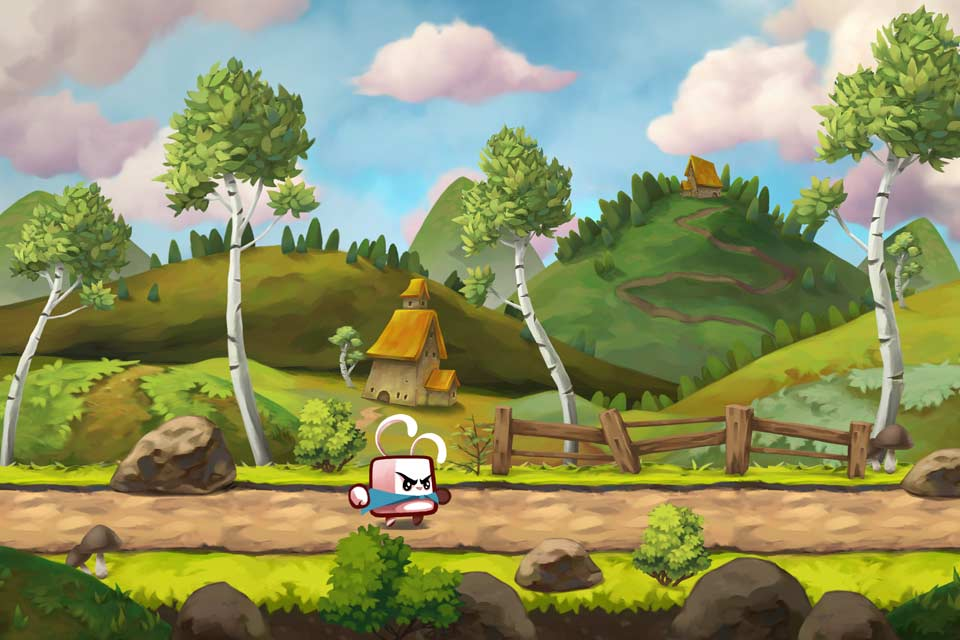
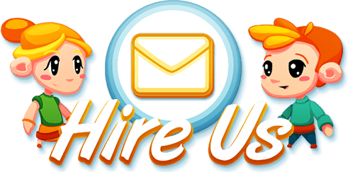
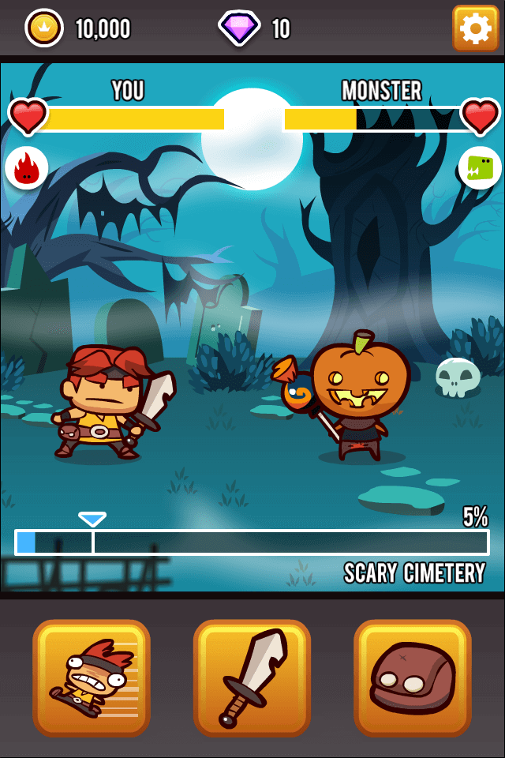

<!-- Top pictures -->
<header>
    

        
    

    

        
    

    

        
    

    

    

</header>

<section class="text--center">
    <header>
        
    </header>

    <!-- The actual portfolio -->
    <article>
        <!-- We make games -->
        

            

                

                    We can answer your need for HTML5 and Unity game development. For Html5, we use
                    <strong>our open source game engine Meta2d</strong>, offering clean and easy to edit code.
                

            

            

                

                    We design
                    <strong>appealing characters and environments, clear UI elements and polished cut-out animations</strong> made with Spine or Photoshop to serve your creative vision.
                

            

            

                

                    We have a library of
                    <strong>dozens of deep and instructive tutorials</strong> to prove our expertise. Find them all on the <a href="https://www.youtube.com/c/gdquest">GDquest youtube channel</a>.
                

            

        

        <!-- The team -->
        

            

            

        

        

            
        

        

            

                
                <h4>Nathan Lovato - Game Designer</h4>
                
<strong>Nathan</strong> is the author of the <a href="http://youtube.com/c/gdquest">GDquest Youtube channel</a>. He is both a professional designer and a tutor.

            

            

                
                <h4>MagicFred - Game Artist</h4>
                
MagicFred is a game artist with more than 15 years working in the industry. Founder of Dijiko, he designed and released a variety of games on web and mobile platforms.

            

            

                
                <h4>Arthur Shefer - Developer</h4>
                
Arthur is the author of the open source JS game engine meta2d. He worked on the top grossing web and mobile game My Country as a front end developer.

            

            

                
                <h4>Clement Brard - Developer</h4>
                
Clément is a Unity developer with more than 5 years of experience. He is the author of Lord of the Dungeon.

            

        

        

        <!-- Our work -->
        

            

                
            

            

                
            

            

                
            

        

        

            

                
            

            

                
            

            

                
            

        

        

            

                
            

            

                
            

            

                
            

        

    </article>
</section>
