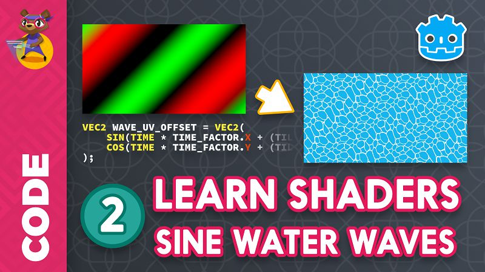

This month's update adds **2 hours of tutorials** dedicated to particles! There are now over **70 video tutorials** in the course's [ Pro version ](https://gumroad.com/l/godot-tutorial-make-professional-2d-games).

The particles chapter shows how to create a variety of effects like smoke and explosions. We start with the very basics and wrap-up with a fireball and layered visual effects.



If the first steps don't change too much between effects, I wanted to show you tricks to build varied and complex effects with a small number of basic textures.



## Stretch goals in the making

### Getting started with UI design in Godot 3

The first UI stretch goal bigger in scope than initially planned. It is mostly ready with four tutorials out and the last one scheduled for release.



### Introduction to shaders in Godot

We collaborated with [Bastiaan Olij](https://www.youtube.com/channel/UCrbLJYzJjDf2p-vJC011lYw) to bring you a high-quality intro to shader programming. It covers the creation of a water shader, starting with 2D, then moving onto 3D.



## Insights from the cross-code developers

The interviews from BitSummit, a gaming event that took place in Kyoto last month, is up! I got the chance to interview two developers with different Skills and experiences to share:

1. [Papadar](https://twitter.com/papadar_), a professional artist who taught himself programming and built an audacious sandbox platformer called [Eatvolve](https://papadar.itch.io/eatvolve).
1. Felix aka Laschen, a veteran from the RPG maker scene and author of an already successful indie Action-RPG called [CrossCode](http://www.radicalfishgames.com/)

They were kind enough to share their insights with us. It's out so you can watch it now!



## Extra tutorials

[Power Sequencer](/blender/power-sequencer/), the blender add-on that we use to edit videos NG quest, is out in version 1.0! Two lengthy tutorials are already on the channel to get up to speed with blender's video editing tools.



## Krita tutorials are coming back

We are working on new **Krita brushes** and tutorials with Joshua you [Zhillustrator](https://twitter.com/zhille), two professional artists respectively specialized in landscape painting and concept art.

On Monday, you'll get an extended tutorial to help you create solid brushes that make the most out of Krita 4's masked brush feature.

New [professional Krita brushes](https://gumroad.com/l/krita-brushes-for-game-artists) are also on the way! As always, the update will be free for everyone who owns our Krita brush kit.

## There's more!

There's more, like the new [Free Godot projects](https://github.com/GDquest/Godot-engine-tutorial-demos) we worked on lately. That's quite a lot of news to take on all at once already, so let's cut it here for now. The best way to stay posted is probably to [follow GDquest on Twitter](https://twitter.com/NathanGDquest).

That said, I'm going to take a *hopefully* well-deserved break with the deers!

See you soon for more content!


