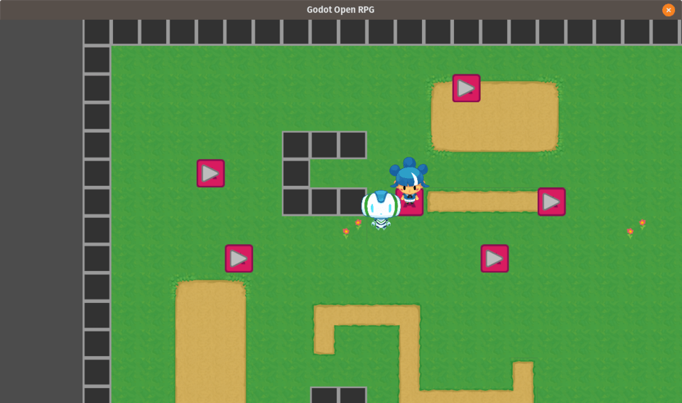
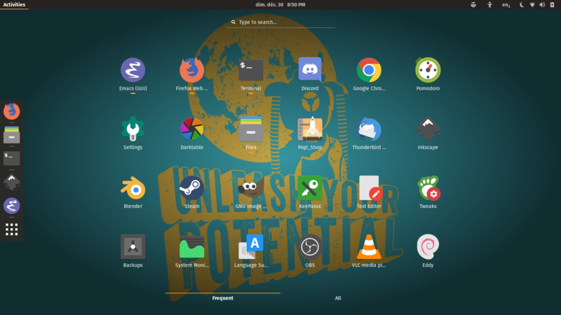

+++
author = "nathan"
categories = ["news"]
date = "2018-12-30T13:38:29+09:00"
description = "This year is coming to an end. I wanted to thank you kindly for everything that happened, for your support with the channel and making it possible for us to work full-time doing education for Free Software!"
tags = ["gdquest", "open source", "linux", "linux gamedev"]
title = "Happy new year! 2018 in review, looking forward"

[[resources]]
  name = "banner"
  src = "banner.jpg"

+++

This year is coming to an end. I wanted to thank you kindly for everything that happened, for your support with the channel and making it possible for us to work full-time doing education for Free Software!

Let's get the year's recap out of the way. In short:

1. I made a big [Godot game creation course](//gumroad.com/l/godot-tutorial-make-professional-2d-games) for intermediate-level users
1. GDQuest became a team! We started working together with Guilherme and Pigdev, Aditia and Razvan, so it's not just me anymore
1. We managed to get back to a stable release schedule on the channel, publishing 2 to 3 videos a week lately
1. We're producing more and more [Free plugins and game demos](//github.com/GDQuest/) with the community



## From a tutorial channel to a Free Software company

This year, GDQuest evolved to become more than just an educational channel on YouTube. At first our goal was to share the techniques professional game developers use to make games.

This progressively evolved into a larger mission: we want to **bring game developers and designers together to become the creators they want to be**.

When people work hand in hand and share their knowledge and their work, that's beneficial to everyone. By helping others and contributing to open source projects you not only learn a lot: we get to create projects that go beyond what we can produce on our own individually.

Our recent [OpenRPG](//github.com/GDQuest/godot-turn-based-rpg) is a good example of that. We were going to build a quick demo about turn-based combat to fill an old Godot Patreon backers' request. Other developers joined the project, and after 2 months we have a flexible base gameplay engine to create RPGs with a dialogue system, mobile support, combat system, character growth...

It's gotten a lot bigger than planned. We have a growing playlist of [Godot RPG tutorials](//www.youtube.com/watch?v=V-VJra5lrv0&list=PLhqJJNjsQ7KHaAQcGij5SmOPpFjrDTHUq) on YouTube now, with more to come!

## We're launching a new crowdfunding campaign soon

We want to create more content, keep growing, and keep improving. But for that we need you.

We're going to launch a **new Kickstarter in January**! This time, we're raising money to hire Gui, Pigdev, Razvan... to work full-time on a new game creation series with Godot.

We will release **videos every day during the campaign** so be sure to [subscribe to the channel](//www.youtube.com/c/gdquest/) to know when it starts!

We have a [Discord server](//discord.gg/87NNb3Z) where the community hangs out. There, we talk about the open source projects and help one another with Krita, Godot, etc. Great place to learn, share, and chat.

If you need to reach me personally or want frequent news, I'm most active [on Twitter](//twitter.com/NathanGDQuest)! *NB: please don't contact me in private to fix issues in your projects, I've got a busy schedule already*

This new project builds on everything we learned this year and all the feedback you gave us. I don't want to spoil it just yet, but hopefully you'll be as excited as we are when it finally comes out! 😄

## On a side note...

I am a proud Linux user now! I got a computer from [System76](//system76.com/) that runs an Ubuntu-based Linux distribution called [Pop_OS!](//system76.com/pop). It's optimized for developers and the experience is outstanding so far. 🙂

I'm impressed at how slick the Linux desktop has become compared to five or six years ago. I think it's really comparable to Windows and Mac in terms of usability now.

On top of that, the fact that you can do everything with the shell and pretty much everything is documented. You can gradually customize your system and boost your productivity over time.

Although now on Windows you can use the Linux subsystem or cygwin to use the system's command line tools natively, the experience has never quite been the same.

I would love to make some videos about game development with Linux moving forward. Also, using the shell, things like these that are useful for any game developer really. Working with text commands can seem a little daunting at first but once you wrap your head around it, you get to save so much time you only wish you got started earlier!

By the way, if you are a content creator making content about Linux or game creation with Free Software and you would like to do a collab sometime, please get in touch!

That said, I'm going to get some rest now. We'd better be in great shape for the Kickstarter's launch 😄
