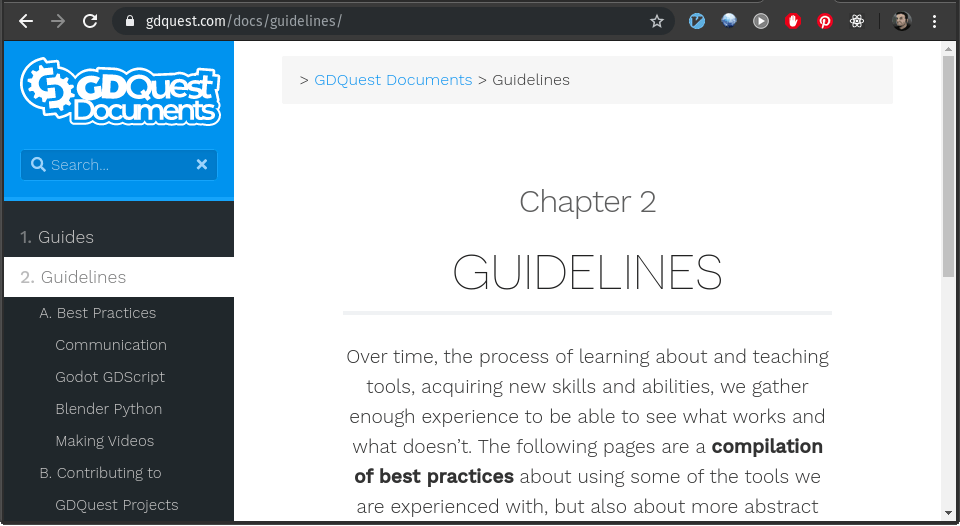
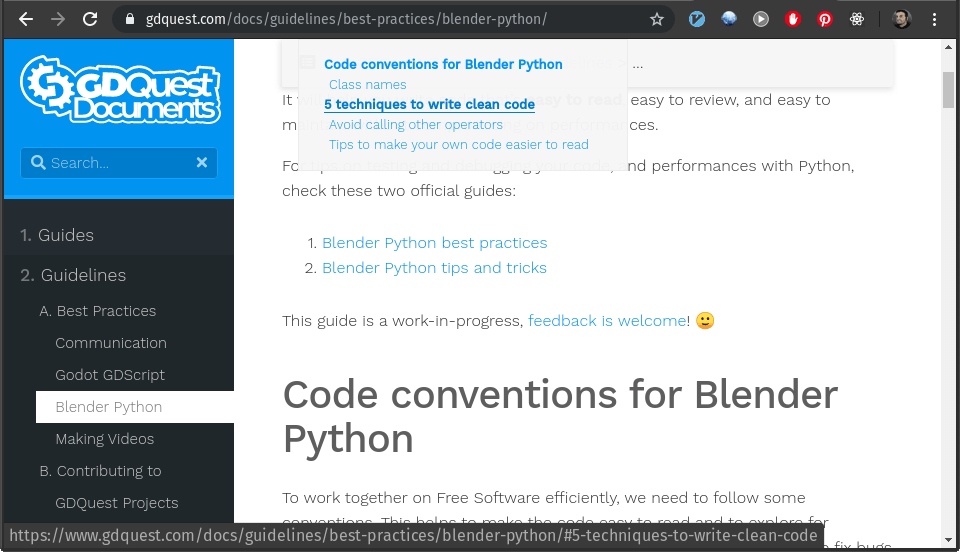

+++
title = "Introducing the docs section"
description = "Exciting news for everyone. We are working hard to make the website more accessible and increasing the quality of our presentations and with it your comfort when navigating these waters."
author = "razvan"

date = 2019-12-11T16:54:51+02:00
weight = 5
#draft = true

categories = ["news"]
tags = ["gdquest", "gdquest website", "website", "faq"]
+++

<!-- If this file goes under contents/docs be sure to start chapters with ##, not # -->

In the past few days we have been hard at work, improving your experience through our website. Since we create content in many forms, including living-documents along the more "regular" tutorials, we have been rethinking user interaction with the GDQuest website.

## Meet the new GDQuest website section

As you might know, we're using [Hugo](//gohugo.io/) to generate this website. Hugo is a static website builder, based on [Go](//golang.org/) language. Recently Go has added the ability to work with [modules](//blog.golang.org/using-go-modules) and the Hugo developers jumped right away on this waggon and started using the feature. What does all this tech-lingo mean to you, the regular GDQuest user and fan?

It means that we now have a beautiful [docs section](//gdquest.com/docs/) based on the excellent [Hugo learn theme](//learn.netlify.com).

This new website section has a handful of cool features and improvements:

- a search engine
- easy to navigate menu on the left-hand side
- easy to access <abbr title="table of contents">ToC</abbr> for long documents
- next/previous buttons for easy navigation through the menu entries
- attachment files section
- code highlights
- easy copy code content with a button

Since the <abbr title="table of contents">ToC</abbr> could be easily missed as it is hidden by default, we're including a snapshot showing it in action:

The <abbr title="table of contents">ToC</abbr> is placed on the left-hand side of the breadcrums area at the top of the page and stays visible on scroll for easy access.

## Until next time

We hope that this brings you great joy in browsing our content and a renewed interest in interacting with the GDQuest website! It certainly is a big change and a nice improvement for us, the core contributors, as well.

---

_For those of you interested in the tech-stuff, we highly recommend checking out the excellent Hugo learn theme. They really did a wonderful job with it._
