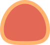
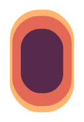
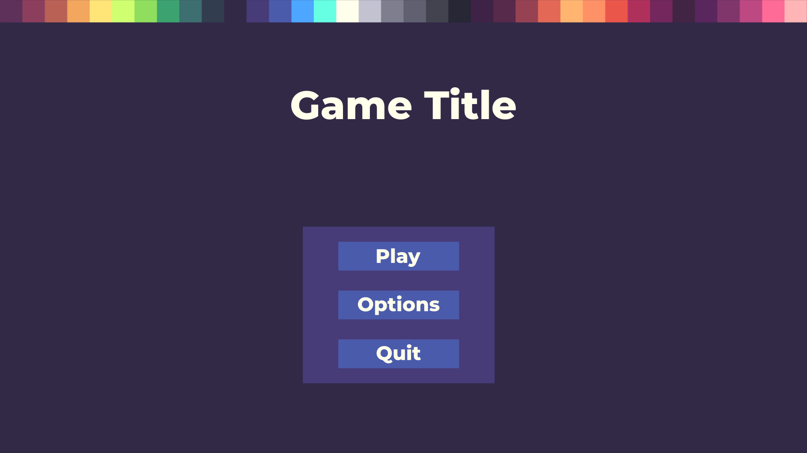
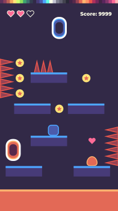
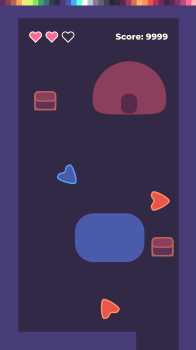

# GDQuest Art Guideline

In this guideline we aim to establish a visual language that communicates meaningful aspects for our game development teaching content. The art direction is mainly oriented towards flat design principles and focus on high distinguishability of the elements.

Below you'll be presented with graphically rich examples and a brief of the core design behind the use of the colors, shapes and types.  

# Colors

We are currently using the [Pear36 color palette](https://lospec.com/palette-list/pear36), a color rich palette with 36 very distinct colors.

- Use colors hierarchically: most important elements are bright, less important elements are dark
- Use outlines to highlight the most important elements: Player, enemies, dangers
- Rely on conventions: conventionally red conveys danger, notice how you can easily distinguish what can and what can't hurt the player just by the colors used: spikes, lava, the enemy (the orange blob)...
- Use complementary colors to express relationships: the orange and the blue portals are two parts of the same system, the walls and floor are safe environment while the lava is unsafe, the player and the enemy are opposite entities...
- Use light fill and lighter outlines for better contrast of important elements, also notice that not every element need outlines, some convey the necessary contrast purely based on their color relationships with other elements: the heart, the coins...

# Shapes

Minimalism is the core of the shapes design, simplicity is core and helps distinguish each individual element.

- Reliable elements are usually represented by squares. These are elements which behavior is predictable and consistent: the player which is a reliable character, static platforms, floor, walls, even the lava since its behavior is consistent
- Circles usually represent interactive elements. The coins, the heart, the top part of the enemy since players can stomp them, the portals...
- Triangles usually convey danger and avoidance, use them for elements that cause damage on contact, or to give direction, as in the enemy that is a mix of a circle and a triangle, meaning its top part is safer than its sides
- You can mix those characteristics to convey better meaning with slightly more complex shapes(see below): the meteors are 2 sized circles to easily distinguish their rotation, the players are notched triangles to communicate their look direction, bullets are capsules to convey movement...

# Type

We are currently using *Montserrat Bold* font for most of the text used in game, it is a good *sans serif* font with enough weight to be readable and still maintain its place in the game screen's hierarchy.

When teaching we often use Debug elements that need to be readable yet distinguishable from ingame elements in order to properly explain technical information. For that we use a *monospace bold* font.

Some interactive debug elements are better as transparent, allowing to immediately perceive how our input propagates inside the game.

# Conclusion

With this in mind you can be as creative as necessary to express meaningful information without complexity and focus on teaching good game development concepts with quality visuals.

In sum:

- Form follows function
- Each element should be distinct and unique
- Simplicity and elegance over complexity
- High abstraction through conservative and well established concepts

# Resources

- Pear36: https://lospec.com/palette-list/pear36
- Montserrat font family:https://fonts.google.com/specimen/Montserrat
- Monospace font: https://fonts.google.com/specimen/PT+Mono
- Flat design principles
  - https://designmodo.com/flat-design-principles/
  - https://simplicable.com/new/flat-design

# Elements

| Name 	| Graphic 	|
|------	|:---------:	|
|Topdown Player	||
|Topdown Player Selected||
|Topdown Enemy||
|Topdown Enemy Selected||
|Topdown Neutral||
|Sidescroll Player||
|Sidescroll Enemy||
|Sidescroll Portal Orange||
|Sidescroll Portal Blue||
|Topdown Portal Orange||
|Topdown Portal Blue||
|Chest||
|Coin||
|Heart||
|Sign||
|Spike||
|Projectile Enemy||
|Projectile Player||

# Samples

| Name 	| Graphic 	|
|------	|:---------:|
|Landscape Topdown Shooter||
|Landscape Platformer||
|Landscape Topdown Strategy||
|Main Screen||
|Options Menu||
|Portrait Topdown Shooter||
|Portrait Platformer||
|Portrait Topdown Adventure||
|Debug Console||
|Topdown Debug Mode||
