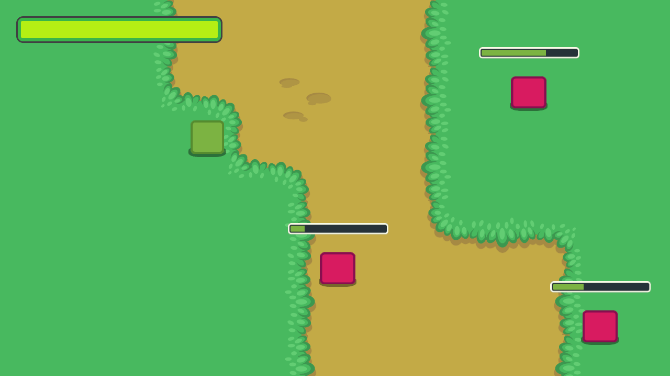

+++
author = "nathan"
category = "godot"
date = "2018-09-05"
description = "get your game creation skills to the next level with the godot game engine! learn the best programming practices and explore essential programming patterns."
tags = ["godot", "game design", "game creation", "gamedev"]
title = "make professional 2d games with godot"

[banner]
  alt = "banner"
  src = "img/banner.png"

[[resources]]
  name = "banner"
  src = "img/banner.png"

+++

## Become a better game developer!

With this course, you will learn to **create the main mechanics** and systems in your own games, using the Free [Godot Game Engine](https://godotengine.org/).

Unlike in many beginner courses that show how to code a specific game step-by-step, this one will teach you **professional game creation techniques** you can apply to any type of game!

> Purchasing the Pro course is the best investment I have made. I can't imagine how much time it saved me compared to trying to learn from ad-hoc tutorials.
>
> What I love most about it is that I feel that I am learning best practices for Godot that I can translate to different styles of games. For me, this has been the best way for me to learn Godot from scratch.
>
> – Craig Cashman



## What will I learn?

1. Learn to create games **like professionals**
1. Discover the **best practices** in the Godot Game Engine
1. Learn game programming techniques that **apply to any game project***
1. Understand how 2d games work with lessons that go beyond the surface

## Requirements

This is *not* a series for complete beginners: you should have at least some programming experience. Check out [our Free tutorials](http://youtube.com/c/gdquest) to get started 😄

You will need:

1. Programming foundations
1. A basic understanding of GDscript

## What's available?

You can find the full list of of available videos on the [Godot course content page](content)


