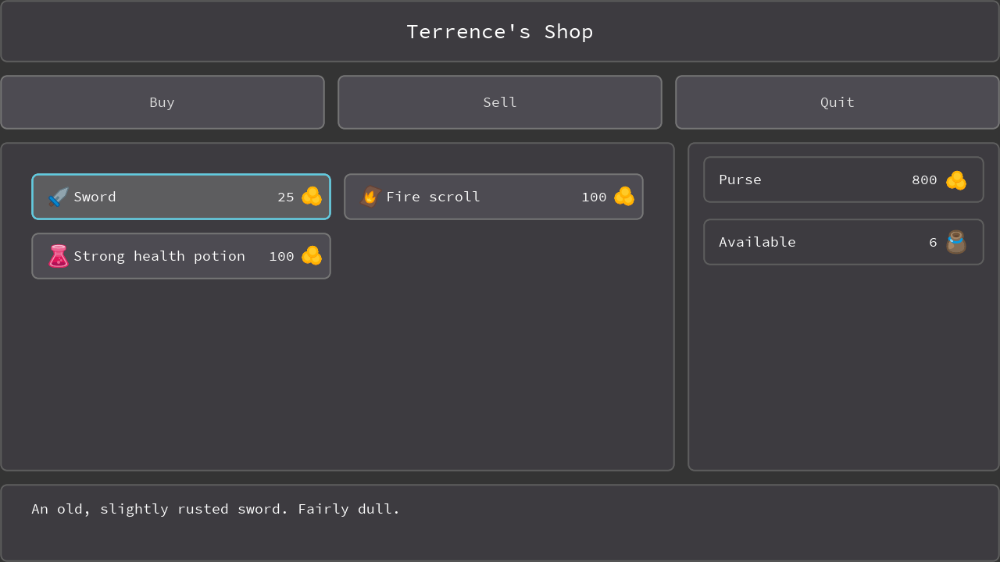
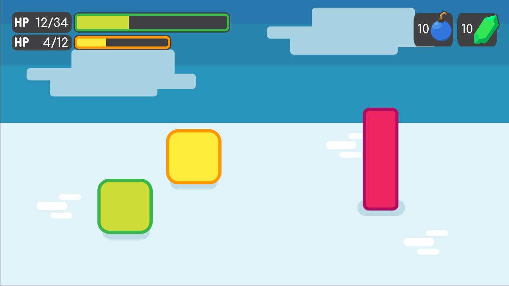

In this course, you will learn how to **best create User Interfaces** for your games with the open source [Godot Engine](//godotengine.org/).

This series is included in our larger [Make Professional Games with Godot]() course. We made it as a standalone if you only want to learn about interface! So you only pay for the chapters you need 😄

I've been one of the biggest contributors to Gdoot's official UI tutorials, like the [Intro to Godot's UI system](//www.youtube.com/watch?v=y1E_y9AIqow). In this course, I'm bringing all my experience and research to **save you dozens of hours** learning to create UI... that works! 😄



## What will I learn?

1. How to create an **Inventory and Shop systems**
1. How to **design reusable UI** components with Godot's theme system
1. **Great programming practices** to separate the UI code from the gameplay, using the node tree, signals, and yield
1. How to **animate a life bar's color and fill**
1. How to pause the game and **create a pause menu**

## Get started with our Free UI tutorials!

Be sure to watch our [Free beginner Godot UI tutorials](//www.youtube.com/watch?v=y1E_y9AIqow&list=PLhqJJNjsQ7KGXNbfsUHJbb5-s2Tujtjt4) first if you're just getting started!

This course will help you **go beyond** our first interface series.

## What does this course contain?

On top of **5 hours of video tutorials**, we always provide the full source code for our tutorials, so you can explore and reuse it in your own games! This includes:

1. The **pause menu**
1. The **animated and hooked life bars**
1. The **inventory system** along with the items menu
1. The **shop system** and the shop menu



You also get lifetime free updates, even if the price increases in the future!
