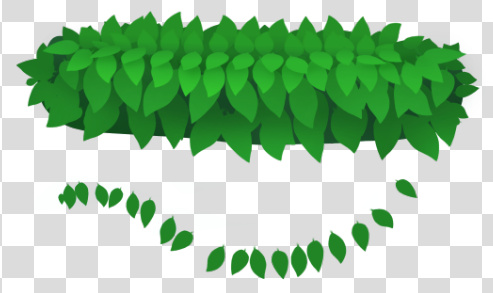
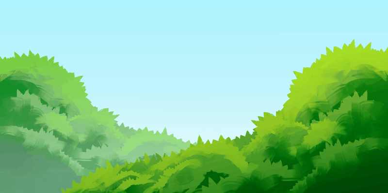
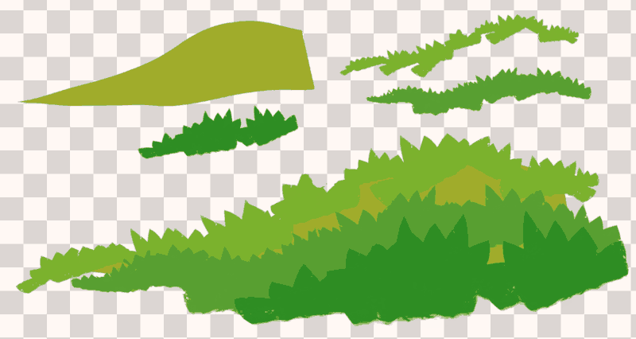
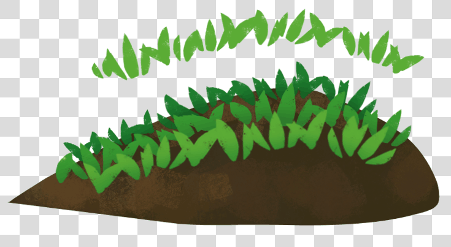
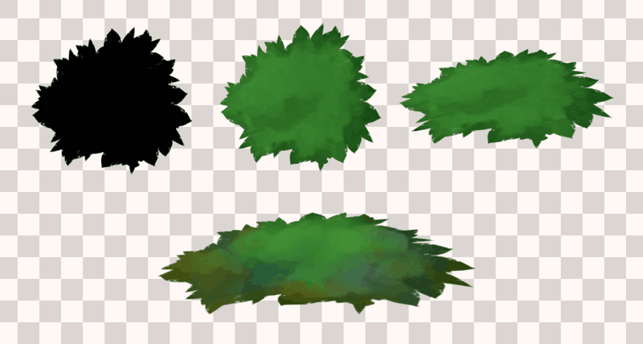

The new release of the [GDQuest Krita brushes](https://gumroad.com/l/krita-brushes-for-game-artists/) comes with 4 vegetation presets. In the past year, I learned a lot about Krita's brush engines, its strengths and limitations. I also tried to release a lot of presets to stuff up the pack. It's now time to slow down, and improve the releases. Starting with this one, the focus is on quality over quantity.

The new presets are all documented. They come with a bit of text and an example picture to show you how to use them. **The premium version adds short, voiceless video demos, to get up to speed even faster!** 

### Leaves 1

Draws rows of leaves, following the stroke's direction. Paint them on separate layers to build bushes, patches of leaves for a tree, etc. You can not only use it as-is: replace the brush tip with your own to stamp other types of assets.

It's the approach I used for the [Krita game art training](https://gumroad.com/l/krita-game-art-tutorial-1), and still use most often:

1. Start with a shape that defines the volume of the sprite
1. Design a few leaves on the side of the document
1. Paint rows of leaves on separate layers
1. Come back to each layer, transform it and add shadows to it

The arrangement of the leaves will not always be perfect, but they're spaced out just enough so you can select individual dabs and modify them with the free transform tool.

### Grass patch 1

It stamps opaque grass patches, with a slight texture to their edges. The lower border of the grass has a slight transition to it, but it stays sharp so you can:

- Keep it as-is for a cartoony effect or to build reusable game assets
- Blend it using the blending/smear brush of your choice

It can draw lines of grass seen from the side, or you can use it to enhance the silhouette of a sprite. E.g. a stylized hill. See the bushes brush below to see how to apply it to top-down game sprites.

### Grass 1

Draws short grass strands, their orientation following the brush stroke. Draw from left to right to have the strands point up. As the leaves brush, you'll use them to draw lines of grass. A scattering brush never works as well as individual layers to which you can add shadows, select and edit. They're very stylized, so they'll work well either with a single color or shaded (as on the example above).

### Bush 1

It's similar to grass patch 1: you use it to draw the silhouette of bushes or leaves. It also works for grass patches when you want long winding strands. The example shows yet another use: drawing a closed, rounded shape, deforming and coloring it to get a modular bed of grass or moss. You can use it for bushes, leaves, and grass.
