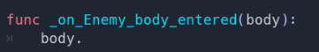
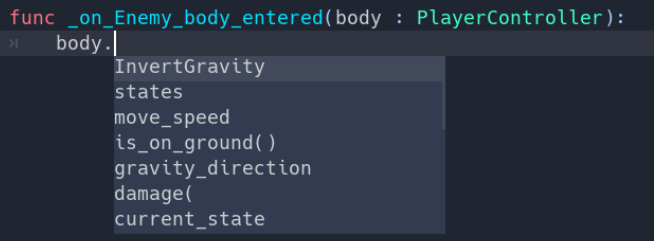
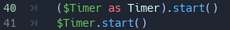
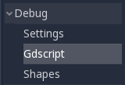
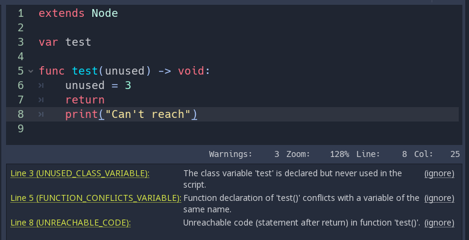
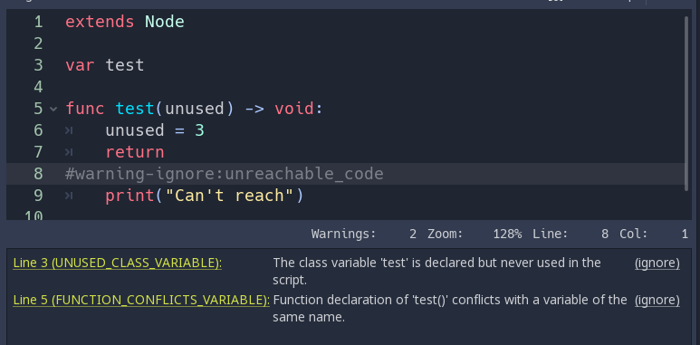

GDscript is getting **optional** typing syntax in Godot 3.1. In this guide, you'll learn:

- **How to use types in GDscript**
- That **static types can help you avoid bugs**

Where and how you use this new language feature is entirely up to you: you can use it only in some sensitive GDScript files, use it everywhere, or write code like you always did!

Static types can be used on variables, constants, functions, parameters, and return types.

{}Typed GDscript is not available in Godot 3.0. It will be available from Godot 3.1.{}

## Why You Should Learn to Use Typed GDScript

With typed GDscript, Godot can detect even more errors as you write code! It gives you and your teammates more information as you're working, as the arguments' types show up when you call a method.

Imagine you're programming an inventory system. You code an `Item` node, then an `Inventory`. To add items to the inventory, the people who work with your code should always pass an `Item` to the `Inventory.add` method. With types, you can force them to:


"""in Item.gd"""
class_name Item

"""in Inventory.gd"""
class_name Inventory

func add(reference : Item, amount : int = 1):
	var item = find_item(reference)
	if not item:
		item = _instance_item_from_db(reference)
	item.amount += amount


<!-- TODO: in nightly build, I don't get the function definition popup
When you use the `Inventory` in your project, you don't have to open the source script to know what the `reference` argument should be: -->

Another significant advantage of typed GDScript is the new **warning system**. From version 3.1, Godot gives you warnings about your code as you write it: the engine identifies sections of your code that may lead to issues at runtime, but lets you decide whether or not you want to leave the code as it is. More on that in a moment.

Static types also give you better code completion options. Below, you can see the difference between a dynamic vs. a static typed completion options for a class called `PlayerController`.

You've probably stored a node in a variable before, and typed a dot to be left with no autocomplete suggestions:

This is due to dynamic code. Godot cannot know what node or value type you're passing to the function. If you write the type explicitely however, you will get all public methods and variables from the node:

In the future, typed GDScript will also increase code performance: Just In Time compilation and other compiler improvements are already on the roadmap!

Overall, typed programming gives you a more structured experience. It helps prevent errors and improves the self-documenting aspect of your scripts. This is especially helpful when you're working in a team or on a long-term project: studies have shown that developers spend most of their time reading other people's code, or scripts they wrote in the past and forgot about. The clearer and the more structured the code, the faster is it to understand, the faster you can move forward.

## How to Use Static Typing in Godot 3.1

To define the type of a variable or a constant, write a colon after the variable's name, followed by its type. E.g. `var health : int`. This forces the type of variable to always stay the same:


var damage : float = 10.5
const MOVE_SPEED : float = 50.0


Godot will try to infer types if you write a colon, but you omit the type:


var life_points : = 4
var damage : = 10.5
var motion : = Vector2()


Currently you can use three types of... types:

1. [Built-in types](http://docs.godotengine.org/en/3.0/getting_started/scripting/gdscript/gdscript_basics.html#built-in-types)
1. Core classes and nodes (`Object`, `Node`, `Area2D`, `Camera2D`, etc.)
1. Your own, custom classes. Look at the new [class_name](https://godot.readthedocs.io/en/latest/getting_started/step_by_step/scripting_continued.html#register-scripts-as-classes) feature to register types in the editor.

{}You don't need to write type hints for constants as Godot sets it automatically from the assigned value. But you can still do so to make the intent of your code clearer.{}

### Custom Variable Types ###

You can use any class, including your custom classes, as types. There are two ways to use them in scripts. The first method is to preload the script you want to use as a type in a constant:


const Rifle = preload('res://player/weapons/Rifle.gd')
var my_rifle : Rifle


The second method is to use the `class_name` keyword when you create. For the example above, your Rifle.gd would look like this:


extends Node2D
class_name Rifle


If you use `class_name`, Godot registers the Rifle type globally in the editor, and you can use it anywhere without having to preload it into a constant:


var my_rifle : Rifle


### Variable Casting ###

Type casting is a key concept in typed languages. We call the conversion of a value from from one type of another casting.

Imagine an Enemy in your game, that `extends Area2D`. You want it to collide with the Player, a `KinematicBody2D` with a script called `PlayerController` attached to it. You use the `on_body_entered` signal to detect the collision. With typed code, the body you detect is going to be a generic `PhysicsBody2D`, and not your `PlayerController` on the `_on_body_entered` callback.

You can check if this `PhysicsBody2D` is your Player with the `as` casting keyword, and using the colon `:` again to force the variable to use this type. This forces the variable to stick to the `PlayerController` type:


func _on_body_entered(body : PhysicsBody2D) -> void:
    var player := body as PlayerController
    if not player:
        return
    player.damage()


As we're dealing with a custom type, if the `body` doesn't extend `PlayerController`, the `player`variable will be set to `null`. We can use this to check if the body is the player or not. We will also get full autocompletion on the player variable thanks to that cast.

You can also use the `is` keyword to check if an object is of a certain type. But unlike casting, this doesn't change the type of the variable for Godot, so you may not benefit from autocompletion in the script editor, although this code is shorter than the one above:


func _on_body_entered(body : PhysicsBody2D) -> void:
    if not body is PlayerController:
        return
    player.damage()


{}If you try to cast with a built-in type and it fails, Godot will throw an error.{}

#### Safe lines ####

You can also use casting is to ensure safe lines. Safe lines are a new tool in Godot 3.1 to tell you when ambiguous lines of code are type-safe. As you can mix and match typed and dynamic code, at times, Godot doesn't have enough information to if an instruction will trigger an error or not at runtime.

This happens when you get a child node. Let's take a timer for example: with dynamic code, you can get the node with `$Timer`. GDscript supports [duck-typing](https://stackoverflow.com/a/4205163/8125343), so even if your timer is of type `Timer`, it is also a `Node` and an `Object`, two classes it extends. With dynamic GDscript, you also don't care about the node's type as long as it has the methods you need to call.

You can use casting to tell Godot the type you expect when you get a node: `($Timer as Timer)`, `($Player as KinematicBody2D)`, etc. Godot will ensure the type works and if so, the line number will turn green at the left of the script editor.

{}
You can turn off safe lines or change their color in the editor settings.
{}

### Define the Return Type of a Function with the Arrow -> ###

To define the return type of a function, write a dash and a right angle bracket `->` after it's declaration, followed by the return type:


func _process(delta : float) -> void:
    pass


The type `void` means the function does not return anything. You can use any type as with variables:


func hit(damage : float) -> bool:
    health_points -= damage
    return health_points <= 0


You can also use your own nodes as return types:


"""Inventory.gd"""

"""Adds an item to the inventory and returns it"""
func add(reference : Item, amount : int) -> Item:
	var item : Item = find_item(reference)
	if not item:
		item = ItemDatabase.get_instance(reference)
	item.amount += amount
    return item


## Typed or Dynamic: Stick to One Style

Typed GDscript and dynamic GDscript can coexist in the same project. But I recommended to stick to either style for consistency in your codebase, and for your peers. It's easier for everyone to work together if you follow the same guidelines, and faster to read and understand other people's code.

Typed code takes a little more writing, but you get the benefits we discussed above. Here's an example of the same, empty script, in a dynamic style:


extends Node
    func _ready():
        pass
    func _process(delta):
        pass


And with static typing:


extends Node
    func _ready() -> void:
        pass
    func _process(delta : float) -> void:
        pass


As you can see, you can also use types with the engine's virtual methods. Signal callbacks, like any methods, can also use types. Here's a `body_entered` signal in a dynamic style:


func _on_Area2D_body_entered(body):
    pass


And the same callback, with type hints:


func _on_area_entered(area : CollisionObject2D) -> void:
    pass


You're free to replace, e.g. the `PhysicsBody2D`, with your own type, to cast parameters automatically:


func _on_area_entered(bullet : Bullet) -> void:
    if not bullet:
        return
    take_damage(bullet.damage)


The `bullet` variable could hold any `CollisionObject2D` here, but we make sure it is our `Bullet`, a node we created for our project.
If it's anything else, like an `Area2D`, or any node that doesn't extend `Bullet`, the `bullet` variable will be `null`.



## Warning System

The warning system complements typed GDscript. It's here to help you avoid mistakes that are hard to spot during development, and that may lead to runtime errors.

You can configure warnings in the Project Settings under a new section called `GDscript`:

You can find a list of warnings for the active GDscript file in the script editor's status bar. The example below has 3 warnings:

To ignore specific warnings in one file, insert a special comment of the form `#warning-ignore:warning-id`, or click on the ignore link to the right of the warning's description. Godot will add a comment above the corresponding line and the code won't trigger the corresponding warning anymore:

Warnings won't prevent the game from running, but you can turn them into errors if you'd like. This way your game won't compile unless you fix all warnings. Head to `GDscript` section of the Project Settings to turn on this option. Here's the same file as the previous example with warnings as errors turned on:

## Cases Where You Can't Specify Types

To wrap up this introduction, let's cover a few cases where you can't use type hints. All the examples below **will trigger errors**.

You can't use Enums as types:


enum MoveDirection { UP, DOWN, LEFT, RIGHT }
var current_direction : MoveDirection


You can't specify the type of individual members in an array. This will give you an error:


var enemies : Array = [$Goblin : Enemy, $Zombie : Enemy]


You can't force the assignment of types in a `for` loop as each element the `for` keyword loops already has a different type. So you **cannot** write:


var names ['John', 'Marta', 'Samantha', 'Jimmy']
for name : String in names:
    pass


Two scripts can't depend on each other in a cyclic fashion:


"""Player.gd"""
extends Area2D
class_name Player

var rifle : Rifle



"""Rifle.gd"""
extends Area2D
class_name Rifle

var player : Player


## Summary

Typed GDscript is a powerful tool. Coming with Godot 3.1, it can already help you write more structured code, help you avoid common errors, and create scalable systems. In the future, static types will also bring you a nice performance boost thanks to upcoming compiler optimizations.

Want to become a better game creator? Be sure to [follow us on Twitter](https://twitter.com/NathanGDquest) for more tutorials and news dedicated to game creation and Free Software!
