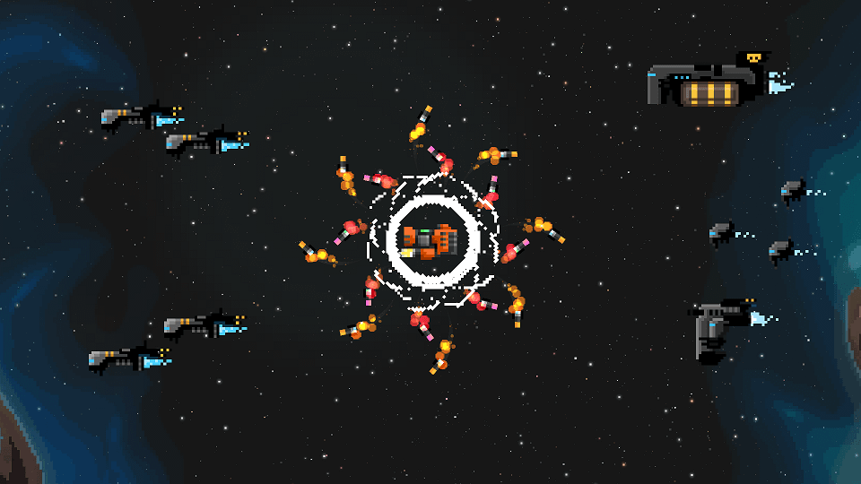
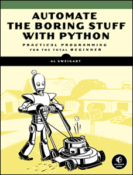

+++
title = "Learn to Code"
author = "nathan"
date = 2018-04-12T09:04:58+09:00
description = "You want to create your own games but have no programming experience? This guide is for you! This series will help you to get started with game code and design."
aliases = [ "/tutorial/game-design/godot/become-a-game-creator/first-steps-programming/", "/tutorial/getting-started/learn-to-code/",]

weight = 1
featured = true

[[resources]]
name = "banner"
src = "learn-to-code-games-banner.png"
+++

You want to get started with game creation and programming but don't know where to start? That's what this series is all about!

This first part is for you if you have little to no programming experience. You're going to learn:

1. That you should **learn programming foundations first**
1. That **Programming is for everyone**. It's not just about math and it's not just for men or young people
1. **How to get started today**

## Take it one step at a time

Game creation can feel overwhelming at first. We've all had a tough time getting started _whether we remember it or not_.

To make games alone you have to learn both:

1. **Game design**, how to come up with interesting mechanics, rules, and goals for the players
1. And **programming**, or how to translate your design in a language that the computer understands

That's a lot to tackle all at once! Like any creative discipline, it takes time. Don't worry though: learning can be a fun experience!



You may not be able to communicate your vision at first and you'll stumble upon obstacles along the way. But you'll also have plenty of "ah-ha" moments and deep satisfaction when your family and friends get to play your games.

When you are just starting out, you should **focus on code and game design separately**. Be it in parallel or one after the other, you should learn the basics, write a few programs, design simple games on paper... then bring both disciplines together to make video games.

That's what we're going to explore in this series, starting with programming.

## What do **you** want to create?

To stay motivated it's best if you understand why you're learning and what your objectives are.

What drives you to create your own game? Take a moment to think about the following questions:

- What game do you want to make?
- Are you doing this for fun, as a hobby, or to become a professional?
- What do you need to learn first to achieve these two goals?

There's no right or wrong answer here. Here's how I got started, a long time ago:

> I want to create a small RPG inspired by Japanese games for fun, finish it, and share it with my friends. I want to do everything so I need to learn to do game design, to write a story, to code the game, to draw characters and environments, to design levels, to make sounds and music, ... err, where should I start?
>
> <footer>Naive 13 years old me</footer>

It was a lot to take on alone but this goal became the beacon that guided me all these years: I've built foundations in all of these domains to some degree. Jack of all trades, certainly master of none! It took me a long time to be able to make games as I got into programming last.



You will have to be patient. Start small and hone each skill you need separately. You don't have to do everything all alone either. With a little bit of experience you can team up with complementary game creators during game jams for example.

Let's assume that you want to make video games by yourself. Maybe it would just be game prototypes that you can try out with your friends and flesh out with the help of a developer at a later stage. You're going to have to dive into code, but...

## To code games, you need programming foundations

If you jump straight in a game editor and try to write code you're in trouble. A game engines is a large collection of technologies that add hundreds, if not thousands of new tools and functions to learn on top of programming foundations. You're going to get stuck often and you'll hit frustrating roadblocks. If you don't know what variables, functions, loops, objects, and classes are or how they work to some extent, you'll want to **build solid foundations** first.

> You need to write code to become a developer. Many beginners are afraid to write code that breaks. You won't break your computer. Sure your app will crash and there may be bugs but that's okay. You can only learn by trying.
>
> <footer><a href="//twitter.com/valryon/">Valryon</a>, co-founder of <a href="//pixelnest.io/">Pixelnest</a></footer>



To get good foundations you should:

1. Learn your **first language** and get a sense for basic programming tools like variables, functions, loops, and classes
1. **Write** simple programs like text-only interactive games or scripts to automate boring tasks on your computer
1. **Read** code from other people and try to understand what it does


Programming - especially game programming - is a creative activity. You can spend your entire life exploring new techniques and sharpening your skills. Take your time and try to enjoy the journey.


Keep the **KISS** principle in mind to avoid frustration: **Keep it Short and Sweet**. You can learn fast with short focused practice sessions.

## The first language you'll learn isn't that important

There are [hundreds of programming languages](//www.wikiwand.com/en/List_of_programming_languages) out there. But it isn't *that* bad: by learning one language you learn a lot more than syntax. You're going to learn concepts like variables, loops, and objects that work about the same in most programming languages. C++, Java, C#, etc. have a lot of similarities so moving from one to the next won't feel like starting over again.



**Learning a given language is a small part of learning programming**. As you gain experience, you'll acquire more and more knowledge that you will be able to transpose across tools and languages: how to structure your code, how to avoid bugs, how to learn on your own with a programming manual or reference...

## Programming is for everyone

You don't need to start with a tough, low-level language like C++. When I was in middle school, a more experienced developer taught me C++, his argument being that it is one of the most widely used languages. At the age of 14, I got a 1000 pages long intro to C++. I had a horrible experience reading it and concluded that programming was not for me. I was disgusted from programming and stayed away from code for years.

I got back into code with Construct 2's visual event system, working as a junior game designer on mobile games. The engine's creators sold it as a _programming-free_ engine. That seemed perfect for a designer like me!



It took me a few months to realize that I was storing values in variables, writing calculations, using functions and loops, data containers like arrays… I was coding all this time. And it was fun! From there I learned some JavaScript followed by Python. It sure had nothing to do with C++. The tutorials were a lot more accessible and both languages much simpler to use.

There are different types of developers, and different paths to becoming a developer. There are languages, programs, and technologies that will prove to be a better fit for your skills and what you want to make.

> Programming is for everyone. You don't need to be a man, to be young or "gifted". If I had started earlier I would've avoided a lot of obstacles in my career.
> It's a myth that we should debunk right now.
>
> <footer><a href="//fenntasy.com/wanuts/">Florïn Zolli</a>, level designer at Ankama (Dofus, Wakfu), community manager at MotionTwin, now studying development</footer>

Women can code just as well as men. Designers and artists can also code. Again: **programming is for everyone**. You've just got to find the tool that's right for you.

## Don't start with C++

Unless you like to learn the hard way, you don't have to start with C++. C++ is a **complicated**, feature-packed language designed to write code that runs fast. It's not meant to be accessible. It's not meant to be part of your first programming experience. Especially if you are young and don't like math or if you are not very comfortable with a computer. Lucky for us, it's not necessary at all to get started with programming or to become a professional game developer.



> There are different types of developers: some like to code for the sake of it while others are driven by projects. You shouldn't be discouraged if you aren't part of the first group. I don't like math, or programming in itself, it's ok : it doesn't prevent you from creating games.
>
> <footer><a href="//fenntasy.com/wanuts/">Florïn Zolli</a>

There are **thousands of ways to code**. You don't have to do complex math to build games. You can challenge yourself with complex algorithms if you want to. Or just animate characters moving on the screen!

Even if it feels scientific at first, programming is a creative problem-solving activity. There are always multiple solutions for a given problem. In an upcoming guide in this series you'll learn about a paradigm, a set of mental tools to structure your code called **Object-Oriented Design**. As the name suggests it involves design work. Keep this in mind as you're taking your first steps: doing code is not just about maths. I am a designer at heart and I enjoy programming.



## Visual programming is still computer code

Do you feel uncomfortable writing code as text? At first that's normal; you're learning to communicate with a machine using a foreign tongue.

You may be tempted to stick to visual programming tools, thinking it's not really programming but it is. Whether you use Scratch, Clickteam Fusion, Unreal's Blueprints or anything similar, you already have some programming experience.



As a beginner the main differences between text-based and visual programming are:

1. Visual programming is a little more accessible at first, as it is visual in nature, but is often slower to write and manage as your code gets more complex
1. With text-based code you can make typos. Unlike us, a computer can't make sense of a keyword if you swap two letters.

- But modern code editors are here to help: they smartly autocomplete keywords as you type, they can tell you when you've made a mistake and often even highlight issues for you.
- As with every discipline, practice makes perfect: the more you write, the fewer typos you'll make.


A code editor can report errors when you run the program and it fails. You will then see the error report as text in a programming console. Text editors can also read your code as you are typing it and report the most common errors before you run your project. This is called **linting**.




In my experience working only with visual languages does not scale well. As your projects grow in size, visual languages will become more inconvenient. They're often slower to use than text as you end up navigating through menus and connecting blocks to do basic operations.

To give you an idea the VisualScript example above only takes 2 lines in the text-based GDscript language:

```gdscript
func _process(delta):
	position += direction * speed * delta
```

You will only see the drawbacks of visual code after you have learned and gotten comfortable with text-based programming. It is okay to start with visual code. Just don't count other programming languages out because they're harder for you to get started with. As a designer I'm glad I made the transition: it felt a little uncomfortable at first but I never looked back.

## I recommend to start with Python

As a game development tutor, I see so many **beginners jump head first in an engine and fail**. They follow step-by-step tutorials or copy-paste code from demo projects hoping to build their own dream project. As they lack programming foundations they get stuck as soon as they tweak a line of code. Doing that, you mostly end up wasting time and building up frustration.

Coding is like writing in a foreign language: you've got to learn some basic vocabulary and grammar first, use everything you learn as often as possible in order to commit it to memory, and take your time.

**Be patient**. It won't take too much time before you can get started with game programming. Try to spend about 20 hours focusing on programming basics. Then you can start having fun with game development if you want. Just don't forget to keep building and sharpening your core programming skills in parallel!


I recommend to start with Python for at least 3 reasons:

1. You can create **all kinds of programs** with it: automate tasks on your computer, code web applications, science applications, even games...
1. It has a **huge active community**. Python is taught in many schools and universities so it's easy to find good learning resources for teenagers and adults alike. My friend Chris Bradiel even [teaches Python to kids](//kidscancode.org/)!
1. It is easy to approach thanks to its **simple syntax**

Python looks like this:

```python
numbers = [2, 4, 6, 8]
product = 1

for number in numbers:
   product = product * number

print('The product is:', product)
```

With these instructions the computer calculates the product of `1 * 2 * 4 * 6 * 8` and tells you the result:

```
The product is: 384
```

**Python is great to get started with code**. For aspiring game creators it's also a reliable tool: it's the most common language to write plug-ins for graphic applications such as Blender, Krita, and Gimp. This is not only true for Free Software: large 3D applications like Maya or 3DSMax also let you write new features with Python.

> During the last Europython I've met companies who use Python in game development work. Crytek and EA (Frostbyte) use it in their assets pipeline, the build system, and automated tests.
>
> <footer>Emmanuel aka TouilleMan, author of the <a href="//github.com/touilleMan/godot-python">Python support in Godot</a></footer>

As explained earlier, we're talking about your first text-based language here. It certainly won't and shouldn't be the last you'll study. Python is a good stepping stone on your learning journey: it's a middleground between visual programming languages like Scratch and strict ones like C++.

You'll find few games written in the Python language. Game development companies mostly use Python for the creation of tools outside of the game engine: everything that has to do with processing art and other assets to use in the game for example.



> Various studies show that the number of Python developers is growing steadily year by year. [...] Many people are starting to use Python for data science and machine learning.
>
> <footer>Jetbrains 2017 <a href="//www.jetbrains.com/research/python-developers-survey-2017/#types-of-development">Python developers survey</a></footer>

<!-- 
<!-- You can write all kinds of programs in Python. Developers around the world use it to create anything from basics scripts to self-improving artificial intelligence, complex cross-platform applications or website back-ends like YouTube's. Both small and large companies like Google and Microsoft hire Python developers. -->
<!--  -->

## Three resources to learn Python step by step

I don't want to flood you with a long list of resources. Instead here's three that I like: two interactive courses which you can complete in your browser without having to download any tool and a free ebook that will help you automate repetitive tasks on your computer with Python.

### Dive into Python 3

You can get started right now with the Python programming language using [Dive into Python](//diveinto.org/python3/table-of-contents.html). It is a practical introduction to the language, showing you real-world uses from the start.

If you want to go further after that, there's a is a great free ebook called [Python Data Science](//runestone.academy/runestone/books/published/pythonds/index.html). This resource will help you develop a good understanding of how computers process data and how to write efficient programs, performance-wise.

### The Python Tutorial

Language creators generally want as many people as possible to use their language. The official website is often one of the best sources you can find to learn everything there is to know about available features and the standard library: the toolset that ships with a programming language.


Python comes with tons of tools, and they're all covered in details in the official reference. The community also wrote a comprehensive intro tutorial that reads like a book.

Read the [official Python tutorial](//docs.python.org/3/tutorial/index.html)


Python's docs website doesn't have the best layout. I use and recommend [Zeal](//zealdocs.org/), a Free documentation browser for programmers, to quickly search and read the docs for multiple languages. You can find the Python tutorial after you download the corresponding docset (click on the menu option `Tools ➡ Docsets`)


### Automate the Boring Stuff with Python

Put your new Python knowledge to good use with this [free book](//automatetheboringstuff.com/)! It is a collection of nice tricks to make your computer work for you. Need to rename many files in a complex way or automate web searches? Each of these programming drills will help you better understand your computer and the Python language by giving you new tools which will help you save time in your future projects.



The Python community also put up a [nice guide](//docs.python-guide.org/en/latest/intro/learning/) to help you go further with the language.

## Summary

That was a long article, right? If you should only remember a few key points:

1. You'll need some **programming foundations** before you can make your own video games
1. Learning to code may feel hard at first but it will get easier with practice
1. You don't have to start with a difficult language
1. **Code is for everyone**. Not only people who like math, not only men
1. Learning to code is a bit like learning a foreign language. You've got to write and read a lot of it to become comfortable

It is time for you to use the resources above and to start building your programming muscles! Pick one course, learn in short, focused sessions, and try to practice on your own to learn most efficiently.

In the next part we'll get started with game design. You can find me [on Twitter](//twitter.com/NathanGDQuest) if you have questions!



_Big thanks to [Simon Love](//twitter.com/ProtoMill) for proofing this guide! And senior game developer [Lars Kokemohr](//www.lkokemohr.de/) for being an awesome mentor._ 😄

## Your Questions

Got questions about getting started with programming? [Send me a tweet](//twitter.com/NathanGDQuest) !

I'll add the most useful answers here. Click on questions to unfold them.

<details>
<summary> What programming techniques and tools should I learn exactly before doing game code?</summary>

It's a tough question as the answer depends on you, on what your goals are exactly and on how comfortable you are with computers. If you want to create games I don't expect you to spend hundreds of hours on programming basics before you'll make your first game. I worked as a designer and an artist for years myself and learned to appreciate code over time.

I believe you can work on your programming skills and make games in parallel. You just need these first twenty hours to get started. Just don't try to learn everything at the same time: programming, design, digital painting, music scoring... this is too much to take on at once to make satisfying progress.

In this article I've talked about programming **foundations**. Because when you code games, you build on top of these foundations. Do yourself a service and get them down and well. Now back to the question, here's a summary of what you should be comfortable with to write games.

First you will need to understand the basic building blocks common to most programming languages that allow you to store data and to control the flow of your game:

1. **Variables** are containers for bits of information or data. They only exist for as long as your program is running.
1. **Conditions** let you create branching paths in your application.
1. **Loops** help automate actions or instructions you need to repeat many times. A video game revolves around a big loop that typically runs 60 times per second.
1. **Functions** take data as input, process it and return new or modified data as an output. Sometimes they modify the data. They are chunks of behavior, actions your can chain together.

Once you can play with these basic tools and combine them you're ready to create tiny games. At this point you will be writing **procedural code**. We'll talk more about this in the next guides in this series. For now just note this approach only works for small programs or isolated parts of your games.

That's why most game engines rely on Object-Oriented Programming, a way to structure your code. It's one of the main programming paradigms and the most common in computer games. You'll then want to understand:

1. **Objects**, building blocks of your future programs that group related data and functions.
2. **Classes**, the blueprint for objects.
3. Basic **Object-Oriented concepts** like **encapsulation**, **inheritance**, **aggregation**, **composition**, **polymorphism**...
4. A few good practices to structure your code like the **Single-Responsibility Principle**

And some other important concepts we will look at later in this series, like the difference between **declarative code** and **imperative code**. I will also give you an introduction to Object Oriented Design from a game designer's standpoint.

</details>

<details>
<summary> Why do you recommend Python and not another language?</summary>

The target of this article is teenagers, adults, and people learning on their own using free resources available on the Internet.

Python is not the only language you could use to get started. There are languages designed specifically to learn programming. The most popular of them today would be [Scratch](//scratch.mit.edu/), a visual programming tool to introduce kids to code.



Then there are other languages with an accessible syntax like Lua, or that offer a wealth of free resources on the web like JavaScript. Java, which has nothing to do with JavaScript, is one of the go-to languages for IT university freshmen as it forces you to arrange your code in certain ways and learn common programming patterns.

Why Python then? First because of the quality of the free courses available out there is high overall. The community set up strong guidelines for what are good practices and what are bad practices. Thanks to this it's easy to stumble upon tutorials I would recommend. This isn't the case with JavaScript where beginners write articles without understanding the language: the quality is all over the place. Great JavaScript resources are often focused on the specifics of web development and don't translate into general software development or games as well as Python's.

Then there's the fact that the [Godot game engine](//godotengine.org) is a great option to learn game development and the transition from Python to Godot's GDscript programming language will be a little easier than coming from another language. Godot pushes you to focus on the basics of object-oriented design in an intuitive way as we will see that later in this series.

</details>

<details>
<summary> What about performances? I heard Python is slow.</summary>

When you're just starting to learn how to code, the language or the engine's performances should be the least of your concerns. Your first goal should be to learn to read and write code, not to write optimized code, that tends to be complex.

You may have heard Python is a [dynamic language](//www.wikiwand.com/en/Dynamic_programming_language) and that it is slower than classic languages like C or C++. It is true when you use base Python, but there are ways to write fast Python programs, and to mix Python with C code. Also, the Python library is built upon the C language and some of the functions you will call in your program use very fast, compiled C code.

The same is true when you work with a game engine. Many engines rely on a high-level language to help code gameplay mechanics fast. These languages, often called scripting languages, may perform instructions much slower than C++, but every engine feature you use, like drawing on the screen, delegates work to the fast engine's C++ core. That's the case, for example, with Godot and GDScript.

I mentioned that there are ways to write fast Python programs. Python is a language specification. There is more than one Python: with [Cython](https://cython.org/), you can compile Python code and get close to C performances. In general, when Python developers need high performances, they use Python to call into optimized programming libraries written in C.



But again: you shouldn't worry about performances when you're just getting started. Don't get me wrong: performances can be important. The day you want to ship a game, you'll have to measure and take care of its speed. But first, you should focus on learning to read and write code well.

</details>
